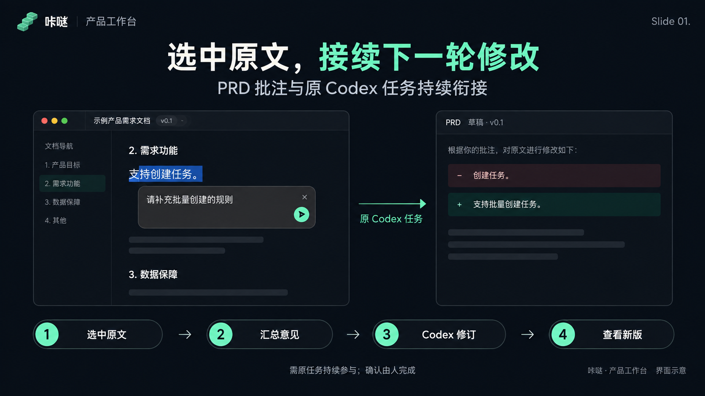
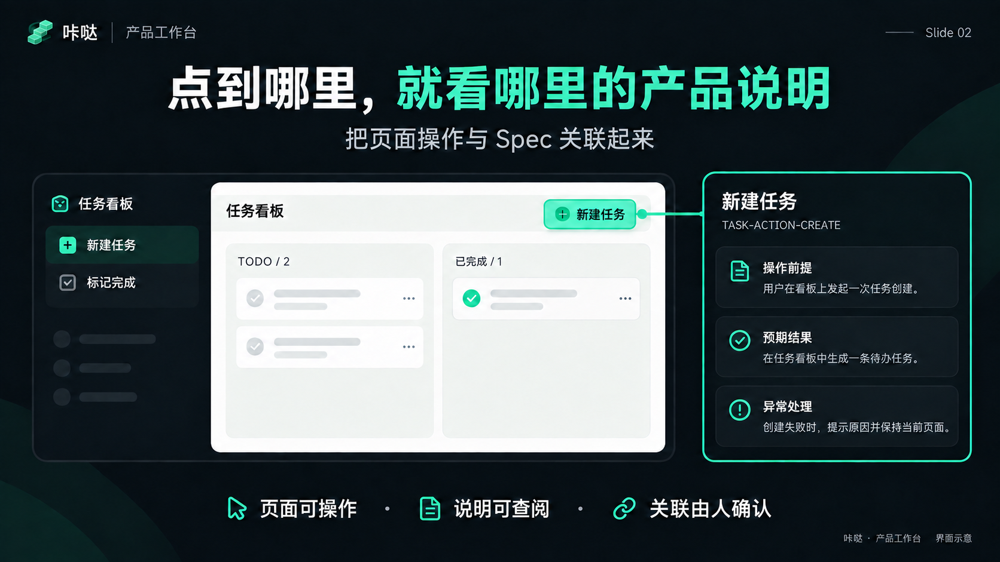
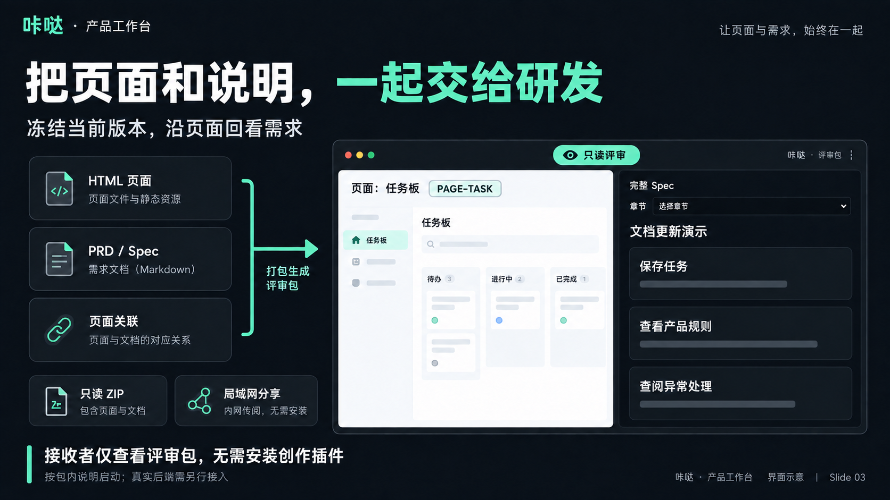
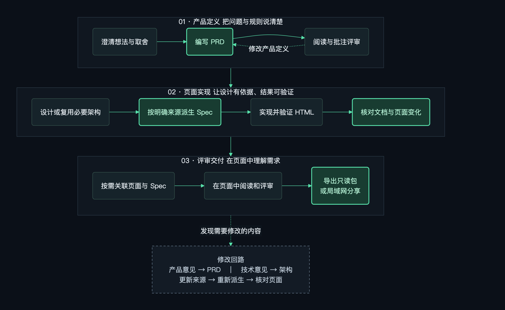
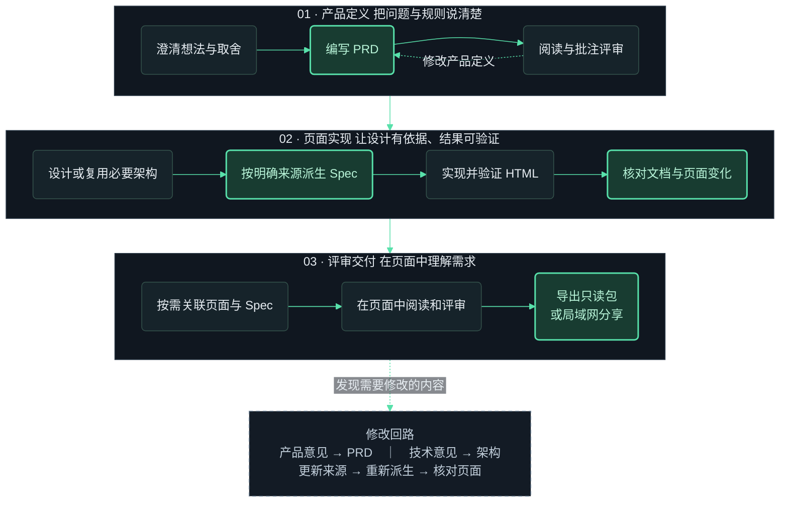

# 咔哒 · 产品工作台

**让产品想法成为可讨论的需求、可操作的页面，以及研发和 AI 都能继续使用的说明。**

一块块搭起，一步步完成。

> 当前版本：0.12.6 候选版。macOS 已完成隔离安装验证；Windows、Linux 尚未完成实机验收。

## 让产品评审，直接进入下一轮修改

在 PRD 中批注意见，让原 Codex 任务接续修订；在可操作页面旁查看对应需求，把页面和说明一起交给研发。

### PRD 持续评审：批注驱动修订



直接选中 PRD 原文写意见，多条汇总后发送，修订后的版本和差异回到同一评审会话。你可以继续下一轮讨论，不必反复复制原文、解释位置和寻找最新文件。**需要原 Codex 任务持续参与；结束会话不代表确认文档。**

### 页面与 Spec 关联：需求随操作呈现



把页面区域或操作与 Spec 关联，在同一个工作台里操作页面、阅读说明。自动候选帮助寻找对应位置，关联由人确认；已有的规则、状态和权限通过关系展示，不由按钮外观推断。

### 一体化交付：页面、需求与关联随包交接



导出固定版本的只读 ZIP，或提供局域网只读链接，让接收者沿页面回看需求。**仅查看评审包不需要安装创作插件**，按包内说明启动查看器即可；真实业务后端与外部接口仍需另外提供。

*以上为依据工作台测试截图重新制作的功能介绍示意图，用于说明操作与价值，不是原始截图。图片随文档保存，可点击查看大图；[素材与生成说明](drafts-documents/assets/feature-images-notes.md)。*

## 前言：AI 越能执行，产品判断越重要

我们认为，产品经理的定位正在变得更加重要。

当 AI 能够快速生成文档、页面和代码时，从想法到可见结果的距离缩短了。但它并没有替我们回答：到底在解决谁的问题？为什么现在要做？哪些规则必须成立？遇到例外怎么办？做到什么程度才算完成？

这些问题没有说清楚，执行得越快，偏离目标也可能越快。产品经理的价值，也因此更集中在理解问题、作出取舍、明确边界，以及判断交付结果是否符合真实需要。

“软件工程不变，AI 工程会持续进化”，是我构建咔哒的出发点。这里的不变，是软件工程仍然需要面对需求、架构、数据、权限、异常、验证和维护；模型、Agent、上下文组织和执行方式则会继续变化。工具可以更新，工程责任不能省略。

咔哒希望把这些责任落实到日常产品工作中：让想法有明确的表述，让页面有可追溯的依据，让修改能够回到文档，让人与 AI 围绕同一份项目资料继续推进。

## 这个插件不做什么

- **不适配A\，** 直到给我解封
- **不替你决定产品。** AI 可以追问、整理和提出建议，需求取舍与产品确认仍由人负责。
- **不承诺一句话交付生产系统。** 页面可以用于探索和演示，真实接口、数据保存、权限与部署需要对应实现和验证。
- **不接管所有研发管理工作。** 咔哒不提供需求立项、排期、代码托管、测试管理或生产发布平台。
- **不把评审分享当成在线协作系统。** 当前没有多人实时编辑、组织账号和审批体系；局域网分享提供只读评审副本。
- **不要求把业务资料搬进专有云端文档库。** PRD、架构、Spec 和页面保留在本地项目中。但调用 Codex 编写、分析或修订时，仍涉及所用模型服务，不能据此宣称全过程离线。

## 这个插件做了什么

咔哒由两部分组成：一套随包提供给 Codex 使用的方法，以及一个在本地浏览器中打开的可视化工作台。

**随包方法帮助你把产品定义和实现依据准备好。** 从追问想法开始，逐步形成 PRD、必要的架构设计和 Spec；需要页面时，再接续 UI 设计与可操作 HTML 的实现。你可以只做其中一段，不必每次从头开始。

**工作台把文档和页面放到同一个阅读、关联与评审环境中。** 你可以阅读 PRD、选择原文提出修改意见，将页面区域或操作与 Spec 关联，也可以在查看页面时直接阅读相关说明，把结果交给研发或评审者。

几类产物各自承担明确职责：

| 产物 | 回答的问题 |
|---|---|
| PRD：产品需求文档 | 为谁解决什么问题？有哪些操作、规则、分支和预期结果？ |
| 独立架构文档 | 模块、数据、接口和关键技术机制如何支持这些要求？ |
| Spec：研发规格说明 | 本次功能具体依据哪些产品规则与技术设计来实施、验证？ |
| HTML 页面 | 当前界面和交互是什么样，可以怎样操作？ |
| 页面与文档的关联 | 当前看到的区域或操作，对应哪一段说明？ |

对已经明确来源绑定的项目，Spec 可以由程序从 PRD 和架构文档中提取对应原文生成。修改 Spec 后，需要把意见承接回相应来源，再核对并重新派生；已有手改不会被直接覆盖。历史 Spec 可以继续沿原方式使用，不会因为安装插件就被强制转换。

## 最核心的价值：减少需求在交接和修改中的丢失

产品工作中经常出现这样的断层：PRD 写过的规则，页面里看不到；页面改了，文档还停在上一版；研发看到一个按钮，却不知道操作的前提、失败结果和恢复方式；AI 换了一轮任务，又需要重新解释背景。

咔哒希望减少这些反复翻译，让讨论始终落到具体对象上：**哪一项需求、哪一个页面、哪一个操作、哪一段说明，以及这次到底改了什么。**

例如，一个“提交申请”按钮，页面只展示了入口。评审时还需要知道：谁可以提交？哪些内容必填？重复提交怎么办？超时后能不能再点？提交成功后去哪里查看？

在咔哒中，可以把这个操作与对应 Spec 关联，在页面旁阅读相关规则。发现遗漏后，将意见交回文档和实现流程，修改完成再核对。文档、页面和评审意见不必各自成为一份孤立材料。

我们最看重的价值，是让**产品判断有依据、研发理解有上下文、AI 执行有明确边界，修改之后还能继续追溯**。这是一种工作方式的改进，不是自动消除所有遗漏的保证。

## 功能简介：从想法到评审交付

下图展示各项能力如何衔接。每一段都可以按项目现状进入；箭头表示工作顺序，不表示无需人的判断就会自动执行。



<details>
<summary>查看与编辑流程图源码</summary>



</details>

图中绿色实线表示主要推进顺序，虚线表示意见回流；绿色描边强调文档、核对结果与交付物。可以从已有资料所在的阶段开始，不必每次重新走完整条流程。

| 能力 | 可以完成什么 | 从哪里使用 |
|---|---|---|
| 想法澄清 | 逐项追问目标、场景、约束和取舍 | 在 Codex 对话中提出想法 |
| 产品文档 | 编写或修订 PRD、整理表达、按来源派生 Spec | 在 Codex 中说明文档任务与范围 |
| 架构设计 | 按实际影响明确模块、数据、接口及工程机制 | 在产品定义足以支撑设计时接续 |
| 图形表达 | 用流程图、状态图等辅助讨论 | 在 Codex 中提出需要解释的流程 |
| UI 与 HTML | 设计并实现 PC 或手机形态的可操作页面 | 在 Codex 中明确页面目标；手机形态交付仍为 HTML |
| PRD 批注 | 选中文字、汇总意见、分批发送，由原 Codex 任务修订 | 工作台中的 PRD 阅读与评审入口 |
| 页面关联 | 确认页面区域、操作与 Spec 的对应关系 | 工作台绑定模式 |
| 上下文阅读 | 查看关联说明、公共约束和完整 Spec | 工作台评审模式与文档阅读入口 |
| 评审交付 | 导出包含页面、文档及关联的只读 ZIP，或提供局域网只读链接 | 原工作台的导出与发布入口 |

当前随包提供七项 Skill：`grilling`、`product-documentation`、`software-architecture-design`、`prd-concise-cn`、`diagram-design`、`ui-ux-pro-max`、`ant-design-html`。用户可以用自然语言提出任务，无需先记住这些名称。

## 功能使用说明

### 1. 安装一次，在多个项目中使用

当前咔哒是 Codex 插件，需要支持插件的 Codex，以及 Node.js 20.11 或以上。安装包已经包含工作台、运行依赖和七项 Skill，普通使用者不需要编译源码，也不需要另装维护者的个人 Skill。

将本仓库的 [INSTALL.md](INSTALL.md) 链接交给 Codex，并说：

> 请按照这份说明安装咔哒工作台，检查环境和已有安装，并验证安装结果。

Codex 按说明从同一仓库的 Releases 取得发布包和校验文件，完成校验、解压、预检与安装。GitHub 自动生成的 Source code 压缩包是源码，不是预构建安装包。当前尚未公开发布，可先使用维护者提供的候选包。

安装完成后，按宿主提示确认启动脚本信任，并在新任务中检查插件是否已加载。详细操作与失败恢复统一见 [安装说明](INSTALL.md)。

**同一台电脑、同一个 Codex 用户环境只需安装一次，不按项目重复安装。** 例如 Windows 用户的资料可以继续放在：

```text
D:\workplace\
├─ 项目A\    PRD、架构、Spec、HTML 等项目文件
└─ 项目B\    PRD、架构、Spec、HTML 等项目文件
```

插件由 Codex 安装到其管理的用户目录，不需要装进 `D:\workplace`，也不用在项目 A、B 中各复制一份。使用哪个项目，就在 Codex 中打开哪个项目文件夹。新电脑或不同 Codex 用户环境需要分别安装。

### 2. 只有想法时，从问题开始

在自己的项目文件夹中新建 Codex 任务，例如：

> 我想做一个团队任务看板。先帮我讨论清楚目标用户、主要场景和范围，逐项问我关键问题；想法明确后整理 PRD，先不要开发页面。

你可以要求画图解释复杂流程，也可以直接提供已有材料。没有确定的规则应保留为待确认，不能为了文档完整而虚构决定。

### 3. 已有文档时，从当前资料接续

> 请读取当前项目的 PRD 和已有架构，检查这次要做的任务分配功能是否说清楚。只补充本次缺口，不重写无关章节；必要设计明确后再派生 Spec。

PRD 首次生成并通过校验后，如果你没有安排下一步，Codex 会询问“是否现在开始评审？”，提供“开始评审”和“稍后评审”两个选项。宿主不支持浮窗时，会在当前对话中询问；选择稍后不会自动打开工作台。

已有文档或需要稍后继续时，可以说：

> 打开这份 PRD 开始评审。

在阅读器中选中文字、写下意见并添加到待发列表，可以积累多条后一起发送。原 Codex 任务需要保持参与，才能接收意见、修订同一份文档并发布新版供你查看。结束评审与确认文档是两个动作；关闭阅读器不代表需求已确认。

### 4. 需要可操作页面时，说明实现范围

> 依据当前 PRD 和 Spec，实现任务看板的 PC 网页。本次只做任务列表、创建任务和状态切换；需要模拟的数据明确标注，完成后核对页面与文档。

已有工程沿原组件和构建方式接续；空项目可以使用随包 HTML 起步能力。要求手机形态时同样可以实现，但交付的是网页，不是原生手机客户端。

页面完成后，按本次范围验证操作、状态和关键分支，再核对 PRD、架构和 Spec。能打开页面、构建成功或完成上报，都不能单独证明产品已经验收。

### 5. 把页面和说明关联起来

> 用咔哒工作台打开当前项目，识别已有 HTML、PRD 和 Spec。先让我确认来源，再进行页面关联。

确认所用页面与文档后，在绑定模式选择一个页面区域或操作，再在实际页面中选择对应位置。自动候选帮助寻找位置，是否建立关联由人确认。

例如，把“创建任务”操作关联到页面上的创建按钮。之后在评审模式中，就能通过页面标记查看相关说明。规则、状态和权限等内容通过关联阅读，不需要把每一条规则都拖到页面上。

没有 Spec 时，也可以先打开符合格式要求的 PRD 进行阅读与评审；已有资料不符合格式时，应先核对问题，再按明确授权整理，原文件不会因为打开工作台就被自动改写。

### 6. 把评审结果交给别人

需要交付一个固定版本时，从工作台导出只读 ZIP，将当前页面、文档和关联一起交给对方回看。只读评审包与咔哒创作插件是不同的交付物；接收者仅查看评审包，不需要安装这套 Codex 插件，按包内说明启动查看器即可。

需要同一局域网内查看时，可以从原导出与发布入口开启服务、设置密码，再发送项目链接与密码。源文件变化不会自动发布，需要明确更新发布内容。它不等于公网托管，也不会提供页面所依赖的真实业务后端。

### 7. 更新插件和 Skill

我们维护的共享 Skill 会同步到咔哒的发行版本中。客户升级插件即可取得该版本的方法，不必逐个项目替换规则文件。

升级不会自动重写现有 PRD、Spec 或 HTML。需要按新版方法检查旧项目时，应明确提出检查范围，再决定哪些内容需要调整。

## 正在解决什么

- **支持更多 Agent。** 推进对 DeepSeek、Qoder 等的支持。
- **简单需求的页面手动标记。** 预计中秋节后启动，让简单需求也能直接在页面上标记说明。
- **优化低性能 LLM 的 Skill 约束。** 持续改进，让能力较弱的模型也能更稳定地理解和遵循 Skill 要求。

以上为正在推进或计划开展的事项，不代表当前版本已支持。

## 联系作者

邮箱：[a623640680@gmail.com](mailto:a623640680@gmail.com)

截图带 star 会加速回复哟！

## 当前可用范围与发布说明

- 当前以 Codex 为使用入口；没有承诺其他 Agent 可以直接加载全部能力。
- 0.12.6 候选包已完成 macOS 隔离安装验证，项目统一验证包含 204 项 Node 测试和真实浏览器回归。
- Windows、Linux 的创作插件安装与运行尚未完成实机验收；局域网分享的跨设备使用也仍需验证，不能用本机测试代替。
- 本地优先不等于 AI 全程离线。模型调用需要相应服务；新 HTML 工程首次安装依赖通常需要网络或已有缓存。
- 源码仓库：[anbozzz/kada-product-workbench](https://github.com/anbozzz/kada-product-workbench)。安装包请查看 [Releases](https://github.com/anbozzz/kada-product-workbench/releases)；若尚无发布附件，请勿将 Source code 当作安装包。

安装步骤见 [INSTALL.md](INSTALL.md)，维护者的打包和发布流程见 [RELEASE.md](RELEASE.md)，更完整的现有能力说明见 [README.md](DEVELOPMENT.md)。

