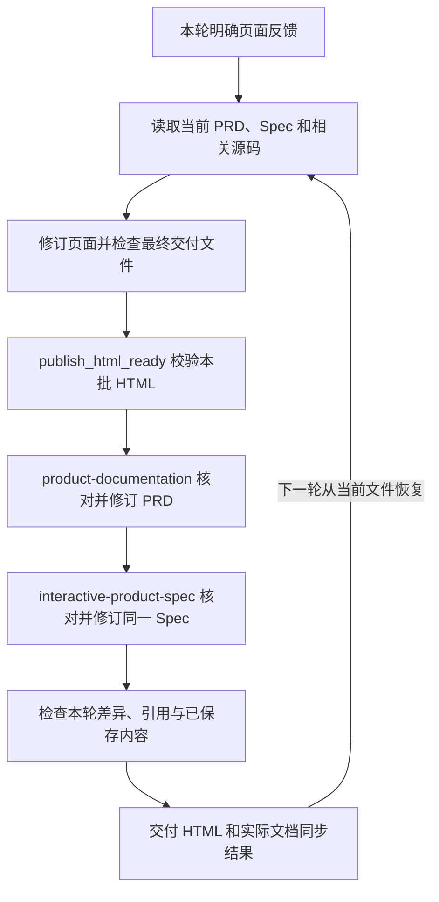

# 技术架构设计：HTML 交付后的产品文档同步

| 字段 | 内容 |
|---|---|
| Status | adopted |
| Date | 2026-09-03 |
| Project | Interactive Product Spec |
| Scope | HTML 完成上报、PRD 与统一 Spec 同轮核对、移除选择弹窗 |
| Product source | 用户要求页面更新后必须同步两份文档，舍弃原文档选择弹窗 |
| Technical evidence | `html-delivery*.mjs`、完成协议测试、共享文档 Skill、插件实际安装副本 |
| Related decisions | [ADR-0005](../../decisions/ADR-0005-html-delivery-document-sync.md)；显式上报沿用 [ADR-0003](../../decisions/ADR-0003-explicit-html-delivery-routing.md) |

## 1. 目标与责任

用户主要围绕页面提出修订。每轮页面达到可交付状态后，当前 Agent 必须核对 PRD 和统一 Spec 并完成受影响修订，避免多轮后依赖聊天回忆集中补文档。已有覆盖可以无需修改，探索方案仍保留候选；执行同步不等于产品定稿。

- Agent 拥有本轮用户反馈、实际页面改动和交付文件检查结果，声明需要交付哪些 HTML；检查方法沿用共享 Spec 标准。
- 上报工具只校验指定 Project、HTML 路径、大小和 revision，固定返回待同步任务；不读取或修改 PRD/Spec，不独立证明业务完成或文档一致性。
- `product-documentation` 拥有同轮同步方法及 PRD 正文；`interactive-product-spec` 维护同一 Spec。工程约束由 `software-architecture-design` 按实际影响补入现有约定位置。
- 当前文件保存结果。JSON 投影、人工 Map 和工作台两种写回策略保持原所有权，不增加同步数据库或第三份正文。

## 2. 运行流程

1. `SessionStart` 注入完成协议，不扫描目录、不发起对话。
2. 当前 Agent 在页面修订或任务恢复时读取最新来源；需要架构变化时先完成技术决定。只读 HTML、聊天代码和构建测试偶然产物不上报。
3. 按 `product-documentation` 所引用的统一 Spec 标准检查本批最终交付文件后，合并入口上报；不在每次中间文件写入时触发。插件验证绝对路径、realpath 边界、文件类型、非空与大小上限，按路径和内容计算批次身份。
4. 工具固定返回 `status=document-sync-required`、`route=prd-spec`、`skill=product-documentation` 和 `followUpSkills=[interactive-product-spec]`。无论客户端是否支持表单都不弹窗，不让用户选择文档、类型或跳过。
5. 当前 Agent 依次完成两份文档的核对和必要局部修订，保留稳定 ID、有效引用、工程章节与人工 Map。新需求、删除和合并同时检查旧正文及直接依赖；未请求映射时不启动工作台。完整方法只维护在产品文档 Skill。
6. 两份文档均核对且必要修改已保存后才能报告本轮完成。冲突、失败或用户明确暂缓时报告未完成部分，沿 Project 现有工作记录恢复；不能用上报响应替代完成证据。

没有对应文档时，由 Skill 按实际范围生成草稿；非产品 HTML 可判定不适用，不造产品需求。PRD 已先行处理也要核对 Spec，已有覆盖不重复改写。仅 PRD 修改不触发 HTML 上报，不因此擅自开发页面。压缩仍保留给明确的压缩请求。

## 3. 状态、兼容与取舍

本轮批次保留 `projectPath + sorted(htmlPath, revision)` 的身份和返回结构，不持久化选择或同步状态。相同 revision 重试仍返回待同步任务，适应上报后中断、文档写入失败或文档另有变化；组件、JS 或 CSS 改变交付页面而 HTML 入口未变时也上报该入口。revision 仅标识入口内容，不证明整份页面包未变；当前 Agent 不把两次相同要求重复执行为两份正文。

旧 `prdFollowup` 形状继续接受并严格校验，covered 与 new-or-uncertain 均不免除任一文档；新调用省略。旧选择文件不读取、不迁移、不删除，避免旧版选择或取消压过新规则。此兼容不证明历史 PRD 整理或授权确实发生。

选择弹窗、二次 PRD 类型选择、选择去重与 covered 静默分支均移除。拒绝继续保留“选择即处理”的状态，也不以 Stop、PostToolUse 或目录扫描猜测交付时点。无需新的完成凭证或数据库；文档一致性由 Agent 和 Skill 对照当前文件检查。

不改项目中心、绑定与评审入口、人工 Map、PRD 草稿入口、JSON 投影和现有两种 Spec 写回策略。普通工作台阅读或映射不会因此自动改写文档。

## 4. 验证、安装与限制

| 风险 | 验证方式与边界 |
|---|---|
| 连续修改漏掉 Spec | 连续十轮上报每轮返回两份文档的待同步要求；不声称测试执行了 Agent 的语义核对 |
| 上报被误当完成 | 相同 revision 重试、并发上报、旧选择文件、损坏旧状态和 covered 声明均不能免除同步 |
| 弹窗残留或依赖宿主表单 | 有无 elicitation 能力的真实 MCP 进程均无对话，直接返回待同步任务 |
| 文件越界或工具越权 | 绝对路径、符号链接、重复、缺失、非 HTML、空文件、大小和批次数量检查；不读写文档、不生成状态文件 |
| 原工作台回归 | 项目统一 `npm run verify`，覆盖原入口、导航、映射、局部写回和只读交付 |
| 发布与加载不一致 | 新版本自包含包、校验清单、隔离安装、实际缓存内容与 SessionStart / MCP 核验；安装与新任务接入分别报告 |

本协议自 0.11.1 发布，0.11.2 细化交付前检查并统一共享 Skill。保留旧版本包作为回滚来源；回滚到 0.10.0 会恢复文档选择旧行为。安装状态见 `RELEASE.md`。不手工改 Codex 缓存或 Hook 信任。

仍依赖当前 Agent 遵循上报和同步方法，机械测试不能证明任意产品的需求语义、实际后端或用户验收。Codex 外部页面变化不监听；下一次明确任务按当前文件恢复。若未来有原生交付事件或必须覆盖外部写入，再重访此决定。
