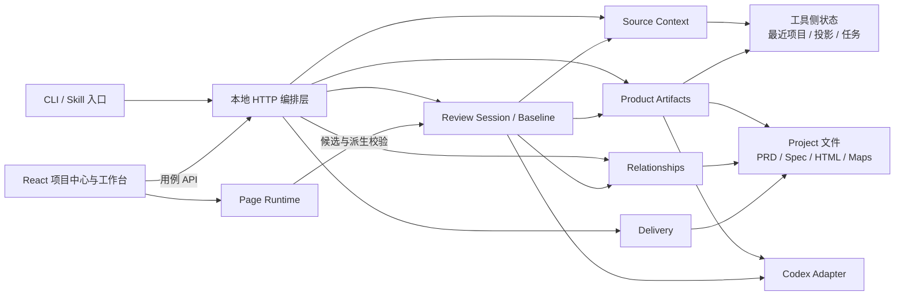
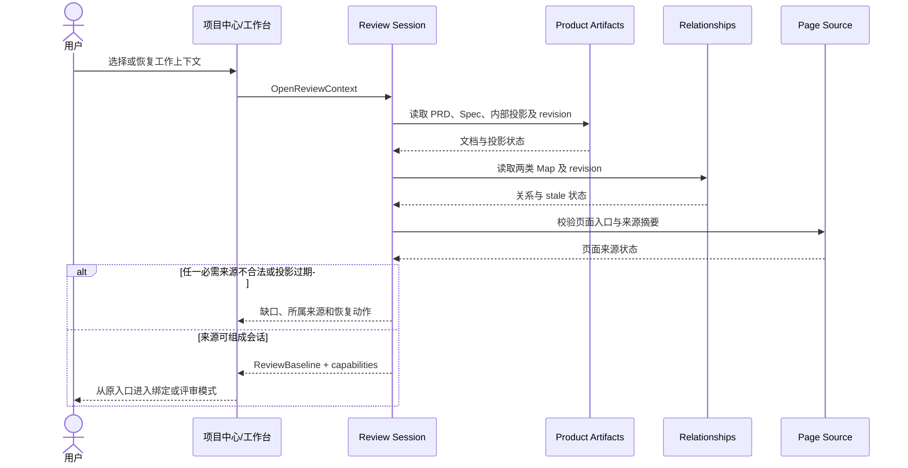
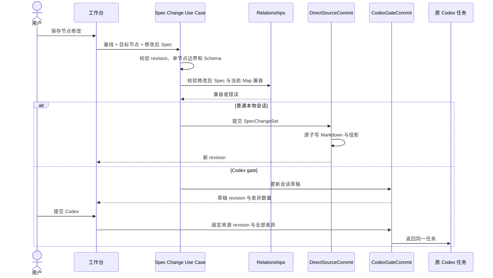
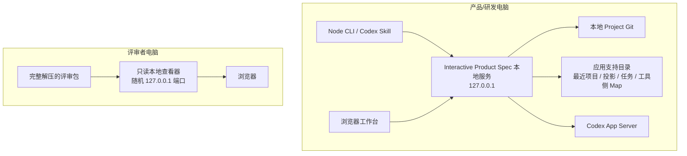

# 技术架构设计：产品事实工作闭环

| 字段 | 内容 |
|---|---|
| Status | adopted |
| Date | 2026-09-01 |
| Project | Interactive Product Spec |
| Scope | 从单一 Spec 工具演化为产品事实工作闭环后的职责收敛、版本基线与下一阶段模块化 |
| Product source | [产品系统蓝图](../../product-blueprint.md)、[产品需求文档草稿](../../drafts-documents/Interactive%20Product%20Spec产品需求文档.md) |
| Technical evidence | [当前架构契约](../../ARCHITECTURE.md)、[当前使用与产品边界](../../README.md)、`src/`、`schemas/`、`tests/`、`browser-tests/` |
| Related decisions | [ADR-0001：以评审基线和应用服务收敛产品工作闭环](../../decisions/ADR-0001-review-baseline-and-application-services.md)、[ADR-0002：通过可见 Codex 任务生成 PRD 标准化草稿](../../decisions/ADR-0002-visible-codex-prd-normalization-draft.md)、[ADR-0003：以显式 HTML 完成上报替代 Stop 扫描](../../decisions/ADR-0003-explicit-html-delivery-routing.md)、[PRD 页面关系与内部投影](../../decisions/2026-08-31-prd-page-linking-and-internal-projection.md)、[映射事实与运行时状态分离](../../decisions/2026-09-01-mapping-validation-status-ownership.md)、[关联有效性与导航能力分离](../../decisions/2026-09-01-binding-validity-navigation-capability.md)、[只读评审包](../../decisions/2026-09-01-portable-read-only-review-package.md) |

## 1. 结论与适用性

本次需要技术架构设计，因为产品已经新增 PRD、内部投影、两类 Map、Codex 会话和只读交付等跨模块能力，正式来源、状态所有权、写回方向和失败恢复已经不能从“Spec 查看器”结构直接推出。

当前实现的核心架构方向是成立的：继续使用本地优先的模块化单体、单项目中心和单工作台，保持 PRD、Markdown Spec、HTML、`prd-map.json`、`spec-map.json` 与内部投影分层，不拆微服务、不新增平行页面或第二套工作流。

主方案是在不改变外部产品流程的前提下，引入明确的“评审基线”版本向量和应用服务边界，把来源装配、两种 Spec 提交策略、Map 持久化、投影任务与只读快照从大型 HTTP/UI 编排器中逐步抽离。当前状态保持 `adopted`：ADR-0001 范围内的第一阶段已经实现并通过统一验证；完整基线漂移检查和继续缩小 UI 编排器仍未完成，因此不把整份目标设计升级为 `implemented`。

本次审计发现的四项风险及当前处置如下：

1. 服务端来源装配已从约 1012 行的 `server.mjs` 抽到 `review-session.mjs`，服务端编排器降至约 690 行；`App.tsx` 和项目中心组件仍约 1790、1947 行，是后续模块化的残余风险，但 HTTP 传输已经移出顶层。
2. `/api/config` 已返回显式 `ReviewBaseline` 和 `capabilities`，只读包也会重写本机来源并关闭能力；完整基线在所有跨来源动作前重新读取磁盘并逐项阻断漂移，仍是下一阶段工作。
3. 普通本地直写与 Codex gate 草稿回流已收口为 `DirectSourceCommit` 和 `CodexGateCommit` 两个显式策略，共享 Schema、草稿 revision 与 Map 兼容性校验；架构检查阻止 HTTP 路由重新决定策略。
4. 当前项目身份由本地路径、来源类型和页面入口派生，适合单机恢复，不足以直接承载跨设备、多人空间或长期产品身份；未来若进入协作发布，必须新增稳定业务身份，不能把路径哈希扩大使用。

## 2. 目标、范围与依据

### 2.1 必须实现的结果

- 一次活动工作台必须能明确说明正在消费哪些来源 revision，以及哪些变化会阻断写入或导出。
- PRD、正式 Markdown Spec、HTML、两类 Map、内部投影、运行时候选与评审快照必须保持唯一且可解释的所有权。
- 普通本地写回与 Codex gate 必须共享相同的校验、差异、冲突和原子性政策，只在提交所有者上不同。
- 新增产品能力应进入明确的应用用例和领域模块，不再让 HTTP 路由或 React 顶层组件成为规则拥有者。
- 项目中心、绑定模式、评审模式、Codex gate 与只读导出继续从当前真实入口工作，迁移期间不删除或降级任何已存在能力。
- 设计必须为未来的实现证据回链、变更影响和可选 Agent 适配保留清晰端口，但不提前建设远程服务或通用平台。

### 2.2 范围内

- 本地服务内的来源装配、工作会话、revision 基线和能力授权。
- PRD 读取与 `prd-map.json`、Spec 读取与内部投影、`spec-map.json` 的职责边界。
- Spec 节点修改的校验、差异、直接提交和 gate 提交策略。
- 项目中心与工作台前端的状态边界和用例调用方式。
- 投影任务、服务重启恢复、只读评审包与 manifest。
- 与现有 Schema、架构检查、Node 测试和浏览器旅程的兼容迁移。

### 2.3 明确不改

- 不改变 PRD 与 Product Spec 的产品内容标准和确认生命周期。
- 不合并 `prd-map.json` 与 `spec-map.json`，不把内部 JSON 投影变成正式来源。
- 不改变 selector、语义指纹和页面导航能力分离的现行决定。
- 不改变普通本地直写和 Codex gate 两条产品路径的用户结果。
- 不引入数据库、微服务、消息队列、云端账号、多人权限或公网部署。
- 不重写现有 UI 信息架构，不新增独立 PRD 工作台、导出工作台或 Agent 管理页。
- 不因为第一阶段代码完成就把整份设计状态写成 `implemented`，不以文档验证代替代码与用户验收。

### 2.4 当前事实与证据

- `README.md` 明确把 PRD、Markdown Spec、HTML、两类 Map 分层，并把内部 JSON 定义为工具侧可重建投影。
- `ARCHITECTURE.md` 已把 HTTP 编排、Schema、语义校验、Map、投影、Spec 写回、PRD、评审包和前端状态拆出部分模块，并以 `npm run verify` 作为统一验证入口。
- `src/spec-service.mjs` 对 Spec 草稿和正式 Markdown 使用 revision 冲突保护；普通会话一次只允许改变一个节点，写正式 Markdown 与投影失败时执行回滚。
- `src/prd-map-store.mjs` 与 `src/map-store.mjs` 分别拥有两类关系；`src/server.mjs` 在装配会话时分别加载 revision 和 stale 状态。
- `src/projection-service.mjs` 以来源 revision、页面来源、模型和推理强度识别可复用投影；运行中任务在服务重启后转为可恢复的失败状态。
- `src/review-package.mjs` 已生成包含 Spec、PRD 与两类 Map revision 的 manifest，并以独立只读服务面关闭写入 API。
- `src/project-store.mjs` 以 Project 路径、来源类型和 HTML 入口或开发地址派生本地项目 ID，最近项目上限为 20。
- 当前工作树位于 `codex/prd-page-linking` 分支，包含相对 `main` 的 PRD、映射验证和只读交付能力；本设计以当前分支为实现事实基线，不把 `main` 当作同一版本。

### 2.5 Unknown / TBD

- TBD：下一阶段是否首先建设“产品事实到实现证据回链”或“变更影响工作台”；两者共用本设计基线，但用户结果和实施范围不同。
- TBD：多人协作、跨设备 Project 身份和服务端存储是否进入产品；在明确前保持本地路径身份，不提前迁移数据模型。
- TBD：远程真实页面、登录态和敏感数据是否会成为正式来源；当前设计继续失败关闭在本地页面边界。
- TBD：除 Codex 外是否存在经过验证的 Agent 需求；当前只抽取最小适配端口，不承诺通用 Agent 协议。

## 3. 架构驱动因素

### 3.1 业务不变量与硬约束

- Markdown Spec 是唯一正式 Spec 正文；内部 JSON 只能从固定来源 revision 重建。
- PRD 正文、PRD 页面关系、Spec 正文、Spec DOM 关系和页面实现分别由不同对象拥有，任何聚合页面都只能消费这些事实。
- 自动候选、当前页面识别、运行时映射状态、导航缓存和视图偏好不得持久化为人工确认关系。
- 产品写入必须基于 revision；外部变化时拒绝覆盖，不能使用最后写入者获胜。
- 普通本地会话提交到正式 Markdown，Codex gate 提交差异到原任务；不得出现同时写两处或隐藏的第三提交者。
- 项目中心、工作台和评审包必须保持同一产品能力，不复制业务规则到另一套实现。
- 编辑服务与离线 ZIP 查看器仅监听本机；已确认的局域网发布另用独立只读后台进程，实现与验证边界见 4.6。所有文件读取限制在明确来源边界。
- 现有用户入口和全部已实现能力在迁移过程中必须保持可达并通过统一验证。

### 3.2 质量场景

| ID | 来源（Source） | 刺激（Stimulus） | 环境（Environment） | 对象（Artifact） | 响应（Response） | 响应指标（Response Measure） |
|---|---|---|---|---|---|---|
| QA-01 | 正式来源不被覆盖 | 用户打开节点后，Markdown Spec 被其他任务修改 | 普通本地可编辑会话 | Spec 提交用例 | 拒绝旧基线写入，保留用户编辑并要求重新载入 | HTTP 409；原文件字节不变；冲突测试通过 |
| QA-02 | 人工关系与运行态分离 | 当前页面不包含其他场景的已确认目标 | 正常切页与自动保存 | `spec-map.json` | 只在内存显示 `out-of-context`，磁盘仍保存 `confirmed` | 保存后所有现存 Annotation 状态为 `confirmed`；关系数量不变 |
| QA-03 | 多来源一致性 | PRD、Spec、Map 或页面在会话期间任一变化 | 写入或导出前 | 评审基线 | 明确指出变化来源并阻断可能混合版本的操作 | 每个阻断返回具体 revision 类型；不生成评审包 |
| QA-04 | 可恢复投影 | 本地服务在 Codex 投影运行中重启 | 冷启动恢复 | 投影任务 | 未完成任务转为失败，保留 thread 信息并允许重试 | 重启后不残留 `queued/running`；用户看到恢复动作 |
| QA-05 | 本地安全 | 浏览器或页面请求越界文件、外部代理或写 API | 正常工作台与只读包 | HTTP 服务和评审查看器 | 正常服务限制 Project/页面根；只读包拒绝全部写入 | 外部重定向、越界路径和写 API 的负向测试全部通过 |
| QA-06 | 模块可演进性 | 新增一种产品资料关系或 Agent 提交策略 | 开发与回归 | 应用服务和 UI 用例 | 新规则进入单一模块，不在顶层组件复制 fetch 与状态机 | `check:architecture` 能拒绝反向依赖或顶层重新持有持久化请求 |
| QA-07 | 入口连续性 | 重构来源装配和会话基线 | 当前所有启动方式 | 项目中心与工作台 | 唯一来源直达、项目中心、绑定、评审、gate、离开、导出均保持原结果 | `npm run verify` 全部通过；原入口真实浏览器回归无新增缺失 |

## 4. 整体设计

### 4.1 领域与所有权

采用一个本地模块化单体，按事实生命周期划分六个逻辑边界。它们是代码职责和用例边界，不是微服务。

| 逻辑边界 | 拥有的状态与决定 | 只消费的状态 | 不得拥有 |
|---|---|---|---|
| Source Context | 本地 Project 绑定、来源选择、最近项目和文件边界 | 文档与页面合法性结果 | PRD/Spec 正文、Map 内容和产品确认 |
| Product Artifacts | PRD/Spec 读取、结构解析、revision、内部投影元数据 | Project 边界、Codex 生成结果 | DOM 关系、视图状态和提交策略 |
| Relationships | `prd-map.json`、`spec-map.json` 的校验、revision、原子保存 | PRD 章节、Spec 节点和页面上下文 | PRD/Spec 正文、运行时派生状态 |
| Review Session | 评审基线、工作模式、能力集合、gate 草稿和提交策略选择 | 来源与关系 revision | 正式文档生命周期、Agent 内部状态 |
| Page Runtime | 当前 iframe、页面识别、候选、导航、selector 和指纹校验 | Spec 页面节点和人工 Map | 正式产品事实、确认状态持久化 |
| Delivery | 冻结基线、资源边界、manifest 和只读查看器 | 已经保存的来源与关系 | 正式来源写入、审批和远程发布 |

`ReviewBaseline` 是本设计新增的逻辑聚合，不先要求新建持久化文件。它在打开工作台时由服务端装配，至少包含：工作上下文身份、页面来源摘要、PRD revision、PRD Map revision、Markdown Spec revision、内部投影 revision、Spec Map revision和会话模式。每个写用例只校验自己拥有的 revision，同时在导出和跨来源提交前校验完整基线，防止合法文件被组合成错误时点。

Spec 修改使用同一个 `SpecChangeSet` 语义：包含基线、目标节点、变更前后内容和 Map 兼容性结果。提交策略只有两个正式实现：

- `DirectSourceCommit`：一次提交一个节点，原子写回 Markdown 并同步投影。
- `CodexGateCommit`：允许会话内积累节点差异，提交时返回原 Codex 任务，不直接写 Markdown。

未来 Agent 适配只能实现 gate 的外部协作端口，不能新增绕过 `SpecChangeSet`、revision 或映射兼容校验的写入链。

### 4.2 静态结构

静态依赖规则：

- HTTP 和 React 顶层组件只组合用例，不解析 PRD、计算 Map revision、决定 Spec 提交策略或制作 ZIP。
- Product Artifacts 不依赖 Relationships；两者由 Review Session 在固定基线中组合，避免正文与关系互相成为隐藏所有者。
- Page Runtime 可以计算候选和派生状态，只能通过 Relationships 的正式保存用例持久化人工结果。
- Delivery 只读取已经装配并校验的完整基线，不能从 UI 临时状态自行拼装来源。
- Codex Adapter 隔离 App Server 的 thread、模型和推理强度细节；Product Artifacts 和 Review Session 只依赖生成或回流能力合同。
- 当前 `src/server.mjs`、`App.tsx` 和项目中心组件按上述依赖逐步瘦身，不要求一次性改目录或大重写。

### 4.3 运行交互

#### 打开工作台与形成基线

#### 修改 Spec

失败、重试与并发规则：

- 所有修改和 Map 保存采用乐观并发；冲突返回明确代码，不自动重试写入。
- 原子写入只有本地临时文件和 rename；多文件写入失败时恢复已修改的正式来源，并保留错误证据。
- Codex 投影可手动重试；同一来源、页面、模型和推理强度的运行任务去重，一致完成结果可复用。
- gate 提交失败时保留当前草稿和差异，除非用户明确离开并接受放弃。
- PRD 格式不合格时仍失败关闭页面绑定；用户明确发起后，独立 PRD 草稿任务以 Project 为唯一可写根、以 `drafts-documents/` 下的预定路径为唯一产物。任务完成只在原 PRD revision 未变化且新草稿通过格式合同时切换来源；失败或冲突继续保留原选择。
- 导出过程使用固定基线；在准备与下载之间不重新读取其他 Project 来源，临时包下载或超时后清理。

### 4.4 状态与数据

数据按生命周期分为五层：

| 数据层 | 例子 | 持久化与一致性 |
|---|---|---|
| 正式来源 | PRD Markdown、Product Spec Markdown、HTML 页面包 | 由当前 Project 拥有；写入使用 revision 和原子替换 |
| 持久关系 | `prd-map.json`、`spec-map.json` | 各自独立 Schema、revision 和写入队列；只保存人工关系 |
| 可重建投影 | `product.spec.json`、projection metadata | 工具侧按来源 revision 缓存；不进入产品确认和项目交付 |
| 会话与派生状态 | gate 草稿、候选、页面识别、运行时映射状态、导航缓存、视图偏好 | 只在当前服务或浏览器生命周期存在；不得反向污染正式来源 |
| 冻结快照 | 评审 ZIP、manifest、文件摘要和来源 revision | 生成后只读；快照不再跟随项目变化 |

关键身份与约束：

- 本地 `projectId` 继续由 Project 路径、来源类型和页面入口派生，只用于工具侧恢复和缓存；不得当作正式产品 ID。
- PRD 章节由稳定中文语义 ID 连接 Map；Product Spec 由产品 ID、版本和节点 ID 连接内部投影与 Spec Map。
- 页面和 DOM 关系不使用像素坐标。Spec Map 的页面 URL 负责尽力导航，selector、目标兼容性和语义指纹负责关系校验。
- `ReviewBaseline` 是 revision 版本向量，不是新的产品正文或审批状态。第一阶段可由 `/api/config` 返回，无需持久化新文件。
- 评审包 manifest 保存快照 revision 和文件摘要；后续若引入实现证据，先引用外部稳定标识，不复制代码、测试或发布状态。

迁移期间不修改现有 Schema v0.1。只有新用例无法由服务端基线表达、或需要跨进程长期恢复同一编辑会话时，才评估新增会话 Schema；不能为代码整理提前迁移项目文件。

### 4.5 部署与运维

当前与目标均采用单机本地部署：

运行约束：

- 正常服务与评审查看器只监听本机。正式服务可以读取明确 Project 和工具侧状态；评审查看器只能读取包内冻结资源。
- 配置、投影任务和 Map 写入继续采用原子文件替换。没有数据库迁移、后台守护服务或远程运维责任。
- 投影任务记录在工具侧目录；冷启动恢复时损坏的单条任务不阻断服务，运行中任务转失败并给出恢复动作。
- 评审包临时目录在成功下载、超时或失败后清理；包内 manifest 提供文件摘要，用于发现分发后的文件损坏。
- 观测以结构化错误、明确冲突代码、任务状态、保存状态和验证日志为主。若未来进入远程协作，再单独设计身份、审计、指标、备份和灾备。
- 回滚继续依赖 Git、保留的旧 Map/投影和原子写入回滚；本设计不引入不可逆数据迁移。

### 4.6 多项目局域网发布（LAN-PUBLISH-001）

状态：本节已实现并通过 macOS 本机回归，2026-09-15；跨设备与 Windows 实机验收待完成。产品依据：PRD v0.15 的 `需求-评审交付-局域网发布管理`、`需求-评审交付-局域网密码访问`。不改变整份架构的分阶段状态。

#### 原因、范围与取舍

ZIP 的内嵌查看器仅监听 loopback，不能承担跨项目后台分享。复用快照构建器，新增独立发布进程和本机管理接口，保留 ZIP 格式、启动器、原工作台、Map 与两种 Spec 写回。否决编辑服务直接开放局域网，以免暴露文件与写入能力；否决每项目一个服务，以免重复端口与生命周期管理。不开公网隧道，不新增数据库或账号。

#### 模块职责与可信边界

- `review-package.mjs` 的 `collectReviewSnapshot` 同时供 ZIP 与发布使用；逐文件检查真实路径、符号链接边界及读取前后摘要，发布额外排除整个工具状态目录。PRD、Spec、Map 的已加载 revision 与构建前后文件摘要均核对。
- `publication-service.mjs` 承接 `server.mjs` 的管理路由；检查 loopback 连接、Host、Origin、跨站请求与随机管理 token。只从当前已确认项目构建，不接受访客提供的路径。
- `publication-client.mjs` 启动独立后台，通过随机 loopback 控制端口及私有 token 通信。`publication-daemon.mjs` 独占注册表写入与对外读取；发布端没有管理、扫描目录、Codex 或任意文件 API。
- 原项目中心提供全局服务与发布列表，原导出面板提供单项目操作，两处复用 `PublicationManager`。来源失效时在原项目中心复用同一管理面板；恢复来源前不提供更新，不增加路由或作者工作模式。

#### 数据模型与持久化

状态根下 `publications/` 保存私有注册表、请求记录和不可变快照，不写项目源目录。目录权限 0700，JSON 文件 0600；写入采用临时文件、sync、原子替换。注册表 `schemaVersion=1` 含全局 revision、复用端口、records、操作回执与 cleanupPending。

记录以随机 `id` 表示 publicationId，`projectKey` 为真实 Project 根且唯一；记录项目显示信息、enabled、snapshotId、generatedAt、authEpoch、密码及加盐 SHA-256 验证值。为兑现作者查看/复制密码，明文只留在受限本机注册表和必要的准备中命令文件，不进入普通状态、快照和访客配置。密码、验证值、epoch、操作回执同一原子提交，避免多文件半次改密；不宣称具备强密码保护。

快照包含冻结配置、资源和 SHA-256 manifest。所有读取固定在 `/p/{id}/s/{snapshotId}/` 下，不回退到作者磁盘或站点根。更新/删除将旧快照加入 cleanupPending，提交成功后清理；失败保持旧链接失效，并提供重试清理。结果未知的准备快照保留到原操作核实，不把孤立暂存自动回收当作已实现功能。

#### 操作接口与并发

已实现 `GET /api/publications`；`POST /api/publications/commands` 接收 `{operationId,action,id?,expectedRevision,password?}`；当前项目由作者服务决定。action 为 start/stop/publish/update/resume/pause/password/delete/cleanup。`POST /api/publications/secret` 读取指定项目密码；`POST /api/publications/operation` 核实原 operationId。管理与秘密读取需要本机 token。

准备阶段保存由服务端计算的请求指纹及规范命令，重复同 ID 同请求复用原快照和结果，不同参数拒绝。并行构建的提交经过单一后台队列，expectedRevision 与全局 revision 不符返回 409；全局 stop 提交 revision 后，先前构建不能以旧 revision 重新开放服务。已提交的 update 不改变服务启停或 enabled。

命令先原子持久化，再切换可见状态、撤销目标会话及执行监听启停；写盘失败保留旧可见状态。stop 关闭监听与连接后返回，保留全部 enabled。最后一项暂停或删除也释放端口。首次发布/恢复项目/全局开启可启动监听；启动失败保留内容设置并单独返回 serviceError。

客户端将待核实 operationId 存于 sessionStorage。响应丢失后禁用新命令，通过原 ID 查询；准备完成且未确认的命令只按保存内容重放，不重新构建、不换 ID。后台回执与注册状态一同提交，确认未执行才允许新的操作。

#### 认证与版本一致性

`POST /p/{id}/auth` 验证四位数字；未授权只提供通用密码壳，不返回项目清单或内容。不限制失败次数，不锁定。会话为服务端随机 token，Cookie 使用 HttpOnly、SameSite=Strict、项目 Path、浏览器会话期限；服务端绑定项目、authEpoch 与 snapshotId，逐请求校验。暂停、删除、改密码撤销该项目会话；服务停止或进程重启清空会话。

`GET /p/{id}/version` 返回当前版本；可见视图每 10 秒检查。`POST /p/{id}/session/version` 在用户明确加载后切换到当前快照并重新打开整页，演示输入重新初始化。旧快照资源返回 409，不混入新版同名内容；401 回到验证。所有响应 no-store，已经交付的内容不能收回。

#### 部署、恢复与可观测性

对外监听 `0.0.0.0`，列出本机 IPv4 地址供选择分享；地址选择不改变监听范围。端口优先复用，占用时选可用端口。不自动配置防火墙、公网映射或开机启动。新后台进程默认对外停止，手动恢复只开放 enabled 且快照完整的项目；单快照损坏不阻断其他项目。

`publication-lock.mjs` 按状态根保证单实例。macOS/FreeBSD 用 lockf 锁住传入的文件描述符，由 Node 持有至退出；Linux 用 flock；Windows 分支用专用命名管道。锁文件永久保留，存活判定不依赖旧 PID 或删除锁文件，进程崩溃由操作系统释放锁。macOS 已验证独立进程争锁与崩溃释放；其他平台未实机验收。

私有控制端点与 token 文件不进入快照。浏览器或作者服务退出不终止独立发布进程；新进程不自动恢复对外监听。网络地址变化在状态刷新时更新；当前 UI 未单独实现地址变化通知。运行日志不记录密码、token 或正文。

#### 实施、回滚与验收

本批 `npm run verify` 通过：199 项 Node 测试及 15 条浏览器旅程。新增测试覆盖双项目隔离、四位密码、快照更新与旧资源拒绝、全局启停、原 ZIP、原操作响应丢失核实、来源缺失管理、作者服务退出后继续访问、写盘失败、单实例与崩溃锁释放。原工作台阅读、绑定、映射、编辑、评审和离开流程回归通过。

尚未以第二台局域网设备、真实主机重启、Windows/Linux 或网络切换完成实机验证；不把本机浏览器通过写成跨设备可达。回滚前关闭发布服务，保留注册表与快照；原 ZIP 和工作台继续使用，旧代码不删除不认识的发布数据。

## 5. 候选方案与取舍

| 候选 | 收益 | 代价与风险 | 是否采用及原因 |
|---|---|---|---|
| A. 模块化单体 + ReviewBaseline + 两种提交策略 | 保留当前入口和本地部署；显式解决跨来源一致性；可逐步缩小顶层编排器；为实现证据和 Agent 适配留下受控端口 | 需要分阶段重构和增加应用级合同测试；短期存在新旧装配并存 | 采用。直接命中当前风险，且不改变用户流程和部署模型 |
| B. 只补文档，继续由 server/App/项目中心组合所有状态 | 改动最少，短期无迁移风险 | 每增加 PRD、证据、Agent 或协作能力都会扩张顶层条件分支；来源 revision 仍无统一基线 | 不采用。可以作为第一阶段只读准备，但不足以长期承载产品边界 |
| C. 拆分远程服务、数据库和微服务 | 容易想象多人协作、远程发布和统一身份 | 当前没有已确认的多人、远程或容量需求；显著扩大安全、运维、迁移和数据所有权 | 不采用。规模和未来可能性不足以证明需要分布式架构 |
| D. 把所有产物统一进一个数据库模型 | 查询和状态管理表面统一 | 会复制 PRD/Spec/HTML 正文，破坏 Git 和正式来源权威；Map、投影和会话生命周期被强行合并 | 否决。与核心业务不变量冲突 |

## 6. 实施、迁移与回滚

1. 先建立文档权威入口：蓝图拥有跨能力产品骨架，PRD 拥有研发可读产品行为，`ARCHITECTURE.md` 继续只描述已实现代码事实，README 降为使用与能力概览。
2. **已完成**：在现有服务装配结果中增加只读 `ReviewBaseline` 和 `capabilities`，不改变任何端点和 UI 行为；新增基线组合测试。
3. **已完成**：把 Spec 变更校验、差异和提交选择收束为一个应用用例，direct/gate 分别实现显式提交策略；保持当前 HTTP 请求和响应兼容。
4. 在项目中心 PRD 错误卡片中接入独立的可见 Codex 草稿任务；限制 Project 写入根和目标路径，完成后以正式解析器重新校验并刷新扫描结果，不改变两种 Spec 提交策略。
5. 把 PRD Map、Spec Map、导出和来源恢复改为接收显式基线，不再直接读取顶层活动会话的任意字段；导出前校验完整版本向量。
6. **传输边界已完成**：前端已把工作台和项目中心的服务调用移入按用例命名的 API 模块；UI 区域拆分仍待后续，不改变页面结构、路由和现有状态保留规则。
7. **第一阶段已完成**：`check:architecture` 已阻止顶层组件和投影 hook 直接持有 HTTP 传输，并约束两种 Spec 提交策略；完整跨来源混合 revision 回归仍待第 5 步实现。
8. 全部现有入口通过统一验证和隔离浏览器回归后，才删除旧装配字段和重复分支，并把 Architecture Design 状态改为 `implemented`。

- 兼容与迁移：第一阶段不修改项目文件、两类 Map Schema、内部投影格式、CLI 参数和 HTTP 外部行为。新增基线字段保持向后兼容；旧最近项目与旧 Map 原样读取。
- 回滚点：每一步独立提交。若基线或用例抽离导致回归，可回退当前步骤并继续使用旧装配路径；不得删除或迁移用户文档、Map 和工具侧投影作为回滚手段。

## 7. 验证与可观测性

| 驱动因素/风险 | 验证方式 | 通过条件 | 证据位置 |
|---|---|---|---|
| 正式来源和派生数据分层 | Schema/语义合同测试、架构检查 | 内部投影不被扫描为正式项目资产；运行时状态不写 Map | `tests/contracts.test.mjs`、`tests/project-discovery.test.mjs`、`scripts/check-architecture.mjs` |
| 多来源基线一致性 | ReviewBaseline 单元与服务集成测试 | 当前配置明确暴露版本向量；已拥有 revision 的写入继续拒绝漂移；完整跨来源导出阻断尚待实现 | `tests/review-session.test.mjs`、`tests/server.test.mjs` |
| direct/gate 提交所有权 | Spec 服务测试与 gate CLI 测试 | direct 仅写正式 Markdown；gate 仅返回草稿差异；共同校验保持一致 | `tests/markdown-spec-editor.test.mjs`、`tests/cli-gate.test.mjs`、`tests/server.test.mjs` |
| 项目中心与原工作台连续性 | 真实浏览器旅程 | 唯一来源直达、最近项目恢复、PRD-only、PRD+Spec、绑定/评审、离开均可达 | `browser-tests/workbench.browser.mjs`、`browser-tests/prd-browser.browser.mjs` |
| 映射有效性与动态场景 | 映射单元测试和浏览器旅程 | 当前不可见不触发复核；selector/类型/指纹异常才进入复核；重新进入场景恢复定位 | `browser-tests/precise-route.browser.mjs`、`ui/src/lib/spec-mapping.ts` 相关测试 |
| 只读包边界 | 导出服务测试、只读 API 负向测试、文件 manifest 检查 | 不含越界与源码；写 API 全拒绝；revision 与摘要齐全 | `tests/server.test.mjs`、`tests/ui-artifact.test.mjs`、`src/review-package.mjs` |
| 顶层编排器继续膨胀 | 架构规则和代码 Review | 新持久化用例不直接进入 `App.tsx` 或项目中心 fetch；依赖无反向引用 | `scripts/check-architecture.mjs` 与实现 Review |
| 整体回归 | 当前 Project 统一验证 | 架构、合同、UI 构建、Node 测试和真实浏览器旅程全部通过 | `npm run verify` 输出；仅证明所测层级 |

可观测性保持面向本地任务：每次保存显示目标、成功 revision 或精确冲突；投影显示任务状态、thread、模型与恢复动作；导出显示冻结资料和 manifest 摘要；基线不一致必须指出是哪一类来源变化。当前不引入遥测或远程日志。

## 8. 决定、风险与后续

- ADR：[ADR-0001：以评审基线和应用服务收敛产品工作闭环](../../decisions/ADR-0001-review-baseline-and-application-services.md) 已接受并完成第一阶段源码遵循；旧扁平配置字段移除、稳定 Project 身份或第三类提交所有者出现时必须重访。
- ADR：[ADR-0002：通过可见 Codex 任务生成 PRD 标准化草稿](../../decisions/ADR-0002-visible-codex-prd-normalization-draft.md) 已接受；它新增独立的产品文档草稿任务，不改变或绕过 DirectSourceCommit 与 CodexGateCommit。
- RFC：不适用；当前没有多个独立责任方需要异步承诺接口或运行责任。
- 残余风险与技术债：顶层 UI 编排器仍然较大；完整基线漂移检查尚未覆盖所有跨来源动作；项目身份仍是本地路径身份；兼容期同时存在扁平配置与新基线/能力字段；Vite 构建仍提示部分 Mermaid/可视化 chunk 超过 500 kB，但当前没有经确认的本地首屏性能预算；评审包 Windows 启动器未签名；动态后端页面仍不具备离线重建能力。
- 后续触发条件：确定首个下游工作结果、引入实现证据、支持第二种 Agent、进入多人/跨设备协作、支持远程真实页面、改变文档或 Map 所有权、增加批量正式写回，或本地启动/评审包体积成为明确质量问题，任一发生时必须重访本设计和产品蓝图。

## 工作台实例与可用状态（WORKBENCH-RUNTIME-001）

2026-09-17 implemented（macOS 本机）；用户授权实现。原因：多个任务各自启动导致用户无法判断可用性及关闭重复实例。沿原工作台与项目中心增加统一实例面板，不新增产品模式；发布后台独立，关闭编辑工作台不关闭发布。

工具状态目录保存每实例私有记录（随机实例 ID、地址、随机控制令牌），列表必须逐个请求实例健康接口核对身份，不能仅凭 PID/旧文件认定运行。CLI 普通启动在操作系统启动锁内查找相同来源、模式及显式页面路由的可用实例，兼容才复用；Codex gate 和 PRD 批注接收器保留独立生命周期并明确标注，不能复用后让另一任务接管提交结果。监听成功且健康请求返回目标实例后才报告启动成功；项目来源未确认显示等待确认。

实例 API 仅接收本机 Host/Origin 和随机控制令牌。实例列表不返回其他实例令牌；跨实例关闭由本机服务代理。关闭用准备/确认两阶段：浏览器收到准备请求后冻结交互、回报当前未保存状态，全部登记标签页确认且无未保存或后台处理中任务才关闭；未响应标签页、未提交 gate 草稿或活动评审阻断，保留原内容。禁止通过批量杀 Node 进程或端口归属猜测关闭。

页面定时探活，失败显示断开并提供重试，冻结包不挂载管理功能。回归覆盖并发启动复用、不同来源隔离、实例身份校验、跨站拒绝、未保存与未响应阻断、关闭后断连、发布服务不受影响及原工作台路径。旧版未注册实例不猜测接管，升级重新启动后纳管。

实现补充：`workbench-runtime.mjs` 在同工具状态根的 `workbench-instances/` 保存独立实例文件；启动互斥沿操作系统锁，不另做 PID 抢锁。`cli.mjs open` 先复用普通可用实例，否则分离后台启动并最多检查 15 秒，输出真实结果；macOS 的 `打开工作台.command` 调用该入口。已确认目标来源的普通 CLI 启动只复用匹配的来源、模式与初始路由，不能用无目标的 open 逻辑替换显式项目请求。

关闭协议：每标签页以独立 clientId 汇报，准备挑战有效 10 秒；客户端冻结后在后续心跳携带挑战 ACK，服务端要求全部登记客户端在 4 秒内确认且无 dirty；心跳约 1 秒，管理端等待 2.6 秒再确认，超时/后台标签页调度慢时保守阻断。通信失败不能清除冻结，只有成功读到取消或过期状态才恢复。浏览器离开时有未保存内容触发原生确认；正常离开移除标签登记，崩溃或未响应仍保守阻断。原记录不作为运行证据，不强制关闭无法核实的实例。

2026-09-17 验证：202 项 Node 测试通过；统一验证中原有浏览器路径通过，PRD 队列结束测试补齐等待真实完成状态后复测通过；新增实例管理旅程改为核实关闭回执与实际端口停止，复测通过。累计 16 条浏览器旅程覆盖，单次统一命令中途遇到的两项测试时序问题按受影响范围复测，不声称未中断的一次全绿。Windows/Linux、旧插件实例迁移尚未实机验收。本机新版入口已启动，原发布地址返回 HTTP 200。
