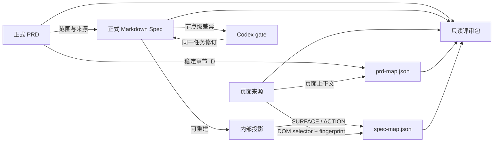
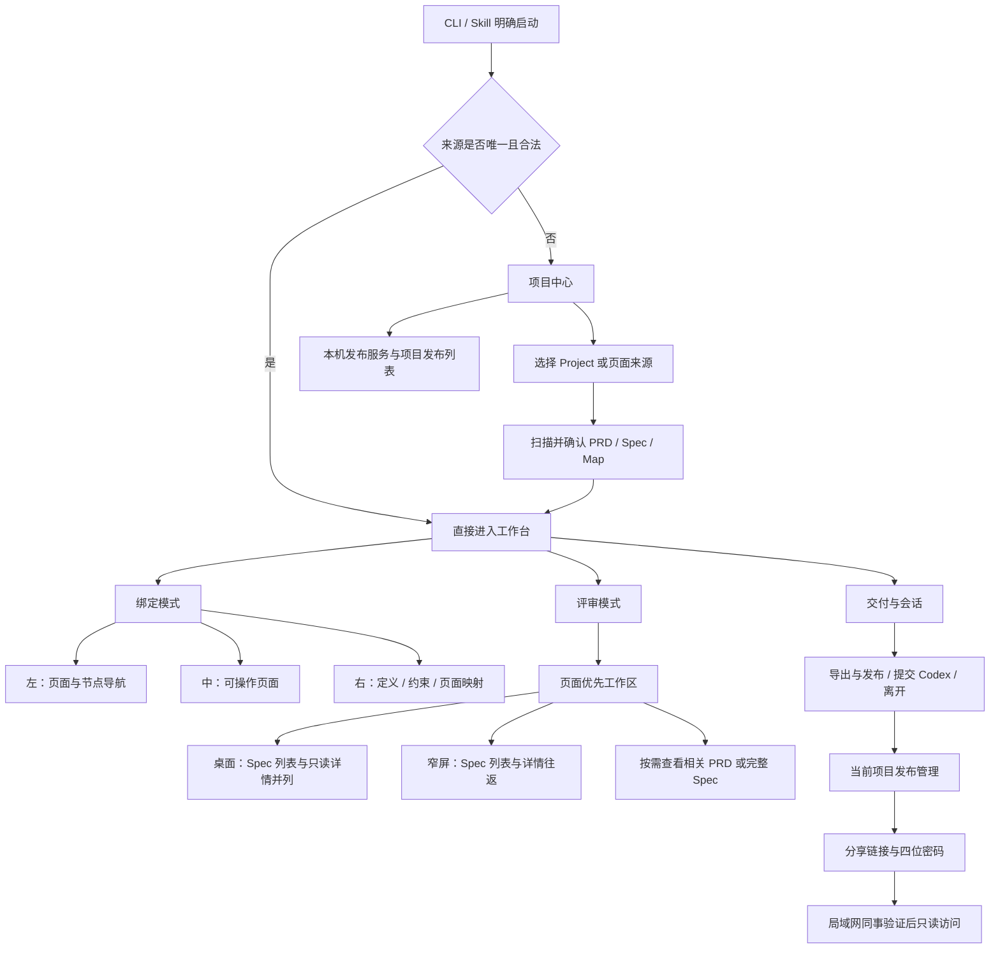

# Interactive Product Spec产品需求文档

<!-- prd-profile: 可映射PRD-v1 -->

> 文档状态：草稿
>
> 适用版本：v0.17
>
> 最近更新：2026-09-17
>
> 产品负责人：TBD

## 1. 产品概述

### 1.1 产品定位

Interactive Product Spec 是一个面向产品人员、研发人员和 Codex 的本地产品事实对齐工作台。它把 PRD、按页面完整承接需求的精简 Product Spec 与可操作页面放在同一个工作上下文中。研发从页面的 Action / Surface 及其直接关联说明即可理解展示、全部操作、条件、结果和例外，无需另读 PRD；用户仍可独立阅读 PRD、确认页面关系、修订 Spec，并把差异交回同一个 Codex 任务继续工作。

产品解决的核心问题不是“再生成一份文档”，而是降低产品事实在文档、页面、Agent 和研发之间反复翻译时的丢失与误解。正式文档继续保留各自权威，工作台通过稳定关系和 revision 把它们连接起来，不用复制正文建立第二套需求库。

当前产品是本地优先、Codex-first 的单人工作台。它不是项目管理、代码开发、测试管理或生产部署系统，也不提供账号、多人审批和公网协作。

### 1.2 目标用户

- **产品人员**：维护 PRD 与 Product Spec，希望在真实页面上核对产品含义、修订局部内容，并把修改继续交给 Agent。
- **研发人员**：需要从页面快速找到相关产品说明、规则和上下文，减少在多份文档间跳转和猜测。
- **评审者**：需要在不获得项目写权限和开发环境的情况下，持续回看页面、PRD、Spec 与已确认关系。
- **Codex 使用者**：希望让生成、图形人工修订和正式文档更新发生在同一个可见、可继续的任务闭环中。

这些角色描述工作职责，不代表系统已经实现账号或权限模型。

### 1.3 本期范围

本期包含：

- 从明确 Project、HTML 页面包或本地开发地址建立工作上下文；
- 识别并绑定合法 PRD、Markdown Product Spec、`prd-map.json` 与 `spec-map.json`；
- PRD 独立阅读、目录搜索、Mermaid 图查看和页面到章节绑定；
- 从 Markdown Spec 生成或复用工具侧内部投影，并保留来源 revision 和可见 Codex 任务；
- `SURFACE` / `ACTION` 的页面导航、自动候选、人工确认、重新关联、解除和漂移提示；
- 页面上下文中的 Spec 正文、非 DOM 约束阅读和节点级修订；
- 普通本地原文件写回与 Codex gate 草稿回流；
- 可移植的本地只读 ZIP 评审包；
- 多项目局域网只读发布：一个本机服务、各项目独立链接与四位密码、项目启停和快照更新（已实现，跨设备实机验收待完成）；
- 最近项目恢复、离开、切换来源和保存状态提示。
- Codex 完成用户要求的 HTML 创建或修订后，在同一任务核对 PRD 与统一 Spec 并完成必要修订，无需文档选择弹窗。
- PRD 发生语义变化并仍为草稿或评审中时，由原 Codex 任务打开批注工作台，接收多批意见、发布修订，并在用户明确确认后完成正式文档确认闭环。

本期不包含：

- 在仅浏览、绑定或评审时自动改写 PRD，或自动批准 PRD / Product Spec；
- 从 DOM 反推完整业务规则，或无需人工确认的持久映射；
- 任务管理、研发排期、代码托管、测试管理、生产部署与线上指标；
- 账号、团队空间、多人评论、权限矩阵或审批流；
- 远程生产系统接入、真实后端离线仿真或公网发布；
- Codex 之外的正式 Agent 支持承诺。

### 1.4 产品成功后的用户结果

- 产品人员能从一个明确入口看到本次工作的 PRD、Spec、页面和关系状态，并知道每项资料的权威边界。
- 用户能从页面定位相关 PRD 章节和 Spec 节点，以人工确认建立可持续复核的关系，而不是依赖截图坐标或一次性口头说明。
- 用户只修改需要变化的节点；外部文档已经变化时，产品拒绝覆盖并要求重新载入。
- Codex gate 中的图形修订能返回同一个等待任务，由 Codex 继续修订正式 Markdown Spec。
- 研发或评审者能收到一份冻结、只读、可本地打开的结果，并从 manifest 看见对应 revision。
- 产品人员可独立启停多个项目并保持链接和密码更新快照；局域网同事验证后只能访问被分享的项目，不能查看总览或写回来源。
- 页面或文档后续变化时，用户能区分关系仍有效、需要手动进入动态场景和真正需要复核三类情况。

## 2. 核心业务概念

### 2.1 业务对象

- **工作上下文**：本次工作绑定的 Project、页面来源、PRD、Spec 和两类 Map 的组合；它只连接来源，不拥有来源正文。
- **PRD**：给研发连续阅读的正式产品正文。每个可映射页面章节和全局规则使用稳定中文语义 ID。
- **Product Spec**：按实际页面完整承接适用需求的长期产品事实，包括普通操作和共享规则，保持精简且可独立支撑研发阅读。Markdown 是正式正文，工作台内部 JSON 只是可重建投影。
- **页面来源**：本地 HTML 页面包或受限本地开发地址，用于提供可见结构和交互证据。
- **PRD 页面关系**：页面/路由上下文到 PRD 稳定章节 ID 的人工关系，保存在与 PRD 同目录的 `prd-map.json`。
- **Spec 组件关系**：Spec 页面节点到页面上下文、CSS selector 与语义指纹的人工关系，保存在 `spec-map.json`。
- **内部投影**：从 Markdown Spec 派生、经契约校验、供工作台使用的结构化视图；用户不需要在项目中维护或冻结它。
- **评审会话**：一次工作台运行过程，包含工作模式、来源 revision、临时视图状态和可选 gate 草稿。
- **PRD 正式状态**：由正式产品文档拥有的 `草稿 / 评审中 / 已确认 / 已替代`；它与评审会话、批注批次分别记录。
- **只读评审包**：某一时点页面、文档、映射和 revision 的冻结 ZIP，不带写入或 Codex 能力。

- **项目发布**：归属一个本地 Project 的独立交付记录；一个项目只有一个当前发布版本，改名不改变发布身份。不同 HTML 入口属于同一项目时，更新同一发布前需展示将替换的来源。
- **本机发布服务**：管理多个项目只读快照的后台服务；服务运行状态与各项目发布意愿分别保存。资料原文仍由项目文件拥有，发布记录只拥有冻结副本、密码和可访问状态。

### 2.2 关键关系



PRD 与 Product Spec 是不同粒度的正式产品文档。`prd-map.json` 连接页面与 PRD 章节，`spec-map.json` 连接 Spec 页面节点与 DOM；两类关系不能合并。内部投影、自动候选、当前页面识别和视图偏好都是工具状态，不是正式产品事实。

### 2.3 关键术语

| 术语 | 本文含义 |
|---|---|
| 正式来源 | 当前 Project 中拥有产品正文或页面实现的文件，不含可重建投影和运行时缓存 |
| 稳定章节 ID | PRD 页面章节或全局规则标题下的隐藏中文语义 ID；标题和排序变化时保持不变 |
| 页面节点 | 可以直接落到 DOM 的 `SURFACE` 或 `ACTION` Spec 节点 |
| 非 DOM 约束 | 规则、状态、权限、事件、验收、外部依赖等不直接映射组件的 Spec 节点 |
| 候选 | 工作台根据页面和 Spec 语义计算的推荐位置；未经人确认不成为 Map |
| 语义指纹 | 确认映射时保存的目标语义特征，用于页面变化后的漂移检测 |
| gate | 由 Codex 启动的阻塞式图形修订会话；编辑先形成草稿，提交后返回原任务 |
| revision | 对当前来源内容计算的版本摘要，用于拒绝过期写入和标识评审快照 |
| 需手动进入 | 关系仍有效，但当前页面无法自动恢复动态场景；不等于需重新绑定 |
| 需复核 | selector 多命中、目标类型不兼容或语义指纹变化，关系可能已失效 |

## 3. 产品整体结构

### 3.1 功能结构

| 业务功能域 | 主要职责 | 主要用户 | 与其他功能域的关系 |
|---|---|---|---|
| 工作上下文与来源接入 | 建立、校验和恢复本次 Project 与资料组合 | 产品人员、Codex 使用者 | 为所有阅读、映射、修订和导出能力提供来源边界 |
| PRD 阅读与页面关系 | 阅读正式 PRD，并维护页面到稳定章节的关系 | 产品人员、研发、评审者 | 可独立工作，也可与 Spec 工作台并行出现 |
| Spec 准备与 Agent 投影 | 从正式 Markdown 形成可用工作台视图 | 产品人员、Codex 使用者 | 为 Spec 导航、映射和编辑提供结构化输入 |
| 页面与组件映射 | 把页面节点与真实 DOM 对齐并持续校验 | 产品人员 | 消费页面和投影，产出 Spec Map |
| Spec 阅读与修订 | 在页面上下文阅读正文、约束并修改节点 | 产品人员、研发 | 根据会话模式写回正式来源或形成 gate 草稿 |
| Codex 协作回流 | 把可见投影过程和图形差异连接到 Codex 任务 | Codex 使用者 | 连接 Spec 准备、gate 修订和后续 Agent 工作 |
| 评审与交付 | 提供只读工作模式、可移植冻结包和多项目局域网发布 | 研发、评审者 | 消费当前页面、文档、Map 与 revision |

### 3.2 主要入口与导航关系



用户通常从当前 Project 直接启动。来源唯一且合法时直接进入工作台；存在歧义、缺失或用户需要切换时进入项目中心。工作台保留绑定模式与评审模式，二者共享页面、PRD、Spec 和保存状态，不建立平行产品。

### 3.3 共用页面或区域

| 页面或区域 | 主要职责 | 被哪些功能使用 |
|---|---|---|
| 项目中心 | 选择来源、扫描资料、恢复最近项目、准备投影并确认进入；管理本机服务与项目发布列表 | 工作上下文、Spec 准备、会话恢复 |
| 工作台顶部 | 切换模式，打开相关 PRD 与完整 Spec，导出、提交 Codex、离开并显示保存状态 | PRD、映射、修订、评审、交付 |
| 页面画布 | 运行页面、导航场景、缩放平移、显示候选和已确认标记 | PRD 页面关系、Spec 映射、评审 |
| Spec 页面树或查找列表 | 按页面与子页面组织节点；绑定模式承担映射任务，评审模式承担只读查找 | 页面映射、Spec 阅读 |
| Spec 详情区 | 绑定模式阅读定义、约束和映射并可编辑；评审模式只读定义与约束 | Spec 阅读、映射、修订、评审 |
| PRD 阅读器 | 完整正文、目录、搜索、相关章节、Mermaid 缩放和页面关系 | PRD 阅读、评审 |

## 4. 详细功能说明

### 4.1 工作上下文与来源接入

该功能域负责把当前任务绑定到明确的 Project、页面来源和产品资料，并在后续重新进入时恢复同一上下文。它只做来源选择与合法性校验，不替用户决定哪份候选是正式产品事实。

#### 4.1.1 项目中心与来源确认
<!-- prd-section-id: 需求-工作上下文-项目中心与来源确认 -->

##### 功能说明

项目中心在来源不唯一、存在缺失或用户主动切换时出现。它帮助用户逐步确认 Project 或单个页面来源、PRD、Markdown Spec、两类 Map 和工作模式，并在所有必需来源可用后进入原工作台。

##### 入口与页面

- 用户运行 CLI、从 Skill 启动或在工作台点击“离开”后进入。
- 页面首先显示最近项目与当前启动上下文，再提供 Project、HTML 页面包或本地开发地址的选择。
- 来源扫描结果按 PRD、Spec、页面和 Map 分组，分别显示推荐项、合法性和缺失处理。
- Codex gate 启动时保留本次明确来源，不允许最近项目覆盖启动上下文。

##### 用户操作与产品结果

1. 用户选择 Project 目录、单个 HTML 页面包或本地开发地址。
2. 用户明确点击扫描，产品只在当前范围内列出候选并推荐可用来源。
3. 用户确认 PRD、可选 Markdown Spec 和两类 Map；需要创建 `prd-map.json` 时必须明确确认写入位置。
4. 如果 PRD 格式不合格，用户可明确选择模型和推理强度，创建可见 Codex 对话生成 `drafts-documents/` 下的标准化草稿；草稿通过格式校验后自动成为当前 PRD 候选，用户继续阅读和确认页面映射边界。
5. 如果 Markdown Spec 缺少内部投影，用户在同一步恢复或创建可见 Codex 投影任务。
6. 所有当前任务必需来源就绪后，用户确认进入工作台；产品保存最近项目记录并直接打开绑定或评审模式。

##### 必要规则

- 扫描候选不代表自动绑定，任何文件都不能仅因名称或路径相似被当作正式来源。
- 合法 PRD 可在没有 Spec 时进入；选择了 Markdown Spec 但投影未准备完成时不得降级进入空 Spec 工作台。
- 格式不合格的 PRD 保持原样，产品显示具体错误并失败关闭绑定。只有用户明确点击后才创建可见 Codex 草稿任务；任务只写预定 Draft 路径，不能覆盖原 PRD、创建 `prd-map.json` 或修改其他产品制品。
- Codex 任务完成不等于 PRD 内容已确认；服务端必须确认原 PRD revision 未变化，并用同一格式合同重新校验草稿，校验通过后才切换当前来源。
- 最近项目最多保留 20 个。移除记录必须二次确认，并明确哪些工具侧 Map 会被删除；项目文档、HTML 和内部投影不在删除范围内。
- 项目中心不要求用户选择或维护 `product.spec.json`；兼容夹具不作为正常产品入口。

#### 4.1.2 最近项目恢复与离开
<!-- prd-section-id: 需求-工作上下文-最近项目恢复与离开 -->

##### 功能说明

该区域让用户恢复已保存的工作上下文，或在不丢失待保存关系的前提下离开当前工作台。它避免用户每次重复扫描，也避免“离开”直接清空当前来源。

##### 入口与页面

- 项目中心首页显示最近使用的项目；工作台顶部“交付与会话”提供离开入口。
- 离开前的状态区显示当前 PRD、Spec、两类 Map、保存状态和 gate 草稿提示。
- 用户可继续当前绑定，或明确选择“切换项目或文件”。

##### 用户操作与产品结果

1. 用户选择最近项目，产品先在服务端重新校验已保存的路径、页面来源和资料。
2. 校验成功时直接恢复工作台；失效时进入来源确认并保留可理解的缺口提示。
3. 用户点击离开时，产品先保存等待中的 Spec Map；gate 有未提交草稿时说明离开后果。
4. 用户确认继续或切换；只有切换才返回项目中心并清除当前活动上下文。

##### 必要规则

- 最近记录是工具侧便捷配置，不是正式项目清单，也不能替代当前文件校验。
- 恢复入口不接受客户端借旧项目 ID 更换路径或扩大扫描范围。
- 收起导航、切换模式或打开 PRD 不等于离开，不应清空选择和页面上下文。
- 未提交 gate 草稿在离开前必须明确提示，不能静默丢弃。

#### 4.1.3 工作台启动状态与实例管理
<!-- prd-section-id: 需求-项目中心-工作台运行管理 -->

##### 目标与范围

让用户明确知道工作台是否已可用，并管理不同任务启动的实例，无需理解服务器或端口。编辑工作台与局域网发布服务分别管理。

##### 入口与前置条件

提供本机“打开工作台”双击入口：发现普通可用实例时直接打开，没有时后台启动并检查；检查失败明确提示排查信息，不把已执行命令当成成功。原项目中心及工作台顶部持续显示状态，点击进入同一“工作台运行管理”面板。

```text
原项目中心 / 原工作台                       [● 工作台 · 已就绪]
  → 工作台运行管理
    项目名（当前）  已就绪 / 等待来源确认 / 已断开 / 已关闭
    普通工作台 / Codex 提交会话 / PRD 批注会话
    [打开] [关闭工作台]      失效记录：[移除失效记录]
```

##### 正常流程与结果

1. 启动时检查服务身份与工作台页面；来源已载入显示“已就绪”，仍需选择来源显示“等待来源确认”，失败说明原因。普通工作台仅在来源、模式及显式页面路由一致时复用已有实例；其中任一不同均保持独立。Codex 提交和 PRD 批注会话有各自接收任务，单独标识并保留，不把多个任务的提交混在一起。
2. 页面持续检查连接，服务停止后显示“已断开”；用户明确关闭当前实例后显示“已关闭”。用户可刷新检查、查看并打开其他实例。
3. 关闭前说明目标项目及影响。产品暂停目标实例标签页操作并核对未保存状态；有未保存修改、未提交 Spec 草稿、文档生成/加载中、未结束 PRD 评审，或其他标签页未响应时阻止关闭，说明应先完成什么。关闭被明确拒绝或取消后恢复操作并保留内容；通信中断时维持关闭保护，直到核实结果，不提供强制丢弃。
4. 全部检查通过后只关闭选中实例。空闲 Codex 提交会话同时取消等待；在线发布、其他工作台、已保存文件和最近项目记录保留。
5. 失效实例可移除登记记录，不终止其他进程。旧版本未登记的实例不冒充已纳管，须重新启动新版后加入列表。

##### 业务规则与约束

启动检查与连接状态来自实际响应，不凭历史记录或打开的标签页数量推断。关闭浏览器标签不等于关闭后台；通过统一入口启动的普通工作台独立运行，主动关闭从管理面板进行。未保存状态核对失败时保守阻止关闭。保留原扫描、来源确认、最近项目、文档阅读、编辑、映射、评审、离开、ZIP 和发布路径；冻结查看器不提供实例管理。

### 4.2 PRD 阅读与页面关系

该功能域让 PRD 在没有 Spec 时也能独立进入页面工作台，并在存在 Spec 时作为原工作台的增量阅读能力。工作台只维护页面到章节的关系，不借绑定动作修改 PRD 正文。

#### 4.2.1 相关 PRD 阅读器
<!-- prd-section-id: 需求-产品文档-相关PRD阅读器 -->

##### 功能说明

相关 PRD 阅读器按工作上下文提供不同范围：普通绑定模式提供完整 Markdown 正文与全部可绑定章节；普通评审模式默认提供当前页面已经绑定的完整章节内容，关闭“仅看当前页面关联内容”后可阅读全文。由原 Codex 任务明确发起 PRD 批注时，通过原可拖宽抽屉显示完整文档，不要求已有 Spec 或页面关系。各路径保留目录、搜索和版本状态。

##### 入口与页面

- 工作台顶部始终显示“相关 PRD（数量）”；当前项目没有 PRD 时不显示虚假入口。
- 阅读器以可调整宽度的侧边抽屉打开；绑定模式显示完整正文与全部章节，评审模式默认只显示当前页面已绑定章节，关闭“仅看当前页面关联内容”后目录和正文显示全文。
- Mermaid 图以内联 SVG 渲染，可打开大图、缩放、平移和导出。
- 关闭阅读器后返回原工作台，不改变当前页面、Spec 选择或映射模式。
- PRD 批注会话直接在原工作台展开可拖宽抽屉；选区旁提供评价浮窗，正文下方汇总已添加的原文与评价，支持预览、编辑和移除。可收起 PRD 查看页面，再从原 PRD 入口展开，画布底部的尺寸、缩放和拖拽控制保持可用。

##### 用户操作与产品结果

1. 用户打开相关 PRD，先看见文档标题、版本、状态；评审模式直接进入当前页面已绑定章节，绑定模式进入完整文档。
2. 用户通过目录或搜索定位内容，阅读器滚动到对应标题并高亮当前搜索结果。
   正文滚动时，左侧目录同步高亮当前所属功能章节；进入该章节的下级内容仍保持所属章节高亮，跨章节后随之切换。当前目录项不在可视区时，仅滚动左侧目录使其可见，不反向改变正文位置。文档概述等未列入左侧目录的内容不误亮其他功能；目录高亮不改变页面关联选择。关闭再打开、加载新版及图文高度变化后，按当前正文位置重新定位。
3. 用户打开复杂 Mermaid 图，在不离开正文的情况下缩放查看或导出图片。
4. 用户关闭阅读器，原页面和工作台状态保持不变。
5. 在原任务发起的 PRD 批注会话中，用户选中文字后，在选区旁的浮窗填写评论、替换或删除意见，通过“添加”或 Enter 收入底部待发列表，继续选择下一处。换选区时已写评价保留为独立待发项，不与下一处混用。Esc、点击别处或收起抽屉后，未完成评价仍可继续填写；同地址同标签页刷新后保留。底部可预览原文与评价、编辑或移除待发项，也可补充全文说明。正文只高亮实际选中的文字，不扩展为整段；引文预览也只展示选中文字。鼠标悬停在该选区上显示对应备注，编辑备注后同步更新；同段有相同文字时区分实际选中的位置。刷新和发送后，在同一正文版本中保留回显；版本不一致或旧批注无法唯一定位时不猜测高亮位置，原意见仍可从草稿或队列预览。
6. 用户完成或取消尚未添加的评价后，可预览整批内容，通过发送按钮或底部输入框的 ⌘ / Ctrl + Enter 加入队列；底部 Enter 换行。浮窗“添加”不发送，无需另行保存；发送失败保留草稿。发送成功后，用户立即可以编写下一批，不必等待上一批修订完成。
7. 队列显示每批意见及状态。等待中的批次可撤回编辑；已有新草稿时，撤回内容保留在历史，不覆盖新草稿。原任务领取后的批次只能停止，不能撤回；页面先显示正在请求停止，收到确认后才显示已停止，不回滚已经写入的内容。断线时请求仍保留，需要立即中断时用户在 Codex 中停止任务。
8. 新版发布后，同一阅读器展示新版全文、上轮变化区段及修订说明。已发送的等待批次继续按发送顺序交给原任务，无需因前一批发布而逐批重新发送。原任务保留每批原始引文和意见，对照当前新版处理；已被前批满足的意见说明无需再改，无法判定的冲突先向用户核对，不按旧行号覆盖新版。未发送草稿仍需核对后适配新版，冲突引用需重新选择。
9. 用户可以选择“结束评审”或“确认当前版本”。两者都要求先提交或删除未发草稿，处理或撤回等待/待核对批次，并完成或确认停止进行中的批次。
10. “结束评审”只关闭本次协作，用户仍可查看正文和差异，PRD 保持原正式状态。“确认当前版本”把当前 revision 返回原 Codex 任务；原任务使用产品文档流程更新或冻结正式文件并重新验证，工作台读取到 `已确认` 状态、相同产品和匹配 revision 后才显示确认完成。浏览器不直接改写或移动 PRD。

##### 必要规则

- 阅读器只接受符合 `可映射PRD-v1` 的正式或草稿文档；可打开不代表内容已确认。
- 搜索、目录位置、抽屉宽度和 Mermaid 缩放属于视图状态，不写入 PRD 或 Map。
- Markdown 中的图片和链接按本地安全边界读取；工作台不得越过当前 Project 或评审包范围访问文件。
- 当前页面相关章节来自 `prd-map.json`；普通评审模式开启范围开关且没有关系时显示“当前页面未绑定 PRD 内容”，并提示关闭开关可阅读全文；全文展示不代表已绑定。明确的 PRD 批注会话阅读全文，但不得把全文说成已建立页面关联。
- 绑定模式仍允许阅读全文、搜索全部章节并增删当前页面关系；模式切换不改写 PRD 或 Map。
- PRD 批注只在用户选择 PRD 且文档流程准备好草稿后明确开启，不由任务停止触发。批注绑定原版引文；载入外部版本或接收新版不清空未提交草稿，核对前不允许旧版未发送草稿直接发送。外部改动或旧协议中缺少领取证据的批次仍需人工核对；本会话正常发布不因此阻断已发送队列。
- 批注会话默认只修订 PRD，不连带修改 HTML 或 Spec。原任务断开时保留已提交意见，回到原任务恢复；等待超时不得被视为评审完成。未发送草稿暂存当前标签页；存储不可用时明确提醒，更换工作台地址不保证恢复草稿。
- 连接提示不得把近期活动、工具等待或批次领取当成 Codex 当前仍在运行。页面显示接收等待情况；连接请求失败清除旧状态。当前实现不能在对话结束后自动唤起原任务，须在发送区明确展示该限制，发送成功仅代表意见进入本机队列。用户要求的“对话结束后直接发送并启动原任务”仍为未完成需求，不以这项提示修正视为已实现。
- 新可写评审只接受状态以“草稿”或“评审中”开头的 PRD；“已确认”或“已替代”版本需要先按产品文档流程形成新草稿。格式通过、revision 变化、批次发布、会话结束和 HTML 上报都不能替代用户确认。

#### 4.2.2 页面到 PRD 章节绑定
<!-- prd-section-id: 需求-产品文档-页面章节绑定 -->

##### 功能说明

产品人员可以把当前页面或路由上下文与一个或多个稳定 PRD 章节关联，使后续用户从页面直接找到完整产品说明。绑定粒度是页面或关键交互区域章节，不是任意段落或单个控件。

##### 入口与页面

- 在可编辑绑定模式打开相关 PRD 后，阅读器显示当前页面的已关联章节与可绑定章节。
- 页面关系保存提示明确说明只更新同目录 `prd-map.json`，不修改 PRD 正文。
- 只读评审模式和评审包只展示现有关系，不提供绑定动作。

##### 用户操作与产品结果

1. 用户在页面中进入需要说明的页面或路由上下文。
2. 用户打开 PRD，选择与当前页面相关的一个或多个稳定章节。
3. 用户明确保存，产品在 revision 一致时原子更新 `prd-map.json`。
4. 再次进入该页面时，评审模式按当前阅读范围展示，默认只显示已绑定章节；返回绑定模式后仍可浏览全文并继续调整关系。

##### 必要规则

- `prd-map.json` 必须与 PRD 位于同一目录并随 PRD 同组冻结。
- Map 只保存页面上下文和章节 ID，不复制章节标题或正文作为第二事实源。
- PRD 标题、顺序或正文变化但 ID 保持时关系继续有效；ID 删除、重复或 PRD revision 变化时提示复核。
- 页面绑定、结构校验和导出均不能把 PRD 从草稿自动升级为已确认。

#### 4.2.3 本地文档更新
<!-- prd-section-id: 需求-产品文档-本地文档更新 -->

##### 功能说明

普通工作台自动发现所选本地 PRD、Markdown Spec 或兼容 JSON 视图的变化，用户在原页面加载新版，不再长期阅读旧快照。

##### 入口与页面

工作台顶部下方显示更新提示和“加载新版”；PRD 抽屉打开时，同一提示显示在抽屉内。读取失败显示原因及“重试加载”。原有模式、相关 PRD、映射、导出与离开入口保留。

```text
原顶部：产品与版本 | 模式 | 相关 PRD | 导出 | 离开 | 保存状态
更新条：PRD / Spec 已更新 · 当前仍为旧版             [加载新版]
原工作区：Spec 列表 | 页面画布 | 操作定义；PRD 抽屉保持原位
```

##### 用户操作与产品结果

1. 工作台打开期间自动检查已选文件；检测到变化仅提示，不打断阅读或替换编辑内容。
2. 用户点击“加载新版”，校验后一起替换本批文档快照。保留当前工作模式、搜索、仍存在的节点选择、抽屉、滚动位置和画布运行状态；节点被删除时明确提示并清除该选择。
3. 正在编辑节点、调整未保存的 PRD 页面关系、拖拽或保存映射时，先完成或取消当前操作再加载；Codex gate 中已有修订草稿时保留草稿并提示先处理。
4. 文件删除、内容不完整、格式错误或读取过程中再次变化时保留旧版及当前操作，明确旧版状态；文件修复后可以重试。新版引用了已删除节点时保留原文并提示失效引用；人工 Map 原件不因更新而重建或清空。

##### 必要规则

- 变化按文件内容判断，不依赖人工修改版本号；只读取当前已选来源，不扫描整个目录、不触发模型生成、不写 PRD 或 Spec。
- PRD 批注会话继续由原发布与本地重读机制管理；冻结的离线评审包保持冻结，不轮询本机来源。
- 标准节点 Markdown 可直接更新视图；无法确定结构的旧格式明确提示回项目来源重新生成视图，不猜测产品语义。更新成功不等于产品确认。

### 4.3 Spec 准备与 Agent 投影

该功能域把正式 Markdown Product Spec 转换成工作台可消费的内部视图。它既支持由当前 Skill 连续完成，也支持用户从项目中心创建可见 Codex 投影任务；两种入口必须遵守同一正式来源和 revision 边界。

#### 4.3.1 Markdown Spec 投影准备
<!-- prd-section-id: 需求-产品Spec-Markdown投影准备 -->

##### 功能说明

用户选择 Markdown Spec 后，产品生成或复用与当前来源 revision 一致的内部投影。投影任务在 Codex 中可见、可打开和可继续，工作台显示模型、推理强度、任务状态和结果。

##### 入口与页面

- 在 `$product-documentation` 的 Spec 编写流程中，由同一任务生成或修订正式 Spec；需要工作台时派生内部投影，用户请求映射且已有可用页面时再继续映射。
- 独立项目中心中，缺少投影时在 Spec 来源步骤创建可见 Codex 任务。
- 页面显示排队、运行、完成、失败或取消状态，以及可用的 Codex 任务信息。

##### 用户操作与产品结果

1. 用户选择已有 Spec，或由 Skill 依据 PRD 与明确产品决定生成或修订当前范围的 Markdown Spec，无需先有 HTML。生成时同时判断架构需要，必要工程决定写入同一正文，已有充分约束直接复用；本批 Spec 足以执行后再进入已授权实现。有实际页面时双向核对普通操作、弹层和状态分支，共用规则直接关联；页面未承载的要求和无来源行为明确标出缺口。
2. 产品固定来源 revision、可选页面证据、模型和推理强度，检查是否已有一致投影。
3. 一致时直接复用；不一致时创建可见 Codex 任务并显示进度。
4. Codex 返回结构化结果后，产品完成结构、跨引用及标准 Markdown 节点留存校验，再把内部投影绑定到当前工作上下文；节点遗漏、类型被改变或凭空新增时提示失败，不覆盖上次有效结果。
5. 投影成功后用户进入工作台；失败时保留任务入口和错误，可重新生成。

##### 必要规则

- Markdown 是唯一正式 Spec；内部投影保存在工具侧，可重建、可失效，不进入项目交付和确认生命周期。
- 投影必须绑定明确来源 revision；来源变化后不得复用旧结果。
- 缓存复用同样检查标准节点留存；历史补充型 Spec 可继续映射，不因打开或评审而自动增补需求、重置 ID 或人工关联。
- Spec 正文及直接关联说明完整承接本次适用要求，不能只放 PRD 引用；节点数量和引用数量不证明语义完整。
- 生成结构通过只表示可被工作台消费，不表示 Product Spec 内容已确认。
- 当前 Skill 已有 Codex 任务时不要求用户再从项目中心创建第二条任务。
- 服务重启导致任务中断时，产品必须显示失败与恢复方式，不能长期保持“运行中”。

### 4.4 页面与组件映射

该功能域把 Spec 中能直接对应页面的 `SURFACE` / `ACTION` 节点与真实 DOM 对齐。页面树负责导航和任务组织，自动候选负责降低人工成本，人仍拥有最终确认。

#### 4.4.1 页面树、候选定位与人工确认
<!-- prd-section-id: 需求-页面映射-页面树与候选确认 -->

##### 功能说明

用户在稳定的“页面 → 子页面 → 节点”树中选择页面节点，工作台识别当前页面、计算 DOM 候选并把目标滚动到可视区域。唯一且高置信候选可以按当前页面批量确认，歧义、冲突和缺失项逐项处理。

##### 入口与页面

- 绑定模式左侧常驻页面树，中间为可操作页面，右侧“页面映射”显示候选、确认、重新关联和解除动作。
- 模块只作为筛选、标签和约束归属，不进入页面树层级。
- 画布底部工具条上方的独立悬浮按钮提供“一键绑定 · N 项”，N 为当前页面高关联、目标唯一且无冲突的未绑定项数量；无可绑定项或正在编辑、拖拽、保存时禁用，评审与只读模式不显示。
- 画布支持滚轮/触控板平移、Ctrl/⌘ 加滚轮缩放、空格拖动和桌面/平板/手机预设。


##### 用户操作与产品结果

1. 用户选择页面时按明确地址打开该页，不以页内组件绑定成功为前提；选择节点时优先恢复有效人工关联，没有关联时先进入所属页面，再定位其中的区域或控件。
2. 用户切换到另一个节点时，工作台按当前映射状态选择详情入口：`confirmed` 和 `out-of-context` 默认打开“操作定义”，待映射或 `invalid / ambiguous / drifted` 默认打开“页面映射”。重复点击当前节点保留用户手动选择的详情标签。
3. 目标页面内存在语义候选时，工作台将候选滚动到中央并高亮；组件缺失时保留已打开页面并提示尚未找到位置。没有明确地址时只辅助当前页面，不遍历页面控件。导航与定位不写 Map，也不在结果返回后再次切换详情标签。
4. 用户检查页面位置，可确认单项，也可点击悬浮“一键绑定”，按当前页面批量确认唯一高置信项。点击时重新检查当前页面和候选，一次加入本批关联并自动保存；反馈绑定数量及保存中状态，失败沿用保存错误与重试入口，不虚报已落盘。已有绑定不覆盖，低关联、歧义及与已有目标冲突项跳过；不自动遍历其他页面或执行页面业务动作。
5. 无可靠候选时，用户选择“在页面上选择位置”或拖拽节点到合法目标。
6. 产品保存页面上下文、selector、语义指纹和确认时间到 `spec-map.json`，页面树更新映射状态，并回到“操作定义”。

##### 必要规则

- 只有 `SURFACE` / `ACTION` 进入页面树和映射完成率；非 DOM 节点不显示为待映射。
- 自动候选、点击定位和路由跳转都不能静默写入 Map。
- 操作节点只能绑定有明确交互语义的控件；区域节点只能绑定有语义的容器。
- 多个节点竞争同一 selector 时不允许批量确认，必须人工处理。
- 一个页面控件允许保留多个已确认 Spec 关联：同一真实控件只显示一个原样式悬浮标记，多于一个时右上角显示数量；点击后列出全部关联的名称与 ID，选择进入操作定义。单关联保持直接打开；不因重复关联自动删除或合并 Spec。
- 中间页面内自由浏览不反向改变左侧选中节点；用户可以先保留节点，再进入正确动态场景完成绑定。
- 点击页面中的已关联 Spec 标记始终打开“操作定义”；拖拽节点或主动选择“页面映射”始终进入映射处理，不受默认分流影响。

#### 4.4.2 映射状态、动态场景与重新关联
<!-- prd-section-id: 需求-页面映射-映射状态与重新关联 -->

##### 功能说明

工作台在每次载入页面时根据当前 DOM 校验人工关系，并区分仍然有效、当前场景暂不可见和真正漂移。用户可以重新关联或解除关系，但运行时状态不能污染正式 Map。

##### 入口与页面

- 页面树显示“全部 / 待映射”，只有存在 `invalid / ambiguous / drifted` 时显示“需复核（数量）”。
- 详情区显示当前关系、页面上下文、自动导航能力和重新关联入口。
- 详情标题区在两个标签中持续显示当前映射状态，用户无需进入“页面映射”才能判断节点是否需要处理。
- 页面标记是可聚焦按钮；悬停或键盘聚焦时放大并显示“查看 Spec”。

##### 用户操作与产品结果

1. 用户打开已有映射的节点，工作台先尝试保存地址或明确路由，再校验当前 DOM。
2. 目标唯一且语义一致时显示已关联并高亮。
3. 地址无法恢复动态场景时显示“已关联 · 需手动进入”；用户自然进入场景后自动恢复定位。
4. selector 多命中、类型不兼容或语义指纹变化时进入需复核；用户重新关联后覆盖旧关系。
5. 用户解除映射时仅删除该关系，不删除 Spec 节点或页面内容。

##### 必要规则

- 页面地址是尽力导航提示，不是关系成立的前提；当前目标不可见不等于映射失效。
- `invalid / ambiguous / drifted / out-of-context` 是当前会话派生状态，正式 Map 保存时统一保留人工确认事实。
- `out-of-context` 不进入需复核数量；它表示当前没有处在足以校验关系的页面上下文。
- 工作台不保存点击轨迹、像素坐标、页面内存或业务对象快照，也不执行被绑定目标本身的动作。
- 读取旧 Map 时可以在内存中规范状态，但只有用户正常保存才更新磁盘文件。

### 4.5 Spec 阅读与修订

该功能域让用户在页面上下文中阅读页面节点正文和关联约束，并以最小修改范围更新正式 Spec 或 gate 草稿。页面映射和产品语义编辑共享当前节点，但各自保持独立责任。

#### 4.5.1 操作定义与来源阅读
<!-- prd-section-id: 需求-产品Spec-操作定义与关联约束 -->

##### 功能说明

用户可阅读选中节点的操作定义，或独立打开完整 Spec。节点定义连续呈现本操作及明确关联的适用规则，包含条件、结果、异常和恢复。来源入口点击后定位对应文本并高亮，可隐藏高亮；不要求研发切换到另一标签补齐行为。

##### 入口与页面

- 绑定模式右侧包含“操作定义｜页面映射”两个标签。
- 适用规则正文在操作定义下连续显示，保留原有字段、条件、例外与待确认项；来源区域提供定位入口：PRD 打开宽幅文档阅读区并定位对应章节，公共规则定位已有条款，不重复展开正文。
- 评审模式通过查找 Spec 或页面标记打开只读详情，只包含“操作定义”，不展示“页面映射”和编辑入口。
- 桌面宽度下，从 Spec 查找列表选择节点后列表保持打开，右侧详情随选择更新；窄屏下详情临时替代列表，并提供“返回 Spec 列表”。
- 绑定、评审和 gate 会话均从顶部“评审资料 → 完整 Spec”进入，无需先选节点；未提供 Markdown 来源时禁用并说明原因，不从投影拼造全文。


##### 用户操作与产品结果

完整 Spec 阅读：用户点击顶部入口，打开已载入 Markdown 全文，按章节定位公共说明、节点与工程定义；关闭后保留原页面、节点及未保存编辑。

节点阅读：

1. 用户从页面树、搜索或页面标记选择节点。
2. 产品显示节点正文和结构化元信息；“页面匹配提示”只在完整编辑中维护，不混入正常阅读。页面及规则引用显示对应中文名称，稳定标识保留用于追溯；无法解析的引用保留原文，不猜测名称。正文按 Markdown 呈现标题、列表、表格、引用、代码、图片及已有图形格式。
3. 用户在操作定义中阅读明确关联规则的正文；仅同模块而未声明适用的规则不混入当前操作，也不依据标题或模块自动增删关联。
4. 用户点击 PRD 来源进入文档阅读区并定位高亮对应章节，点击公共规则定位当前操作中已有条款；均提供“隐藏高亮”，切换节点清除旧规则高亮。绑定模式可切换页面映射，评审模式保持只读。来源缺失时明确提示，不以其他章节替代。

##### 必要规则

- 节点概括性定义、各内容块及适用规则正文含表格、列表、标题、引用、代码块或图片时提供“放大查看”；纯文本及仅行内强调、行内代码不提供该入口。弹窗显示完整只读内容，宽表格和代码可滚动；点击关闭、遮罩或按 Esc 返回原节点及阅读位置。放大不触发编辑或保存，逐字段编辑继续显示 Markdown 原文。图片与图形沿用已有阅读能力及资源缺失提示。
- 阅读布局：操作定义〔中文字段名／Markdown 正文／适用时的放大入口／原编辑入口〕→ 放大弹窗〔标题与关闭／可滚动的完整内容〕。
- 规则只定义一处，操作阅读时引用已有正文；不截断异常、不由程序生成摘要或补造适用结论。同一规则内完全重复的正文只显示一次，不跨规则省略条件，来源仍保留。阅读不修改 PRD、Spec、人工 Map 或确认状态。
- 所有非 DOM 节点明确标记“无需页面映射”，不提供拖拽或定位入口。
- 页面标记点击只打开定义，不执行页面动作，也不改变正式关系。
- 评审模式中映射状态仅作上下文提示：正常“已关联”无需占用标签，未映射、需手动进入或异常状态仍可显示，但不出现候选、确认、重选或解除动作。
- 可以投影和展示只证明满足工作台协议，不代表内容通过产品治理或用户确认。
- 全文只读，沿现有“加载新版”更新；节点直接保存成功后全文同步，gate 草稿未写回时仍显示已载入原文并说明区别。导出的只读评审包保留同一全文快照与章节阅读。

#### 4.5.2 节点级编辑与保存
<!-- prd-section-id: 需求-产品Spec-节点级编辑与保存 -->

##### 功能说明

用户可以双击单个内容块进行原位编辑，也可以打开完整节点编辑标题、状态、来源、匹配提示和内容块结构。两种编辑共用节点级 revision 校验与写回链，不建立内容块副本。

##### 入口与页面

- 操作定义中的内容块支持双击原位编辑；完整节点编辑入口固定在详情底部悬浮操作区，不随正文滚动；正文预留空间，不遮挡末尾内容。顶部不再显示占位文件路径卡片，完整编辑中保留写入目标。切换节点后仅渲染当前节点正文和一个编辑入口。
- 编辑态明确显示保存、取消、当前写入目标和 revision 冲突错误。
- 普通会话显示“本地原文件编辑”，gate 会话显示“Codex 修订草稿”，评审模式不出现编辑入口。


##### 用户操作与产品结果

1. 用户双击一个内容块，修改后明确保存或取消；失焦不自动保存。
2. 需要调整多个字段时，用户打开完整节点编辑；两种编辑态互斥。
3. 产品校验一次只改变当前节点、修改后的 Spec 仍与 Map 一致，并检查当前 revision。
4. 普通会话原子写回 Markdown 并同步内部投影；gate 会话只更新当前会话草稿。
5. 保存成功后用户继续在原节点阅读；冲突或校验失败时保留编辑内容并给出恢复提示。

##### 必要规则

- 普通本地写回一次只允许修改一个节点；不得通过完整编辑批量改写其他节点。
- 外部 Markdown 或当前草稿 revision 已变化时返回冲突，不覆盖新内容。
- 单条编辑遇到状态、来源或概括性定义的现有结构化镜像时必须同步更新，避免投影分叉。
- `Escape` 取消，`Ctrl/⌘ + Enter` 保存；浏览器视图偏好不进入 Spec。
- 保存 Spec 不隐式确认映射、PRD 或产品版本。

### 4.6 Codex 协作回流

该功能域让 Codex 参与生成和修订过程，同时保持用户可见、来源可追溯和人工确认边界。Codex 是当前正式支持的首个 Agent，不等于产品已经成为通用 Agent 平台。

#### 4.6.1 Codex gate 修订与提交
<!-- prd-section-id: 需求-Agent协作-Codex门禁回流 -->

##### 功能说明

由 Codex 启动的 gate 会话把图形修改暂存在当前会话。用户完成页面核对后，点击“提交 Codex”，产品把来源 revision、节点差异和当前 Spec Map 返回同一个等待任务，由 Codex 决定如何修订正式 Markdown 并继续后续工作。

##### 入口与页面

- Codex 通过 Skill 或 CLI 的 gate 参数启动，工作台保留当前来源确认和原有绑定能力。
- 顶部“交付与会话”显示“提交 Codex”；普通本地会话不显示虚假提交入口。
- 节点编辑区明确标记草稿目标，离开时提示未提交差异会被放弃。

##### 用户操作与产品结果

1. Codex 以明确 Project、HTML、正式 Spec、内部投影和 Map 启动 gate。
2. 用户在同一工作台确认来源、映射页面并修改一个或多个节点草稿。
3. 用户点击提交；产品先保存等待中的 Map，再生成结构化差异和应用目标。
4. 等待中的同一 Codex 任务收到结果，核对来源 revision 后修订正式 Markdown Spec。
5. Codex 继续原任务中的实现、文档或其他后续工作；工作台不自行宣称正式文档已更新。

##### 必要规则

- gate 草稿只属于当前会话，不能在提交前直接写入正式 Markdown。
- 返回结果只允许指向 `source-spec-markdown-only`，内部投影和 Map 不能被当作产品正文修改目标。
- 提交给同一等待任务是产品闭环的一部分；无法回到原任务时必须明确失败，不能自动创建另一任务冒充连续性。
- 用户确认页面关系不等于同意所有节点正文；提交动作也不等于 Product Spec 已 Confirm。
- Codex 投影或修订过程对用户可见、可打开和可继续，默认不使用完全隐藏任务。

### 4.7 评审与交付

该功能域让研发和评审者在不获得项目写入能力的情况下阅读页面和产品资料，并把当前工作台状态冻结为可移植本地包。评审是阅读和核对，不新增通过/不通过状态。

#### PRD 生成后的评审选择
<!-- prd-section-id: 需求-产品文档-生成后评审选择 -->

##### 目标与范围
PRD 首次生成完成后，由用户决定现在开始评审或稍后处理。此选择不确认文档，也不授权生成 Spec。

##### 入口与前置条件
原 Codex 任务完成 PRD 格式检查后发起一次选择；已有明确“生成并评审”授权则直接进入，明确暂缓或直接生成 Spec 则遵从并保留真实确认状态。已有批注会话中的修订发布、纯排版或日期调整不重复询问。

##### 正常流程与结果
选择“开始评审”后才打开现有工作台，保留目录、搜索、选区评价、整批发送、修改预览、结束评审与确认当前版本。有 HTML 时保持原页面对照布局；无 HTML 时完整展开同一个 PRD 阅读器，不生成假页面或要求先做页面。

##### 展示与交互
选择框在原 Codex 任务中呈现，具体控件外观沿客户端。语义线框：
```text
PRD 已生成 · 文档名称 / 版本
是否现在开始评审？
可阅读正文、提交修改意见，评审后再确认当前版本。
[稍后评审] [开始评审]

无 HTML：同一工作台 [目录 | PRD 正文 | 批注及确认]
有 HTML：同一工作台 [原页面画布 | PRD 抽屉及批注]
```

##### 取消、返回与再次进入
“稍后评审”或关闭选择框均不打开工作台，文档保持未确认。原任务保留 PRD 文件链接和“在此任务回复开始评审”的继续入口，用户再次明确开始时直接进入，不再询问。同一文档版本重复上报或工具重连不重复弹窗；新版本由本轮实际生成任务判断是否需要发起新选择，不能根据文件变化自动触发。

##### 依赖失败与超时
客户端不支持选择框或选择请求失败时，在原任务显示同一问题并等待明确回答，不自动跳转或确认。开始评审时文件丢失、格式错误或工作台启动失败，说明具体原因并保留重试入口；修复后直接重试打开，不重新询问已作出的决定。

#### 4.7.1 评审模式
<!-- prd-section-id: 需求-评审交付-页面优先评审模式 -->

##### 功能说明

评审模式把功能页面作为唯一常驻工作区，Spec 总览默认以浮层展开，可以收起或关闭；只读详情、完整 Spec 和相关 PRD 按需打开。它服务于连续阅读与页面核对，不承担映射任务处理；用户能浏览页面、查看标记和产品说明，但不能写 Map、编辑 Spec 或提交 Codex。

##### 入口与页面

- 工作台标题旁提供“绑定模式 / 评审模式”切换；gate 会话不允许切到会弱化修订闭环的只读入口。
- 存在可映射 Spec 节点时，评审模式默认展开左侧 Spec 总览浮层；纯 PRD 会话不显示空总览。总览支持收起成“展开 Spec 总览”入口或关闭，顶部“查找 Spec”或 `⌘K` 可重新展开；总览内提供“阅读全文”；列表不显示“待映射 / 需复核”等映射任务筛选和完成数量。
- 评审总览的页面标题只负责展开或收起，重复点击不导航。悬停或键盘聚焦页面行时，右侧显示小型定位图标，点击后复用已有页面导航，不要求手动绑定，也不改变列表展开状态；触屏直接显示图标。独立定位替代原“联动页面”开关，节点选择与页面标记保持原有定位行为。PRD 范围开关继续在当前项目会话中保留，重新加载项目恢复默认开启。
- Spec 总览支持拖动右边缘调整宽度，最小 320px、最大 480px、默认 360px，收起再展开保留所选宽度；工作区不足最小宽度时优先适应可用空间。高度尽量铺满工作区，窄屏自动缩小并保留边距。顶部提供拖动手柄，收起后的入口同样可拖动；拖动位置限制在当前工作区内，收起再展开保留位置，窗口缩小后自动收回可见范围。手柄支持方向键微调，不影响列表滚动或节点点击；关闭后重新打开恢复初始位置。拖动及阅读状态不写入 PRD、Spec 或 Map。
- 桌面宽度下，列表位于页面左侧，选中节点后保持打开，右侧打开或更新只读详情；用户可连续选择多个节点对照页面。
- 窄屏下，选中节点后切换到详情，顶部提供“返回 Spec 列表”；返回时保留搜索词、页面展开状态和列表位置。
- 点击页面标记属于页面优先入口：关闭已经打开的查找列表，直接打开该节点的“操作定义”。

```text
桌面：┌─ Spec 查找列表 ─┐  ┌──── 功能页面 ────┐  ┌─ 操作定义 ─┐
      │ 连续选择节点    │  │ 浏览与标记       │  │ 只读，随选择更新       │
      └─────────────────┘  └───────────────────┘  └─────────────────────────┘

窄屏：Spec 查找列表 ──选择节点──> 只读详情 ──返回 Spec 列表──> 原查找位置
```

##### 用户操作与产品结果

1. 用户切换到评审模式，页面画布保持当前场景和缩放位置。
2. 用户在默认展开的 Spec 总览中选择节点；总览保持打开，点击页面圆点也不自动关闭或隐藏总览，可手动收起或关闭。
3. 产品只展示完整操作定义。选择节点时可恢复有效人工关联；没有关联或原关联无法恢复时，有明确地址则先打开所属页面，再辅助高亮可靠位置。目标缺失时保留定义与当前页面，不进入映射处理。
4. 用户从页面标记打开 Spec 时，查找列表收起，详情直接显示操作定义。
5. 用户打开相关 PRD，默认开启“仅看当前页面关联内容”，没有绑定时看见明确空状态；关闭开关后目录和正文展示完整 PRD，再开启恢复当前页关联范围。
6. 用户关闭按需区域继续操作页面，或切回绑定模式处理关系。

##### 必要规则

- 模式切换不创建新项目、路由或事实源，也不丢失当前页面和选择。
- 评审模式不展示“页面映射”标签、映射任务筛选和正常映射完成数量，也不提供候选确认、映射写入、Spec 编辑、通过/不通过或逐项打勾。
- 已有关联节点可恢复并高亮页面位置；没有关联时的定位预览不代表关系已确认。关系异常时保留原关联并展示被动状态，不以自动候选替换人工关系。
- 页面操作只影响被评审页面的当前运行状态，不反向改写 Spec 页面归组。
- 只读状态必须由服务端能力和接口共同保证，不能只隐藏按钮。

#### 4.7.2 可移植只读评审包
<!-- prd-section-id: 需求-评审交付-可移植只读评审包 -->

##### 功能说明

用户可以从现有工作台导出 ZIP，冻结当前 HTML 页面包、工作台静态资源、PRD、Spec、两类 Map 和 revision。接收者解压后在 Windows 或 macOS 本地打开，只能阅读和操作冻结页面。

##### 入口与页面

- 工作台顶部“交付与会话”提供导出入口，不新增独立导出页面。
- 导出前显示当前绑定资料、保存状态和无法离线包含的边界。
- 包内提供 Windows x64 `打开评审.exe`、macOS `打开评审.command` 和 Node 20 兜底入口。

##### 用户操作与产品结果

1. 用户点击导出；产品先保存等待中的 Spec Map，并校验当前来源是可独立读取的 HTML 页面包。
2. 产品只收集页面入口同目录运行时资源、工作台资源、冻结资料和只读配置。
3. 产品生成 manifest，记录产品信息、来源 revision、文件摘要、生成时间和入口。
4. 用户下载 ZIP 并交给研发或评审者；接收者完整解压后从对应启动器打开。
5. 本地查看器只监听随机 `127.0.0.1` 端口，提供页面、PRD 和 Spec 阅读；所有写入与项目管理 API 拒绝访问。

##### 必要规则

- 本地开发地址不推断构建产物；没有 HTML 页面包时失败关闭并提示先构建或选择入口。
- ZIP 不包含 `.git`、`node_modules`、源码、缓存、source map 或入口目录之外资料，且不跟随符号链接。
- 评审包不得保留工具侧本机绝对路径；作者在正文中明确写入的来源内容不擅自修改。
- 评审包不伪造动态后端、登录态、WebSocket 或外部接口。
- 当前 Windows 启动器没有企业代码签名，跨组织正式分发前由发布方承担签名与支持责任。
- 导出不改变 PRD/Spec 状态，不代表实现验收、评审通过或产品确认。
- 包内 `documents/PRD.md`、`documents/Spec.md` 提供已绑定文档的完整 Markdown 原文；缺少对应 Markdown 来源时不生成该文件。PRD、完整 Spec 阅读面板右上角提供“下载源文件”，不受搜索或当前页面关联筛选影响。下载与本次快照一致，不读取后来修改的作者文件。
- 在线预览进入后直接下载当前已载入原文，不再次输入密码或弹出权限确认；尚未发布的新修改不会进入下载。已有发布需由作者更新内容后获得新按钮和文件。

#### 4.7.3 多项目局域网发布管理
<!-- prd-section-id: 需求-评审交付-局域网发布管理 -->

##### 目标与范围

产品人员把与 ZIP 导出相同范围的冻结内容发布到本机，供同一局域网同事查看。一个服务管理多个项目，每项目独立链接、四位密码和当前快照。本批不提供公网访问、账号、在线评论、历史多版本分享或生产部署。

##### 入口与前置条件

项目中心原页面增加服务总览与项目发布列表；当前工作台“交付与会话 → 导出与发布”保留 ZIP 下载并管理当前项目。首次发布须有明确 Project 及可独立读取的 HTML 页面包；单 HTML 尚未确定 Project 时，沿现有来源确认补齐归属，不把文件名自动当作项目身份。

##### 正常流程与结果

1. 首次发布时展示当前项目、HTML 入口、绑定文档及保存状态；保存待处理 Map。存在未提交 Spec 编辑或 gate 草稿时，先完成或放弃原编辑，再发布，避免把草稿误当正式快照。
2. 用户设置或接受随机生成的四位数字密码，生成含页面、文档、Map、revision 的冻结快照。沿 4.7.2 的资源范围与排除规则；来源在生成期间变化则停止本次生成，提示重新读取后再发布。
3. 服务未运行时，展示本次启动将恢复的其他项目数量及名称；用户执行“开启服务并发布”后启动共享服务。服务已运行时只开启本项目。快照可用且服务核实成功后显示访问链接。
4. 用户复制链接、复制密码或预览；预览沿访客验证路径打开。发送链接与密码由用户自行完成。
5. 更新时显示已发布版本及本次来源；显式“更新发布内容”整体替换当前快照，链接和密码不变。源文件变化不自动发布；生成失败保留旧版。访客已打开旧版时提示有新版，点击加载后整体切换；未加载前仅保留浏览器已有内容，后续旧版本资源请求停止并提示加载新版。更新已暂停的项目或服务已关闭时只替换快照，不自动开启访问。
6. 暂停项目后仅该项目不可访问，快照、发布身份和密码保留；再开启提供上次快照。最后一个项目暂停或删除后，共享服务停止并释放端口。
7. 删除发布前说明链接将失效；删除只移除发布记录和副本，不删除项目源文件。再次发布生成新链接；副本清理失败时旧链接仍不可访问，提示清理未完成并允许仅重试清理。

##### 展示与交互

项目中心显示服务真实运行状态、可访问项目数及每项目名称、发布状态、发布时间、版本，提供复制链接、开启或暂停、管理。管理打开原项目工作台的发布面板；来源缺失、无法恢复工作台时，在原项目中心复用同一发布管理面板并提示来源暂不可用。仍可暂停、开启已有快照、改密码及删除发布；不提供更新，恢复来源后从工作台更新，不要求先重建来源才能管理旧快照。

```text
项目中心（保留来源选择、扫描资料、最近项目与进入工作台）
┌────────────────────────────────────────────────┐
│ 本机发布服务 ● 运行中          [关闭本机服务]   │
│ 当前可访问：2 个项目                           │
│ MDT 会诊  发布中  09-15 14:30  [复制链接][管理]│
│ 抢救记录  发布中  09-15 13:00  [复制链接][管理]│
│ 手麻产品  已暂停                [开启发布][管理]│
└────────────────────────────────────────────────┘
当前工作台 → 导出与发布
[下载 ZIP]  当前项目、来源、已发布版本、服务状态
密码：•••• [查看/隐藏][修改]   [复制链接][复制密码][预览]
[更新发布内容] [暂停/开启发布] [删除发布]
```

当前工作台不提供影响全部项目的关闭按钮；项目中心全局开关显示影响项目数与名称。“服务已关闭”与“项目已暂停”分别显示，不把发布意愿当作可访问证据。加载时显示“正在读取”，无记录显示“暂无发布项目”，读取失败提供重试并禁用依赖未知状态的操作。

##### 数据字段与校验

- 项目归属：沿本地 Project 身份，一项目一条发布；项目改名不改变链接。项目目录移动后不自动合并新旧身份，旧记录仍可管理，首次按新来源发布时明确提示旧链接不会迁移。
- 密码：必填、恰好四位数字，允许前导零；可随机生成或手动设置。非法输入就地提示并保留输入，不提交；取消设置或修改不改变已存密码。
- 链接：本机局域网地址、端口与不含密码的发布 ID 路径。发布 ID 保持至删除；网络或端口变化时刷新链接并提示重新分享。多网络地址按可用接口列出，用户选择同事所在网络的地址，不承诺自动判定可达性。
- 版本与时间：来自最后成功发布的快照；更新中或失败不覆盖上次成功值。

##### 状态与流转

服务有已停止、启动中、运行中、停止中、异常；项目持久状态为未发布、已发布、已暂停，更新中是临时操作状态。只有服务运行且项目已发布、快照可用时才显示可访问。全局关闭不改项目发布状态，再开启恢复所有“已发布”项目，已暂停项目保持暂停。没有已发布项目时不占用端口，全局开启不可用；无发布记录时提示从工作台先发布项目；部分项目快照损坏时只标记这些项目不可用，其余正常恢复。

##### 角色与权限

只有本机工作台可管理全部发布记录、启停、更新、改密码和删除；局域网访客不能获取总览或管理能力。密码按项目独立生效，修改后该项目已有访问会话失效，其他项目会话不变。按用户明确要求，不设置密码失败次数限制或短时锁定。

##### 保存与生效

发布设置及快照保存在本机，关闭浏览器或 Codex 不停止服务。全局关闭前显示“将使 N 个正在发布的项目无法访问”，用户执行后停止所有对外服务，保留项目状态。电脑重启后默认服务停止；手动开启恢复之前已发布项目。关闭、暂停、改密码或删除的结果以服务核实为准，无法收回访客已加载或保存的内容。

##### 重复操作与并发冲突

同一项目的发布、更新、暂停、改密码和删除依次执行；重复点击只产生一次结果。操作中阻止冲突操作，其他项目可独立更新。全局关闭优先阻断新的发布与更新，正在准备的内容不自动变为对外可访问；已成功提交的快照保留供再次开启。

##### 依赖失败与超时

快照失败不影响其他项目或本项目旧版；首次快照失败不产生可用链接。端口占用可改用可用端口并提示地址变化；无可用局域网地址或启动失败时保留已生成内容与发布设置，显示服务异常并提供重新开启。防火墙、网络隔离或电脑睡眠导致同事不可访问时，提示检查网络与主机状态，不把本机启动成功当作跨设备访问成功。

##### 结果未知

启停、更新或删除请求超时后显示“正在核实”，先查询实际操作结果，禁止直接重复提交。核实成功更新状态；确认未执行才允许重试；服务仍不可联系时显示不可核实并保留上次成功记录，允许重试查询。

##### 中断与恢复

关闭面板不撤销已提交操作，重新进入查询实际结果；尚未提交的密码输入丢弃。进程异常退出保留已提交快照与设置，界面显示异常，用户手动重启；未完成快照不作为已发布版本。来源缺失只阻断更新，已有完整快照继续可用；快照自身损坏则仅该项目不可访问，须恢复来源后重新发布。

#### 4.7.4 通过项目链接访问发布内容
<!-- prd-section-id: 需求-评审交付-局域网密码访问 -->

##### 目标与范围

同一局域网访客凭项目链接和四位密码阅读该项目冻结内容，保留页面交互、PRD、Spec 和关联关系阅读；不获得项目文件写入、Codex、项目总览或管理权限。

##### 入口与前置条件

浏览器直接打开分享链接。主机与网络可达、服务运行、目标项目已发布且快照完整时进入密码界面；链接不存在、已暂停或删除时统一提示“内容不可访问，请联系发布者”，不透露其他项目。服务停止或主机离线时浏览器可能显示连接失败，不承诺服务已停止仍能提供提示页。

##### 正常流程与结果

1. 输入四位数字密码并提交；错误时提示密码不正确，允许继续输入，不锁定。
2. 验证成功进入该项目的只读评审视图，显示发布时间与版本；刷新和深链接仍须验证当前项目访问会话。
3. 存在新版时提示“有新发布版本”，访客点击“加载新版”整体切换。此操作会重新初始化页面运行态，点击前说明未保存的演示输入会丢失；不会写回源项目。

##### 展示与交互

功能线框：分享链接 →〔访问密码：____／进入〕→ 原只读评审视图〔页面／PRD／Spec／版本／新版提示〕。密码不合法时就地提示；验证中禁用重复提交，失败仍留在密码界面。访客无项目列表、导出、编辑、Map 保存、提交 Codex 或在线批注入口。

##### 安全、隐私与留痕

密码由服务端验证；页面、配置、文档、图片及其他发布资源均须验证同一项目权限。链接不携带密码，项目 A 的会话不能读取项目 B。登录会话仅在浏览器会话期间使用，服务重启、项目暂停、删除或改密码后失效。四位密码是局域网分享访问门槛，不作为公网或敏感数据保护承诺；发布沿导出已有内容边界，不额外推断或脱敏作者正文。

##### 对象与状态变化

访问中项目暂停、删除或改密码，后续受保护请求失效；改密码返回输入界面，暂停或删除提示不可访问。已经加载或保存的内容无法撤回。更新不强迫正在阅读的访客跳转；服务端更新后只提供唯一当前快照；旧视图发起后续资源请求时提示版本已更新并停止该请求，不能混入新版资源。新进入访客读取最新版，不提供历史版本访问。

##### 依赖失败与超时

验证请求失败保留输入并允许重试，不当作密码错误；刷新或加载新版失败时保留当前可读视图及错误提示。主机恢复后重新打开链接并验证；不得用上次页面缓存绕过已失效的访问权限。

### 4.8 HTML 交付与文档同步

#### 4.8.1 页面反馈的同轮落文档
<!-- prd-section-id: 需求-页面交付-同轮文档同步 -->

##### 功能说明

用户围绕页面提出修订后，Codex 在本轮页面交付前核对 PRD 和统一 Spec，将本轮需求差异保存到对应正文，避免连续多轮后依赖聊天回忆补写。两份文档都必须核对，已有覆盖时可以无需修改。

##### 入口与页面

- 入口是当前 Codex 任务中用户要求的 HTML 创建或修订；同轮多个页面合并处理。
- 通过组件、JS 或 CSS 改变交付页面也属于页面修订，不要求 HTML 入口文件本身发生变化。
- 取消原来的 PRD、Spec、暂不处理及 PRD 类型选择弹窗；不增加工作台页面或用户步骤。
- 原工作台的来源确认、人工映射、评审和只读交付继续使用各自入口。

##### 用户操作与产品结果

1. 用户提出页面意见，Codex 读取当前 PRD、Spec 和页面来源，按本轮反馈修改页面，并按 Spec 标准实际检查最终交付文件。
2. Codex 上报本批页面，由同一产品文档 Skill 先核对 PRD 的需求与规则，再核对 Spec 的页面、路由、操作、状态、工程约束和验收。
3. 有差异时局部修订已有正文并检查直接引用；没有对应产品文档时按本次范围生成草稿。非产品 HTML 说明文档不适用，不建立虚构需求。
4. 两份文档均核对且必要修订保存后，交付页面并简述各自改动或无需修改的依据。下一轮从当前文件恢复；失败、冲突或用户明确暂缓时说明具体未同步项。

##### 必要规则

- 本轮明确反馈只改变对应范围，试做、仿真和待确认不自动升级为已确认；页面可见不证明真实保存、权限、接口或后端能力。
- 修订保留有效 ID、引用、图示、工程章节、无关内容和人工 Map；删除或合并同步处理旧正文及直接依赖，冻结版本遵循所属 Project 的修订规则。
- 页面已经由 PRD 先行指导也要核对 Spec；旧选择记录和“PRD 已处理”声明不能免除同步，工具返回只表示待处理任务。
- 同轮同步不自动进入映射或压缩流程；不根据 Stop、文件监听或目录扫描推断完成。只读 HTML、聊天代码、仅文档修订和构建测试偶然产物不触发。

## 5. 全局产品规则

### 5.1 产品事实与派生数据分层
<!-- prd-section-id: 规则-事实分层-正式来源与派生数据 -->

- PRD 与 Markdown Product Spec 保存正式产品正文；HTML 保存当前页面实现；两类 Map 保存人工确认关系。
- 内部 JSON 投影、自动候选、页面识别、运行时校验状态、导航缓存和视图偏好均为可重建或会话数据，不能成为第二份正式事实。
- 工作台可以编辑被明确绑定的正式 Spec，但不拥有 PRD 正文，也不能根据页面位置生成新的业务规则。
- README、评审包和界面展示可以概述正式事实，但发生冲突时必须回到拥有该事实的正式来源修订。

### 5.2 人工确认与状态语义
<!-- prd-section-id: 规则-人工确认-自动化不得升级确认 -->

- 结构校验通过、高置信候选、页面中存在实现、导出成功、测试通过和 Codex 生成都不能自动升级为产品确认。
- `spec-map.json` 只有在用户确认单项、批量确认、重新关联或解除时变化；候选定位不写 Map。
- 评审模式只表示只读阅读，不引入已通过、未通过、已审查或审批状态。
- 文档 Confirm 必须由其正式文档流程接收用户对整份当前文档的明确确认。

### 5.3 Revision、冲突与原子保存
<!-- prd-section-id: 规则-版本一致性-修订冲突与原子保存 -->

- 所有正式写入必须携带当前基线 revision；来源已在外部变化时拒绝覆盖并要求重新载入。
- 普通 Spec 保存一次只允许修改当前节点；PRD Map 和 Spec Map 各自独立校验与保存。
- 正式 Markdown 与内部投影的联动写入必须原子化；投影写入失败时恢复原 Markdown，不留下半完成状态。
- gate 草稿、浏览器视图状态和运行时校验结果不写入正式文档。
- 导出前必须完成待保存 Map；保存失败时不生成可能误导接收者的快照。

### 5.4 页面导航、关联有效性与数据保留
<!-- prd-section-id: 规则-页面关联-导航能力与关系有效性分离 -->

- 页面地址只用于尽力导航；selector 与目标兼容性、语义指纹才决定人工关系是否仍有效。
- 动态场景暂不可见时保留“已关联”，必要时提示用户手动进入；不能因当前页面上下文不同批量删除关系。
- 工作台不保存或回放用户点击轨迹，不复制页面 Local Storage、内存状态或业务数据快照。
- 页面缩放、平移、浮层和详情固定状态不进入 PRD、Spec 或 Map。
- 画布上方模式提示与下方操作提示均可单独关闭；同一浏览器、同一工作台访问地址中，按项目分别保存关闭偏好，刷新或重新进入同一项目不再显示，其他项目不受影响。清除浏览器存储或更换访问地址后可能重新显示；存储不可用时至少本次页面关闭有效。
- 提示显示或关闭不改变画布尺寸、缩放与页面点击位置。提示文字和空白区域不拦截下层页面点击，仅关闭按钮自身接收点击；返回、页面导航及原缩放、拖动、映射操作保留。
- 用户离开或切换来源前保存等待中的 Map，并明确提示 gate 草稿的数据保留后果。

### 5.5 本地安全与只读交付
<!-- prd-section-id: 规则-本地安全-来源边界与只读交付 -->

- 工作台及管理接口、ZIP 查看器仅监听 `127.0.0.1`；只有局域网只读发布服务可监听本机 IPv4 网络接口，按 4.7.4 验证项目权限并隔离资源；本地开发代理只允许受限本地主机，不跟随到外部主机。
- 页面、PRD、Spec 和 Map 的读取与写入必须限制在当前 Project 或明确同组目录边界。
- 只读评审包使用独立只读服务面，项目扫描、文件浏览、Spec/Map 写入和 Codex 能力全部关闭。
- 本地工具的只读模式不能替代未来多人协作场景中的账号、授权、审计和数据保护设计。

## 6. 待确认事项

| 待确认事项 | 所在章节 | 当前处理 | 影响 |
|---|---|---|---|
| 正式对外名称与品牌 | 1.1 产品定位 | 使用仓库名 `Interactive Product Spec` | 文档、安装包和市场定位 |
| “整个产品工作环节”下一步首先纳入哪个下游结果 | 1.3 本期范围 | 当前止于产品事实进入研发与 Agent 工作的闭环 | 下一模块、事实所有权和产品竞争边界 |
| 多人协作、评论与审批是否进入产品 | 1.3、4.7 | 当前单人本地、无账号和审批 | 部署、安全、权限、审计和商业模式 |
| 是否支持远程真实系统页面 | 1.3、5.5 | 当前仅本地 HTML 与受限本地开发地址 | 登录、隐私、代理和可复现性 |
| 跨设备或移动目录后的产品工作上下文身份 | 2.1、4.1 | 当前按本地 Project 与页面来源形成工具身份 | 团队共享、迁移和历史连续性 |
| Windows 评审包企业签名责任 | 4.7.2 | 当前启动器未签名并明确提示 | 跨组织可信分发与支持 |

## 7. 版本记录

| 版本 | 日期 | 主要变化 | 确认状态 |
|---|---|---|---|
| v0.1 | 2026-09-01 | 基于当前源码、README、架构契约和现行决定形成首版完整 PRD 草稿；补充不合格 PRD 通过可见 Codex 任务生成标准化草稿的闭环 | 草稿，未确认 |
| v0.2 | 2026-09-03 | 增补 HTML 创建或修订后 PRD 与统一 Spec 同轮核对；取消文档及 PRD 类型选择弹窗 | 用户已确认此流程方向，整份文档仍为草稿 |
| v0.3 | 2026-09-04 | Spec 节点详情按映射状态分流；候选定位不抢占标签；确认映射后返回定义，并在所有详情标签持续显示映射状态 | 用户已确认本次交互方案，整份文档仍为草稿 |
| v0.4 | 2026-09-04 | 评审模式移除页面映射与编辑入口；桌面连续保留 Spec 列表，窄屏提供返回；评审选择不触发候选发现 | 用户已确认本次评审交互方案，整份文档仍为草稿 |
| v0.5 | 2026-09-04 | 补充 PRD 语义变化后的批注入口，并拆分正式文档状态、评审会话和反馈批次；新增“确认当前版本”到正式文档确认闭环 | 用户已确认本次流程，整份文档仍为草稿 |
| v0.6 | 2026-09-05 | 页面导航与元素定位分开；按明确地址先进入页面；评审模式支持只读定位预览 | 用户已授权本批方案，整份文档仍为草稿 |
| v0.7 | 2026-09-05 | 普通工作台自动检测本地文档变化，显式原位加载新版；保留编辑、画布和映射，失败可重试 | 用户已授权实现，整份文档仍为草稿 |

| v0.8 | 2026-09-05 | 操作定义合并适用规则阅读；删除独立关联约束标签，PRD 与公共规则来源定位高亮；底部唯一完整编辑入口；映射及只读边界保持 | 用户已确认交互方案，整份文档仍为草稿 |
| v0.9 | 2026-09-06 | 保留既有评审时机、空闲等待及移除开发地址接入的范围修订 | 延续各条原有确认范围，整份文档仍为草稿 |
| v0.10 | 2026-09-08 | 本会话发布后连续处理已发送批次，保留提交原文并对照新版；外部改动、未发送草稿、停止及桌面自动唤起边界保持 | 用户要求修复连续队列，整份文档仍为草稿 |
| v0.11 | 2026-09-08 | 批注仅回显选中文字，悬停显示对应备注；保留同段重复文字位置、编辑与刷新后的回显 | 用户已确认本次交互范围，整份文档仍为草稿 |
| v0.12 | 2026-09-08 | 同一工作台增加完整 Spec 只读入口，承接节点外公共说明与工程定义；沿原版本刷新和评审包快照；中文引用、Markdown 结构化阅读及按形式放大 | 用户已授权本批方案，整份文档仍为草稿 |
| v0.13 | 2026-09-09 | PRD／Spec 编写与旧文档转换统一到产品文档 Skill；映射、编辑回写、评审与 HTML 同步顺序不变 | 用户授权职责合并；整份文档仍为草稿 |
| v0.14 | 2026-09-15 | 增补多项目局域网发布、服务与项目分层启停、独立四位密码、冻结版本更新及访问隔离；不设密码失败锁定 | 用户确认本批方案并授权落文档；补充实施细节仍随草稿评审，未实现，整份文档未确认 |
| v0.15 | 2026-09-15 | 页面实现后核对局域网发布；明确来源失效时复用管理面板、空发布状态及监听边界 | 用户已授权功能实现；本机实现与回归通过，跨设备未验收；整份文档仍为草稿 |
| v0.16 | 2026-09-15 | 导出包及在线预览增加完整 PRD、Spec Markdown 源文件下载；进入后不重复验证，下载对应快照版本 | 用户授权实现；整份文档仍为草稿 |
| v0.17 | 2026-09-17 | 增补启动可用性核实、普通实例复用、统一运行状态与关闭保护、双击入口；上下画布提示按项目关闭并避免点击干扰 | 用户授权实现；整份文档仍为草稿 |


本批评审性能修复（2026-09-06）：打开评审后的空闲等待由插件承担，无新批次时不要求模型周期性查询。提交、停止与确认仍沿原任务和原队列处理。最长等待到期或连接失败时保留批注和评审状态，停止自动续询并说明恢复入口；用户明确继续后接续，不自动确认或新建任务。


## 本批范围修订：移除开发地址接入（2026-09-06）

用户已确认移除“连接开发地址”。项目中心仅保留“扫描项目目录”和“打开单个 HTML”，仍使用原来源确认向导、文档准备、映射和评审。旧开发地址记录保留原文件与映射，但不能继续连接；用户需重新选择本地 HTML 页面包。接口和命令行同样不再接受开发地址，不自动请求旧服务。

功能线框：项目中心 → [扫描项目目录] / [打开单个 HTML] → 原来源确认向导。
本条替代本文有关连接开发服务的当前能力说明；历史设计不作为现行支持承诺。HTML 后续手动编写完整文档或从零生成文档仍在讨论，本批不新增。
