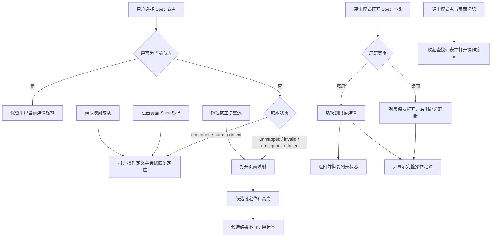
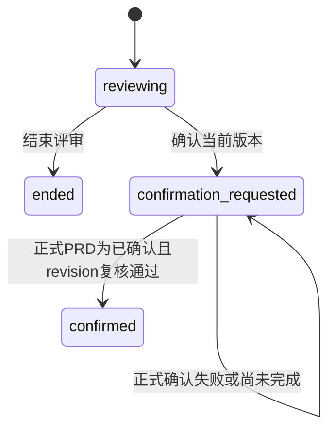

# Interactive Product Spec 工作台详情状态交互 Spec

## 1. 适用范围与来源基线

当前基线为 PRD v0.17；本轮多项目局域网发布（LAN-PUBLISH）已获用户实现授权并完成本机实现与回归。本文仍为草稿，不代表整份文档确认；跨设备与其他操作系统实机验收待完成。既有 DOCS-SKILL-OWNER-001 等内容保留；历史功能不因版本更新而视为已按新版全量复核。

本批定义绑定模式的详情状态分流、评审模式的只读 Spec 查找与详情浏览，以及 PRD 批注会话如何与正式文档状态衔接。目标是让绑定模式按映射状态进入正确任务，让评审模式保持连续阅读，并让“结束评审”和“确认当前版本”产生不同且可验证的结果。

需求来源为 PRD v0.8 的 `需求-页面映射-页面树与候选确认`、`需求-页面映射-映射状态与重新关联`、`需求-产品Spec-操作定义与关联约束`、`需求-评审交付-页面优先评审模式`、`需求-产品文档-相关PRD阅读器`，以及用户在 2026-09-04 确认的三批交互方案。页面证据以本批构建的 `web/index.html` 和上述 React 源码为准。

本批不改变映射状态的判定、`spec-map.json` 格式、保存边界、工作模式或 PRD 关系。2026-09-05 定位修订按用户授权将明确页面导航与页内元素匹配分开，地址解析与兼容边界见 ADR-0009。评审模式沿用服务端只读能力，只收敛可见入口和选择行为。整份文档保持 `draft`；下列本批行为已由用户确认，仍不代表整份产品 Spec 获得确认。

2026-09-05 阅读优化由用户直接授权：消除卡片摘要重复标题、提高关联约束正文可见性。沿 PRD `需求-产品Spec-操作定义与关联约束` 细化呈现方式，适用于绑定和评审模式。本轮用户继续授权普通工作台检测本地文档更新并原位加载新版，细则见本地文档更新节点。

## 2. 页面与模块依赖总览

本轮页面登记与兼容范围：

| 页面 ID | 职责 | 路由 | 来源与新增边界 |
|---|---|---|---|
| IPS-PAGE-WORKBENCH | 既有工作台及当前项目导出与发布面板 | 既有本机工作台根入口 `/` | `ui/src/App.tsx`；保留模式、PRD/Spec 阅读、映射、编辑、提交 Codex、离开和 ZIP；发布面板已接入 |
| IPS-PAGE-PROJECT-CENTER | 原项目中心及服务/项目发布总览 | 既有本机根入口 `/` 的项目中心场景 | `ui/src/components/project-center/project-center.tsx`；保留扫描目录、打开 HTML、来源确认、最近项目和文档准备；发布列表已接入 |
| IPS-PAGE-PUBLISHED-REVIEW | 分享入口验证及原只读评审视图 | `/p/{publicationId}/` | 复用冻结只读查看器，新增密码入口；不是作者工作台的新模式 |

本批仅增补上述发布场景，未全量重写同页既有功能。项目中心“管理”以 publicationId 定位并打开原项目工作台同一发布面板；来源缺失、无法恢复工作台时，在原项目中心复用同一发布管理面板；只管理已有快照，不提供更新。发布列表及面板线框见 PRD 4.7.3，访客线框见 4.7.4；页面已构建至 `web/index.html`，本批未新增 DOM 映射。

### 页面 `IPS-PAGE-WORKBENCH`：Spec 工作台

- **职责**：在同一页面承载 Spec 绑定和只读评审；两种模式共用实际页面、当前节点和文档来源。
- **入口与导航**：从项目中心继续已有绑定或完成来源确认后进入；页面使用工作台同源根入口，具体服务端口由启动过程决定。
- **源码**：`ui/src/App.tsx` 负责选择、定位与详情标签状态；`ui/src/components/workbench/spec-inspector.tsx` 负责右侧详情展示。
- **确认状态**：本批交互已确认；页面其他能力沿现有 PRD 和源码保留。

```text
┌──────────────────────┬────────────────────────────┬────────────────────────┐
│ 左：页面 → Spec 节点 │ 中：可操作页面与 Spec 标记 │ 右：节点标题 + 映射状态 │
│ 选择节点、发起拖拽   │ 候选/已关联位置高亮与定位  │ 操作定义｜页面映射     │
└──────────────────────┴────────────────────────────┴────────────────────────┘
```

评审模式桌面布局：

```text
┌──────────────────────┬────────────────────────────┬────────────────────────┐
│ 左：Spec 查找列表    │ 中：可操作页面与 Spec 标记 │ 右：只读节点详情       │
│ 选择后保持，连续浏览 │ 当前场景保持              │ 操作定义              │
└──────────────────────┴────────────────────────────┴────────────────────────┘

窄屏：Spec 查找列表 ──选择──> 只读详情 ──返回──> 原搜索、展开与滚动位置
```



## 公共约束

### RULE `IPS-RULE-SPEC-READING-CONTEXT`：完整操作定义与来源阅读

- 状态：`confirmed`
- 来源：`product-decision`
- 关联 PRD：`需求-产品Spec-操作定义与关联约束`
- 摘要：保留不重复标题的原摘要。原摘要为空或仅重复标题（忽略空格、标点）时，从正文优先取产品结果、规则、定义、依赖结果、App 行为及旧格式行为/结果字段；跳过空内容、重复标题和状态、来源、页面匹配、关联信息等元数据。无可用摘要时沿用阅读入口提示，不拼接或补写业务语义。只改变卡片预览，原正文和全文搜索保持完整。
- 定义入口：绑定模式仅保留操作定义与页面映射；评审模式只保留操作定义。旧 relations 标签状态回到操作定义。原编辑、定位、确认、解除、返回与节点选择保持。
- 连续阅读：本操作正文后显示明确关联的非页面规则正文，保留字段、条件、例外与待确认内容；去除状态、来源、关联 ID 等元数据及同一规则内完全重复的正文，不概括、不截断。仅同模块但未直接关联的节点不作为适用规则显示。
- Markdown 阅读（2026-09-08 用户要求，本批草稿）：节点和适用规则复用现有 Markdown 阅读器，保留表格、标题、列表、引用、代码块与已有图片、图形能力。页面及规则稳定 ID 根据当前投影解析为中文标题，悬停可追溯 ID；不能解析时保留原文，不伪造标题。状态字段正常阅读显示中文，编辑仍保留原始值。
- 放大阅读（本批草稿）：包含块级结构的字段显示“放大查看”，纯段落、行内强调和行内代码不显示。点击后通过原详情中的只读弹窗提供较宽阅读区，表格与代码超宽时横向滚动，长内容纵向滚动。关闭按钮、遮罩或 Esc 关闭弹窗并恢复入口焦点与原节点位置，再次打开显示完整内容。弹窗事件不触发底层双击编辑，不写正文或 Map；单字段及完整节点编辑继续编辑原 Markdown。
- 来源：点击 PRD 入口打开现有宽幅文档阅读区，定位对应章节并高亮；该章节即使不在当前页面关联集合内也可阅读，不改变关联。公共规则入口滚动到已有条款并高亮；提供隐藏高亮，切换节点清除旧规则高亮。来源缺失时明确提示并禁用定位，不替换来源。
- 编辑入口：完整节点编辑仅保留详情底部固定悬浮入口，正文与操作区分开滚动；完整编辑态隐藏入口，保存与取消沿用现有逻辑。正文顶部移除路径卡片，写入目标保留在编辑态。评审只读不显示入口。
- 节点切换：定义与规则组件使用不同身份标识，旧节点正文、编辑入口及高亮不能残留。
- 边界：阅读不写回文档、Map 或规则关系；不由展示逻辑推断业务适用性。无关联时只显示操作正文，不制造规则空卡片。
- 直接关联：`IPS-SURFACE-REVIEW-DETAIL`。

```text
绑定：操作定义 | 页面映射       评审：操作定义
操作正文：条件、结果、异常与恢复
适用规则：明确关联的原有行为条款
来源：PRD ↗ 文档章节高亮 / 公共规则 ↑ 已有条款高亮
底部固定操作区：[编辑完整节点]；高亮内容：[隐藏高亮]
```

### 工程决定 `ARCH-SPEC-READING-001`：合并操作阅读

- 状态：`implemented`
- 原因与范围：用户确认移除独立关联约束标签；沿现有详情组件合并阅读，来源按需定位高亮。
- 采用方案：直接复用当前内存 Spec 与 PRD 章节，不新增接口或持久化副本；适用条款保留原文，完整来源只读。节点来源与编辑数据分开呈现但仍使用同一节点。
- 2026-09-08 阅读呈现修订：`SpecMarkdown` 复用 `PrdMarkdownPreview` 的 GFM 与安全资源渲染，详情传入当前节点/页面名称及已有 Spec 图片；块级内容开放只读 Dialog，组件本地状态控制开关。字段保存仍回传原文，不回传中文显示替换结果，不新增持久化或接口。
- 本批验证：构建、架构与合同检查、7 项读写回归通过；真实 MDT 工作台验证中文页面/规则引用、表格行列、规则列表、字段放大/关闭/再次打开、原 Markdown 编辑与取消。原有 8 项当前映射保留；没有将“内容已变化”自动确认为有效，也未宣布整包插件升级。
- 明确不改：业务规则、原关联、正式文档所有权、Map、只读权限与节点保存合同。
- 否决方案：自动生成摘要可能丢失异常；复制约束到每个节点产生多份正文；仅删除标签会丢失阅读入口。
- 回归：双模式标签、正文完整性、来源定位与隐藏高亮、无关规则隔离、缺失来源、节点切换、单条编辑与完整编辑、页面映射、窄屏、导出与文档更新。
- 验证：统一 `npm run verify` 通过，153 项 Node 测试和全部浏览器旅程通过；真实 MDT 验证绑定 2 个标签、评审 1 个标签，PRD 章节可定位阅读，源 Spec 与原 Map 未改写。PRD v0.8 与本 Spec 仍为草稿，未代替用户确认。

### RULE `IPS-RULE-DETAIL-DEFAULT-BY-MAPPING-STATUS`：按映射状态决定首次详情入口

- 状态：`confirmed`
- 来源：`product-decision`
- 关联 PRD：`需求-页面映射-页面树与候选确认`
- 规则：切换到另一个节点时，`confirmed`、`out-of-context` 默认打开“操作定义”；无映射或 `invalid`、`ambiguous`、`drifted` 默认打开“页面映射”。
- 例外：重复点击当前节点不重新套用默认值；页面标记、拖拽、主动重选和确认映射按各自显式操作结果处理。
- 直接关联：`IPS-ACTION-SELECT-SPEC-NODE`。

### STATE `IPS-STATE-MAPPING-DISPLAY`：映射状态展示语义

- 状态：`confirmed`
- 来源：`formal-source`
- 关联 PRD：`需求-页面映射-映射状态与重新关联`
- 状态集合：`confirmed` 显示“已关联”；`out-of-context` 显示“已关联 · 需手动进入”；`unmapped` 显示“待映射”；`invalid`、`ambiguous`、`drifted` 分别显示现有异常标签。
- 展示规则：绑定模式中，状态位于右侧详情标题区，在“操作定义”“页面映射”两个标签中持续可见。评审模式的正常“已关联”不占用标签；未映射、需手动进入或异常状态可作为被动上下文显示，切换只读详情标签不改变状态。
- 直接关联：`IPS-SURFACE-INSPECTOR-HEADER`、`IPS-ACTION-SELECT-SPEC-NODE`。

### RULE `IPS-RULE-REVIEW-READONLY-DETAIL`：评审详情与映射任务分离

- 状态：`confirmed`
- 来源：`product-decision`
- 关联 PRD：`需求-评审交付-页面优先评审模式`、`需求-产品Spec-操作定义与关联约束`
- 规则：评审模式只展示“操作定义”，不展示页面映射标签、映射任务筛选、映射完成数量、候选、确认、重选、解除或 Spec 编辑入口。
- 选择规则：从评审 Spec 列表选择节点时打开定义并尝试恢复已有关系；无关系或恢复失败且有明确页面地址时，先导航所属页，再只读预览可靠位置。未知路由不跨页探查，异常映射不被候选覆盖。
- 直接关联：`IPS-ACTION-REVIEW-FIND-SPEC`、`IPS-ACTION-REVIEW-SELECT-SPEC`、`IPS-SURFACE-REVIEW-DETAIL`。

### STATE `IPS-STATE-PRD-REVIEW-CONFIRMATION`：PRD 评审与确认状态分层

- 状态：`confirmed`
- 来源：`product-decision`
- 关联 PRD：`需求-产品文档-相关PRD阅读器`
- 正式文档状态：由产品文档流程拥有 `草稿 / 评审中 / 已确认 / 已替代`。
- 评审会话状态：`reviewing / confirmation_requested / confirmed / ended`。`confirmation_requested` 只表示用户已发出确认请求；`confirmed` 必须由原任务完成正式文件写入并验证后进入。
- 反馈批次状态：沿用 `queued / processing / needs_review / withdrawn / stop_requested / stopped / published`，不改变正式文档状态。
- 直接关联：`IPS-ACTION-PRD-END-REVIEW`、`IPS-ACTION-PRD-CONFIRM-CURRENT`。



## 4. 页面、区域和操作说明

## MODULE `SPEC-MAPPING`：Spec 页面映射

### 页面：Spec 绑定工作台（`IPS-PAGE-WORKBENCH`）

#### SURFACE `IPS-SURFACE-INSPECTOR-HEADER`：详情标题与映射状态

- 状态：`confirmed`
- 来源：`product-decision`
- 关联 PRD：`需求-页面映射-映射状态与重新关联`
- 产品结果：右侧详情标题区展示节点来源、当前映射状态、标题和稳定 ID。映射状态不随详情标签切换而隐藏。
- 直接关联：`IPS-STATE-MAPPING-DISPLAY`。

#### ACTION `IPS-ACTION-SELECT-SPEC-NODE`：选择 Spec 节点

- 状态：`confirmed`
- 来源：`product-decision`
- 关联 PRD：`需求-页面映射-页面树与候选确认`
- 前置条件：用户处于绑定模式，选择可映射的 `ACTION` 或 `SURFACE` 节点。
- 产品结果：切换到另一个节点时执行 `IPS-RULE-DETAIL-DEFAULT-BY-MAPPING-STATUS`；已关联节点同时尝试恢复页面定位，未关联节点可开始候选定位。
- 重复操作：再次点击当前节点时重新触发页面定位，但保留用户手动选择的详情标签。
- 失败与恢复：页面已打开但组件缺失时保留该页与详情标签，提示尚未找到组件；导航超时或路由恢复失败时明确提示。绑定模式继续提供人工进入或重选入口，评审模式仅显示被动提示。
- 数据影响：选择和定位不写入 `spec-map.json`。
- 直接关联：`IPS-RULE-DETAIL-DEFAULT-BY-MAPPING-STATUS`、`IPS-STATE-MAPPING-DISPLAY`、`IPS-ACTION-LOCATE-CANDIDATE`。

#### ACTION `IPS-ACTION-LOCATE-CANDIDATE`：定位自动候选

- 状态：`confirmed`
- 来源：`formal-source`
- 关联 PRD：`需求-页面映射-页面树与候选确认`
- 产品结果：先按所属页面第一条有效本地 routeHint 导航，再在目标 DOM 内计算位置。绑定模式候选可预览但不确认；评审模式仅预览高置信位置。无明确地址时只辅助当前页，不遍历页面动作。
- 标签规则：候选在当前 DOM 找到、导航所属页后找到、低于阈值、候选接近、超时或未找到时，都不得在结果返回后改写用户当前详情标签。
- 数据影响：定位不写 Map，只有用户确认才建立关系。
- 直接关联：`IPS-ACTION-SELECT-SPEC-NODE`、`IPS-ACTION-CONFIRM-MAPPING`。

#### ACTION `IPS-ACTION-OPEN-PAGE-MARKER`：从页面标记打开 Spec

- 状态：`confirmed`
- 来源：`product-decision`
- 关联 PRD：`需求-页面映射-页面树与候选确认`
- 产品结果：点击或键盘激活页面中的已关联 Spec 标记，打开对应节点的“操作定义”并保持页面定位；评审模式下保留已打开的 Spec 总览，不自动关闭或隐藏。
- 数据影响：不写 Map，不触发重新关联。

#### ACTION `IPS-ACTION-ENTER-MAPPING`：显式进入映射处理

- 状态：`confirmed`
- 来源：`product-decision`
- 关联 PRD：`需求-页面映射-页面树与候选确认`
- 入口：拖拽节点到页面，或在详情中选择“在页面上选择位置”“重新选择页面位置”“页面映射”标签。
- 产品结果：进入“页面映射”并提供当前候选、人工选点、重选或解除入口；显式入口不受节点默认详情分流影响。
- 人工选点期间排除画布拖动识别；真实鼠标点击合法目标直接完成绑定，不被拖动结束后的点击抑制吞掉。退出选点后保留原画布拖动能力。
- 取消与恢复：按 `Esc` 取消人工选点后恢复页面操作；选择 Spec 节点（含重选当前节点）或导航到另一个页面时，也先清除旧人工选点状态及预览，再执行定位。目标缺失或导航失败不得残留旧选点拦截层；已有关系保持不变。

#### ACTION `IPS-ACTION-CONFIRM-MAPPING`：确认页面映射

- 状态：`confirmed`
- 来源：`formal-source`
- 关联 PRD：`需求-页面映射-页面树与候选确认`
- 前置条件：用户明确确认合法候选或人工选择合法目标。
- 产品结果：按现有原子保存流程更新 `spec-map.json`，状态变为“已关联”，右侧回到“操作定义”。
- 失败与恢复：目标不合法或保存失败时不报告成功，保留可恢复的映射处理上下文。
- 直接关联：`IPS-STATE-MAPPING-DISPLAY`。

## MODULE `SPEC-REVIEW`：只读 Spec 评审

### ACTION `IPS-ACTION-READ-FULL-SPEC`：阅读完整 Spec

- 状态：`draft`
- 来源：`product-decision`
- 关联 PRD：`需求-产品Spec-操作定义与关联约束`
- 页面：`IPS-PAGE-WORKBENCH`

##### 入口与前置条件
绑定、评审和 gate 会话均可从顶部“评审资料 → 完整 Spec”进入，无需选中节点。

##### 正常流程与结果
打开同一已载入 Markdown 的只读全文，保留公共说明及工程章节，支持章节定位；关闭后保留画布、节点和未保存编辑。没有 Markdown 来源时禁用并说明原因，不从节点投影拼造全文。

##### 保存与生效
“加载新版”沿现有 revision 检查更新节点与全文；直接保存节点成功后更新全文快照，失败保持原版本。gate 草稿未写回时全文仍为原文，提示尚有草稿。只读评审包冻结相同快照；阅读不修改来源、Map 或确认状态。

### 工程决定 `ARCH-SPEC-FULLTEXT-001`：原文快照与节点视图共用版本

- 状态：adopted；源码已实现，专项验证通过，尚未更新应用安装版。
- 原因与范围：投影不含完整工程章节；在既有工作台阅读原 Spec，复用 Markdown 渲染，不新增文档编辑模式。
- 采用：review-session 将已读取原文及 revision 放入配置快照；加载新版、直接保存成功时同步，gate 草稿不替代原文。前端只读该快照；Markdown 图片复用既有受限读取并随快照更新、冻结。只读评审包沿配置冻结，不开放任意文件读取接口。
- 否决：从 JSON 重建全文会漏内容；把工程正文复制到每个节点会产生多份定义。不改变节点/Map Schema 或产品事实来源。
- 回归：节点外条款可读、章节定位、关闭恢复、直接保存与外部刷新、gate 原文、缺来源、窄屏、只读导出及原映射路径。

- 本轮验证（2026-09-08）：17 项定向 Node 测试、含本地图片的普通及冻结配置全文阅读及文档更新/约束阅读/原工作台浏览器旅程通过。统一测试 171/173 通过，2 项旧开发地址预期与现有移除决定不符；另有 PRD 目录高亮回归失败，整包升级暂缓。全文冻结配置已验证，未新增完整 ZIP 接收端验收声明。


### 页面：Spec 工作台评审模式（`IPS-PAGE-WORKBENCH`）

#### SURFACE `IPS-SURFACE-REVIEW-DETAIL`：评审只读详情

- 状态：`confirmed`
- 来源：`product-decision`
- 关联 PRD：`需求-产品Spec-操作定义与关联约束`、`需求-评审交付-页面优先评审模式`
- 产品结果：详情仅包含“操作定义”。页面映射标签与完整节点编辑入口不渲染；只读能力仍由工作台配置和服务端写接口共同保证。
- 映射状态：正常“已关联”省略；未映射、需手动进入或异常状态只作上下文提示，不提供处理动作。
- 直接关联：`IPS-RULE-REVIEW-READONLY-DETAIL`、`IPS-ACTION-REVIEW-SELECT-SPEC`。

#### ACTION `IPS-ACTION-REVIEW-FIND-SPEC`：打开评审 Spec 查找

- 状态：`confirmed`
- 来源：`product-decision`
- 关联 PRD：`需求-评审交付-页面优先评审模式`
- 入口：存在可映射 Spec 节点时，进入评审模式默认展开 Spec 总览浮层；纯 PRD 会话不显示空总览；可收起或关闭，点击顶部“查找 Spec”或使用 `⌘K` 恢复展开；总览的“阅读全文”复用完整 Spec 阅读器，缺少 Markdown 来源时禁用。
- 产品结果：按页面与子页面展示可阅读节点，并支持搜索与模块筛选；不显示“待映射 / 需复核”任务筛选和页面映射完成数量。
- 状态保持：收起不卸载列表，恢复时保留搜索词、模块筛选、页面展开和滚动位置；关闭或切换模式结束该列表会话。
- 页面定位：评审模式页面标题只改变展开状态；悬停或键盘聚焦时显示独立定位图标，触屏常显。点击图标调用既有 `selectSpecPage`，明确路由优先、已有绑定上下文兜底，不切换展开状态。移除原“联动页面”开关，节点选择与页面标记的既有行为不变；绑定模式原标题导航保留。
- 浮层位置：`SpecOverviewFloat` 用顶部手柄的 Pointer Capture 支持鼠标/触控拖动及方向键微调，收起入口同样可拖动；位置按父工作区尺寸限制，ResizeObserver 在窗口/抽屉改变可用空间时重新限制位置。展开宽度由右边缘拖动调整，偏好宽度限制在 320–480px，默认 360px；实际宽度取偏好宽度与工作区宽度减 24px 的较小值，收起恢复保留偏好宽度；边缘支持方向键微调、Home/End 取最小/最大值，高度取工作区高度减 24px，四周留 12px 边距；收起保留列表实例与当前坐标，关闭重开恢复初始位置。
- PRD 阅读范围：普通评审模式的 PRD 总览默认开启“仅看当前页面关联内容”；关闭后原阅读器渲染全部目录及正文，重新开启恢复当前页面关联章节，来源跳转仍保留原有目标章节例外。无关联显示空状态并提示可关闭开关阅读全文。
- 数据边界：PRD 范围开关属于 App 视图状态，浮层位置属于组件视图状态，在当前项目会话保持，重新加载项目恢复默认开启；不调用映射写接口，不改变 PRD 批注会话的全文阅读及绑定模式。
- 回归：默认展开、收起恢复、关闭重开、标题展开不导航、独立定位图标、浮层拖动与位置恢复、PRD 范围往返、只读 Map 不变及原详情/全文阅读。

#### ACTION `IPS-ACTION-REVIEW-SELECT-SPEC`：从评审列表选择 Spec

- 状态：`confirmed`
- 来源：`product-decision`
- 关联 PRD：`需求-评审交付-页面优先评审模式`
- 前置条件：用户处于评审模式，并从 Spec 查找列表选择节点。
- 产品结果：始终打开该节点的“操作定义”；有现存关联时优先恢复人工目标；没有关联或恢复失败时，按明确地址进入所属页后辅助定位，缺失或异常关系仍作被动状态展示。
- 桌面行为：Spec 查找列表保持打开，右侧只读详情打开或随选择更新，用户可连续浏览多个节点。
- 窄屏行为：查找列表隐藏并显示只读详情；详情顶部提供“返回 Spec 列表”。
- 禁止行为：不探查未知路由、不执行业务动作、不写 Map、不打开页面映射或编辑入口。
- 直接关联：`IPS-RULE-REVIEW-READONLY-DETAIL`、`IPS-ACTION-REVIEW-BACK-TO-LIST`。

#### ACTION `IPS-ACTION-REVIEW-BACK-TO-LIST`：窄屏返回 Spec 列表

- 状态：`confirmed`
- 来源：`product-decision`
- 关联 PRD：`需求-评审交付-页面优先评审模式`
- 前置条件：窄屏评审详情由 Spec 查找列表选择打开。
- 产品结果：关闭当前详情并恢复同一查找列表，保留搜索词、模块筛选、页面展开和滚动位置。
- 数据影响：不改变当前页面、Spec、PRD 或 Map。

## MODULE `PRD-REVIEW`：PRD 批注与正式确认

### ACTION `IPS-ACTION-PRD-SCROLL-NAVIGATION`：正文与目录双向定位

- 状态：`draft`
- 来源：`product-decision`，2026-09-08 用户要求 PRD 评审目录跟随正文滚动。
- 关联 PRD：`需求-产品文档-相关PRD阅读器`
- 页面：`IPS-PAGE-WORKBENCH`
- 源码：`ui/src/components/workbench/prd-browser.tsx`

##### 入口与前置条件

原 PRD 阅读抽屉已展开并挂载正文。沿用同一目录、搜索、正文和批注入口；不新增页面，不更改关联选择。

##### 正常流程与结果

点击目录项滚动正文到标题并保留该项高亮，文末无法完全对齐时也不跳回前章；正文继续滚动后按视口顶部下方 72px 的阅读位置，取已越过此位置的最后一个二至四级标题。右侧高亮当前标题，左侧高亮它所属的目录章节；无独立 ID 的下级标题仍归属该章节，遇到同级或更高层且不属于目录章节的新分组才清除左侧高亮。

当前项超出左侧目录视口时只调整目录自身滚动量，使其进入可视区；已可见则保持目录位置。目录跟随不触发正文跳转、不改变键盘焦点或页面关联复选状态。

##### 中断与恢复

正文通过稳定 ref 回调报告挂载后再绑定滚动监听，避免抽屉首次挂载前查不到正文而失去联动。滚动使用动画帧合并更新；图、图片及抽屉宽度引起正文高度变化时通过 ResizeObserver 重新定位。关闭、切换正文或组件卸载时释放监听与观察器；重新打开、加载新版或从差异返回正文后重新计算。

##### 质量与使用约束

仅保存阅读器内的视图状态，不写 PRD、Spec 或 Map。搜索过滤后当前项未显示时不替用户清空搜索，也不强制显示不匹配项。

验收：从 Chrome 原评审入口首次打开，跨功能向下滚动、高亮下级内容所属章节、反向上滚及点击目录跳转均正确；长目录自动使当前项可见且正文不跳动。2026-09-08 已在 MDT PRD v5.9 实际页面验证上述路径；刷新后仍可使用批注入口，未提交测试批次。


### 工程决定 `ARCH-PRD-EXACT-SELECTION-001`：精确批注选区

- 状态：implemented；来源：2026-09-08 用户确认仅回显所选文字、悬停查看备注。
- 原因与范围：原段落行号交集导致整段高亮。沿用原阅读器，以 DOM Range 和 CSS Highlight 绘制文字范围，按文字矩形命中显示备注；搜索重建正文时重新解析范围。
- 数据：anchor 增加可选非负整数 quoteOccurrence，表示同一原始行范围中去空白引文的第几次出现（从 0 起），区分同段重复文字；旧数据缺省时只接受唯一匹配。服务校验并保留此字段，Schema 派生前端类型。
- 边界：批注版本与当前正文一致时显示，不将旧版行号套到新版；草稿、队列、停止、发布、确认及页面入口保持原流程。
- 否决：按段落着色不准确；直接包裹 React 正文文本会干扰搜索和重新渲染。
- 回归：部分文字、跨粗体、重复文字、备注编辑/移除、刷新、搜索、发送后回显与原工作台旅程。

### 接收等待与原任务运行状态

关联 PRD：`需求-产品文档-相关PRD阅读器`。`agentConnected` 兼容字段只报告服务内是否有尚未结束的 wait 调用，不证明桌面任务存活或具备唤起能力。wait 返回、取消和关闭即清除，feedbackStatus 查询不延长；浏览器轮询失败清除本地旧值，过期请求不能覆盖新操作的结果。界面使用有底色、边框和状态圆点的标签：有等待调用时为绿色“接收已就绪”，说明“正在等待批注”；无等待或连接请求失败时为黄色“接收未就绪”，说明“发送仅加入本机队列”。颜色与文字共同区分状态，均保留“对话结束后暂不能自动唤起”，不将其表述为桌面任务在线。源码及安装副本的浏览器检查覆盖初始未就绪、建立等待变绿、取消等待恢复黄色，并回归批注操作。

队列连续处理见下节；发送入口、停止和确认保持原流程。自动唤起原桌面任务尚未实现，不能用另起 CLI 任务或尚未消费的工具返回冒充成功。2026-09-08 已验证 Chrome 原入口显示限制、既有批次保留，服务测试覆盖等待返回后及查询后的状态清除；尚未完成对话结束后的自动处理验收。

### 连续批次处理

关联 PRD：`需求-产品文档-相关PRD阅读器`。用户连续发送多批后，服务依次领取；第一批发布不将后续已发送批次改为待核对。发布工具有剩余可领取批次时直接在 `nextFeedback` 返回下一批，原任务继续处理该返回值；无剩余时调用默认 `wait_prd_feedback` 挂起等待。

每批的 `baseRevision/baseSource/annotations` 保留原提交事实，领取响应另带 `currentRevision/currentSource` 作为本轮修改基线。原任务先读取新版，对照原始反馈处理：已满足则说明并以 `unchanged` 发布，语义冲突先核对，不能把旧行号当成当前写入位置。发布差异使用紧邻的上一版。收到停止请求后仍须确认停止才能继续；未发送草稿的显式适配、外部改动和旧协议待核对批次维持原保护。

#### 工程决定 `ARCH-PRD-QUEUE-CONTINUE-001`

- 状态：implemented（源码及安装副本的模拟消费者验证）；来源：2026-09-08 用户要求连续 4～5 批自动衔接。
- 原因：正常发布把旧 revision 的等待批次全部降为 needs_review，且领取比较提交版本，误将本会话前批修订判为外部改动。
- 范围：服务的发布/领取与 MCP 发布返回。采用提交快照和当前处理基线分离；磁盘与会话已发布 revision 不一致时仍阻断领取。发布返回直接衔接下一批，沿用串行持久化与单批执行。
- 明确不改：页面入口与结构、正文写入责任、未发送草稿、停止/撤回/确认、数据 Schema 和旧协议自动迁移；不承诺唤醒已结束的桌面任务。
- 否决：每次强制用户重新发送违背连续处理目标；直接重写原始引文损失反馈依据；只改等待指令无法解除服务的版本阻断。
- 回归：连续五批且每批真实改版、已满足意见、发布幂等、跨连接恢复、外部改动、停止和草稿保留，以及原工作台入口旅程；执行 npm run verify。自动测试不证明桌面任务已加载新版。

### 页面：PRD 批注工作台（`IPS-PAGE-WORKBENCH`）

#### SURFACE `IPS-SURFACE-PRD-ANNOTATED-TEXT`：正文选区与备注

- 状态：`confirmed`（本次交互范围；整份 Spec 仍为草稿）
- 来源：`product-decision`
- 关联 PRD：`需求-产品文档-相关PRD阅读器`
- 页面：`IPS-PAGE-WORKBENCH`

##### 展示与交互
正文仅高亮被选中的文字，引文卡和预览只展示该引文。悬停选区显示对应备注，移到其他文字后收起；备注浮层可停留阅读并滚动长内容。编辑备注后同步更新；同一位置重叠多条意见时展示各自备注。未选中的段落文字不着色、不显示该备注。

功能线框：正文〔普通文字 → 已批注文字（悬停显示备注）→ 普通文字〕；原底部引文预览、编辑、移除和发送入口保持。

##### 保存与生效
沿用批注草稿和队列，依据 `ARCH-PRD-EXACT-SELECTION-001` 保存同段引文出现位置。刷新、搜索重建正文和发送成功后重新解析精确范围；已发送同版本批次继续回显。CSS Highlight 不改变 Markdown 正文或搜索元素结构。

##### 对象与状态变化
仅显示与当前正文版本一致的草稿或有效批次。旧版本或旧锚点无法唯一定位时不猜测位置，意见仍可在原草稿或队列预览中查看。撤回、移除或切换差异视图时更新或清除对应回显；停止和发布沿既有流程。

##### 验收与变更影响
从原工作台打开 PRD，选段落内部分文字、跨粗体文字及第二处重复文字，添加后只有对应文字高亮；悬停显示最新备注，移开收起。编辑、刷新、搜索及发送后仍匹配正确位置。`browser-tests/prd-exact-selection.browser.mjs` 在源码构建和安装副本通过；原 `prd-review.browser.mjs` 的画布、草稿、撤回、停止、差异与确认回归通过。全量 Node 检查保留两项既有开发地址用例失败，不表述为统一验证全绿。


#### SURFACE `IPS-SURFACE-PRD-REVIEW-CLOSURE`：评审闭环操作区

- 状态：`confirmed`
- 来源：`product-decision`
- 关联 PRD：`需求-产品文档-相关PRD阅读器`
- 布局：PRD 正文和批注队列下方同时提供弱操作“结束评审”和主操作“确认当前版本”；存在未发草稿或未处理批次时两者均禁用。
- 反馈：确认请求发出后显示“等待 Codex 完成正式文档确认”；正式文件复核通过后显示“当前版本已确认”和确认路径。结束会话则显示“本轮评审已结束”，并明确不代表确认。
- 直接关联：`IPS-STATE-PRD-REVIEW-CONFIRMATION`。

```text
┌────────────────────────────────────────────────────────────┐
│ PRD 正文 / 批注队列 / 当前修订说明                         │
├────────────────────────────────────────────────────────────┤
│ 原任务连接状态              [结束评审] [确认当前版本]       │
└────────────────────────────────────────────────────────────┘
确认请求后：等待 Codex 正式确认 → 当前版本已确认（显示路径）
```

#### ACTION `IPS-ACTION-PRD-END-REVIEW`：结束本轮评审

- 状态：`confirmed`
- 来源：`product-decision`
- 关联 PRD：`需求-产品文档-相关PRD阅读器`
- 前置条件：无未发草稿，无等待、处理、停止请求或待核对批次。
- 产品结果：会话进入 `ended`，保留正文和差异供查看；正式 PRD 状态不变。

#### ACTION `IPS-ACTION-PRD-CONFIRM-CURRENT`：确认当前 PRD 版本

- 状态：`confirmed`
- 来源：`product-decision`
- 关联 PRD：`需求-产品文档-相关PRD阅读器`
- 前置条件：与结束评审相同，且磁盘 PRD revision 与工作台当前版本一致。
- 产品结果：会话进入 `confirmation_requested`，原任务收到 PRD 路径和用户确认的源 revision；工作台不直接写文件。
- 完成条件：原任务使用产品文档流程把正式 PRD 标为 `已确认` 或移入确认目录，再调用确认完成工具。工具复核来源 revision、正式状态、产品身份、稳定需求 ID、除状态外正文一致性与最终 revision 后，会话进入 `confirmed`。
- 失败与恢复：文件状态未确认、路径越出 Project、来源或 revision 不符时保持等待确认，不报告完成；用户需回到原任务处理阻塞。

## 5. 工程实现约束

- 复用现有工作台页面、左右面板、节点选择路径和映射状态计算，不新增路由、模式、数据模型或平行工作流。
- 默认详情标签只在“切换到另一个节点”时计算；候选异步完成不得二次改写标签，避免覆盖用户在等待期间的选择。
- 页面标记沿用默认“操作定义”；拖拽和主动映射沿用显式“页面映射”；确认映射沿用成功后回到定义的既有路径。
- 评审列表与详情复用现有浮层和详情组件；点击页面圆点或打开详情时不自动关闭或隐藏总览，保留手动收起及关闭，不销毁列表状态，不新增页面或路由。
- 导航与元素定位分工采用 [ADR-0009](../decisions/ADR-0009-page-first-spec-navigation.md)：显式地址统一解析，页面导航不校验任意子节点；未绑定节点进入所属页面后再计算位置，评审预览不开放映射写入。
- `canSaveSpec` 在评审模式强制为 false；页面映射标签和内容不渲染，避免隐藏入口仍可被键盘或状态切换访问。
- 映射状态只读展示现有运行时结果，不写回正式 Spec 或 Map。
- PRD 正式状态由产品文档流程拥有；`prd-review-service.mjs` 只记录会话、批次与确认请求，`complete_prd_confirmation` 只读验证正式文件后闭合会话。架构边界见 `ARCHITECTURE.md` 与 `decisions/ADR-0008-prd-review-document-status.md`。

## MODULE `WORKBENCH-AC`：工作台验收与变更影响

### AC `IPS-AC-PAGE-FIRST-NAVIGATION`：明确页面先打开、组件再定位

- 状态：`confirmed`
- 来源：`product-decision`
- 关联 PRD：`需求-页面映射-页面树与候选确认`、`需求-评审交付-页面优先评审模式`
- 验收：包含 query/hash 的两个会话地址保留对象参数及片段；同名输入框不串页。页面已有多命中的旧按钮绑定时仍可导航，原 Map 保留；元素未出现时保留已进入页面并提示。连续选择、刷新与评审模式均保持正确页面及当前定义，不执行业务动作、不新增映射。
- 验证：`browser-tests/page-navigation.browser.mjs` 在独立目录复制的构建产物上覆盖上述路径，真实 MDT 从原工作台入口检查页面导航。

```text
页面树 / Spec 查找 → 明确地址 → 正确页面 → 页内区域或控件
                                 └─ 未找到：保留页面与定义，说明缺口
```


### AC `IPS-AC-SPEC-READING-CONTEXT`：摘要有效且约束可连续阅读

- 状态：`confirmed`
- 来源：`product-decision`
- 关联 PRD：`需求-产品Spec-操作定义与关联约束`
- 验收：绑定仅有操作定义与页面映射，评审仅有操作定义；明确关联条款在定义内完整可读，其他模块参考不混入。PRD 来源打开文档并定位高亮章节正文；规则来源定位已有条款；隐藏高亮不隐藏正文，切换节点清除旧规则高亮。底部完整编辑入口唯一，连续切换不得残留旧节点正文。来源缺失及无条款均明确提示；旧 fields 仍可读。窄屏可纵向阅读，无横向溢出；阅读不改写 Spec 或 Map。
- 验证：`browser-tests/constraint-inspector.browser.mjs` 检查合并正文、元数据、旧字段、来源定位、高亮清除及连续切换入口唯一性、零约束、映射切换和窄屏；统一浏览器旅程回归双模式、原 PRD 阅读与节点保存。

### AC `IPS-AC-DETAIL-STATE-ROUTING`：状态分流与用户选择保持

- 状态：`confirmed`
- 来源：`product-decision`
- 前置条件：绑定模式中同时存在待映射节点和已关联节点。
- 验收：首次选择待映射或异常节点时“页面映射”为选中状态；切换到已关联或需手动进入节点时“操作定义”为选中状态；用户手动切换标签后重复点击当前节点，所选标签不变。
- 验证：真实浏览器旅程覆盖待映射、已关联和重复点击分支；源码检查覆盖所有异常状态枚举。

### AC `IPS-AC-CANDIDATE-NO-TAB-TAKEOVER`：候选不抢占详情标签

- 状态：`confirmed`
- 来源：`product-decision`
- 前置条件：节点选择后启动所属页导航及页内候选定位。
- 验收：无论候选成功或失败，异步结果只更新定位、高亮和提示，不改变用户当前详情标签，也不写入 Map。
- 验证：组件源码定向断言与候选浏览器旅程。

### AC `IPS-AC-MAPPING-STATUS-VISIBLE`：详情持续显示映射状态

- 状态：`confirmed`
- 来源：`product-decision`
- 验收：在“操作定义”“页面映射”任一标签中，标题区均显示当前映射状态；确认映射后显示“已关联”。
- 验证：组件测试与真实浏览器旅程。

### AC `IPS-AC-REVIEW-READONLY-DETAIL`：评审详情不暴露映射与编辑

- 状态：`confirmed`
- 来源：`product-decision`
- 前置条件：工作台处于评审模式并已选择 Spec 节点。
- 验收：详情只显示“操作定义”；“页面映射”和编辑入口不可见；未映射或异常节点仍可阅读定义；有明确地址时允许先导航并只读预览可靠位置，未知路径不探查，原映射不被候选覆盖。
- 验证：组件源码定向断言与真实浏览器旅程。

### AC `IPS-AC-REVIEW-CONTINUOUS-BROWSE`：桌面连续浏览与窄屏返回

- 状态：`confirmed`
- 来源：`product-decision`
- 前置条件：用户从评审 Spec 查找列表选择节点。
- 验收：桌面宽度下列表保持打开且右侧详情随选择更新；窄屏下进入详情并可通过“返回 Spec 列表”恢复原搜索、展开和滚动状态；从页面标记打开时列表收起并直接显示操作定义。
- 验证：真实浏览器旅程分别覆盖桌面与窄屏，并检查页面标记入口。

### AC `IPS-AC-PRD-CONFIRMATION-CLOSURE`：PRD 确认不被会话结束冒充

- 状态：`confirmed`
- 来源：`product-decision`
- 关联 PRD：`需求-产品文档-相关PRD阅读器`
- 前置条件：用户已完成所有批注，当前 PRD 为草稿或评审中。
- 验收：点击“结束评审”只进入结束态；点击“确认当前版本”进入等待正式确认态。只有原任务把正式文件状态改为 `已确认`，且工具复核路径、产品身份、稳定需求 ID、除状态外正文未变和 revision 后，页面才显示“当前版本已确认”。
- 验证：服务测试覆盖状态与拒绝分支，MCP 测试覆盖工具暴露，真实浏览器旅程覆盖按钮禁用、等待和最终状态显示。

### 变更影响

- **页面**：`IPS-PAGE-WORKBENCH` 的节点选择、评审 Spec 查找、右侧详情和 PRD 批注闭环区。
- **组件**：`ui/src/App.tsx`、`ui/src/components/workbench/spec-inspector.tsx`、`ui/src/components/workbench/spec-sidebar.tsx`、`ui/src/components/workbench/prd-review-panel.tsx`。
- **数据与接口**：映射数据无变化；PRD 评审合同新增 `confirmation_requested / confirmed` 会话状态与 `complete_prd_confirmation` 工具。
- **回归范围**：节点导航、候选定位、人工映射、页面标记、Spec 正文编辑、PRD 阅读、批注队列、结束/确认分流、模式切换和离开入口。

## 7. 版本记录

| 版本 | 日期 | 主要变化 | 确认状态 |
|---|---|---|---|
| v0.1 | 2026-09-04 | 新增按映射状态分流的详情入口、候选不抢占标签、显式入口和持续状态展示 | 本批行为已确认，整份文档仍为草稿 |
| v0.2 | 2026-09-04 | 评审详情移除页面映射与编辑；桌面保留查找列表，窄屏返回原列表；评审选择不触发候选发现 | 本批行为已确认，整份文档仍为草稿 |
| v0.3 | 2026-09-04 | 新增 PRD 正式状态、评审会话与反馈批次分层，以及结束评审/确认当前版本的完整闭环 | 用户已确认本次流程，整份文档仍为草稿 |
| v0.4 | 2026-09-05 | 摘要跳过重复标题和元数据；操作定义增加关联约束入口；当前关联默认展开、模块参考按需展开 | 用户授权本批阅读优化，整份文档仍为草稿 |
| v0.5 | 2026-09-05 | 明确地址先导航、页内再定位；旧组件异常不阻断整页；评审模式支持只读位置预览 | 用户授权本批定位修订，整份文档仍为草稿 |

## MODULE `DOCUMENT-UPDATES`：本地文档更新

### ACTION `DOCUMENT-LOAD-LATEST`：加载新版

- 状态：`draft`
- 来源：`product-decision`
- 关联 PRD：`需求-产品文档-本地文档更新`
- 页面：`IPS-PAGE-WORKBENCH`
- 触发：普通工作台每 3 秒检查当前选定 PRD、Markdown Spec 或无 Markdown 的兼容 JSON；标签页隐藏时暂停检查，恢复可见时继续。提示条明确仍在阅读旧版；PRD 抽屉打开时提示移到抽屉内，关闭后回顶部。
- 产品结果：点击“加载新版”后整体校验并更新当前会话文档，不重载页面 iframe；保留模式、筛选、仍存在的选中节点、抽屉和滚动位置。选中节点删除则清空选择并提示。已删除节点的 Map 保留，不借更新改写文件。
- 禁用：节点编辑或保存、未保存的 PRD 章节选择、映射保存或待保存、拖拽时保留更新提示并说明先完成或取消当前操作；有 gate 修订草稿时服务端同样拒绝更新。PRD 批注与离线包不参与普通更新。
- 失败与恢复：文件丢失、解析失败、来源再变或请求过期时保留整份旧快照；提示原因并可重试，不报更新成功，不清空 Map，不发起隐式 Codex 任务。非标准 Markdown 回原项目来源生成，不猜测解析；失效关联原文保留，无法连接的结构化引用单独提示。
- 验收：无版本号变化的正文更新仍能检测；PRD 与 Spec 同时更新全部成功才应用；错误后修复可恢复；编辑内容不丢失；PRD 抽屉、搜索、画布交互和映射保持可用；只读包无轮询。

### 工程决定 `ARCH-DOCUMENT-UPDATES-001`：显式加载当前来源快照

- 状态：`implemented`
- 原因：服务保存启动快照，普通工作台没有检查文件变化，已有投影也可能早于 Markdown。
- 采用方案：新增来源更新用例，GET 只检查已绑定路径，POST 携带会话及客户端文档基线；服务在校验前后核对文件摘要和活动会话，避免并发保存或切换项目污染当前快照。标准 Markdown 通过语法树读取节点及原始字段，保留有效页面身份，不调用模型；只更换内存视图，人工 Map 与正式 Markdown 不写入。传输归 workbench-api，轮询归专用 hook。
- 读取兼容：统一 Spec 的独立“公共约束”章节可直接收录规则、权限、状态等非 DOM 节点，工作台仅建立公共约束阅读分组，不按 ID 前缀猜测业务归属；区域与操作仍须有明确 MODULE。全局页面登记表提供当前页面身份、路由及明确父页面，优先于旧视图；后文页面标题可引用总表，不要求重复路由。代码示例不参与读取，节点完整性、重复 ID、状态与来源校验继续执行。
- 边界：不改变 PRD 批注发布、两种 Spec 写回、离线导出冻结或产品确认；新读取的视图不能与来源版本错配。
- 否决方案：整页自动刷新会丢编辑/画布状态；目录监听范围过大；每次变化调用模型成本与输出不确定，且不属于读取行为。
- 回归：来源变化、失败重试、并发保护、首次旧投影提示、节点增删与关联、编辑保护，以及原统一验证入口。

- 本轮验证：统一 `npm run verify` 通过（150 项 Node 测试、原有浏览器旅程及新增更新旅程）；后续补充测试覆盖删除节点的 Map 保留、兼容 JSON、仅 PRD、实际未保存标题和 420px 窄屏，均通过。真实 MDT 项目从 v0.3 加载 v0.7，432 个节点、38 个页面，14 条原 Map 全部保留，3 条已删节点引用提示核对。页面与文档自检不等于用户确认。
- 读取兼容修复验证：统一验证通过（153 项 Node 测试及浏览器旅程）。原 4318 工作台重试成功加载 MDT Spec v1.0，443 个节点、38 个页面；14 条原 Map、MDT PRD 和 Spec 文件均未改写。新增回归覆盖独立公共约束、集中路由覆盖旧路由、无旧投影、非法无模块操作继续拒绝，以及页面输入保持。

### RULE `IPS-RULE-ONE-CLICK-BIND`：当前页面一键绑定

- 状态：`draft`
- 来源：`product-decision`
- 关联 PRD：`需求-页面映射-页面树与候选确认`
- 入口：绑定模式画布底部工具条上方独立悬浮显示“一键绑定 · N 项”；无候选、编辑、拖拽、映射或保存中禁用。评审及只读不渲染。
- 范围：仅当前已识别页面的未绑定 ACTION / SURFACE，分数至少 0.82，沿用既有次优差距 0.08 的歧义降级；竞争同一 selector 或与当前页面已有绑定目标冲突时排除。
- 执行：点击时基于实时 DOM 重算候选并核验页面未切换；所有 annotation 构造成功后一次更新 Map，复用自动保存和 revision 冲突链。保留已有绑定、节点选择、页面和阅读状态，不点击业务控件、不遍历未进入的页面。
- 反馈与恢复：无合格项时提示，不写 Map；加入后显示数量及保存中，保存成功/失败使用既有保存状态。失败保留本地待保存内容和重试入口，不覆盖磁盘冲突版本。
- 工程边界：扩展现有候选发现和画布工具条，不新增接口、存储或独立绑定模式。拒绝循环调用单项绑定导致反复切换节点；一批只更新一次 Map。
- 验收：高关联绑定成功并刷新保留；低关联、同目标竞争、已绑定项不被写入或覆盖；连续点击不重复；只读不显示；原单项绑定、编辑、缩放和来源阅读可用。

```text
工具条上方悬浮：[一键绑定 · N 项]
原工具条：[拖动] [尺寸] [缩放] [适应]
```

### RULE `IPS-RULE-SHARED-TARGET-MARKER`：同控件多 Spec 标记

- 状态：`draft`
- 来源：`product-decision`
- 关联 PRD：`需求-页面映射-页面树与候选确认`
- 展示：沿用通过可见性、唯一匹配和指纹验证的标记集合，按实际 DOM 元素聚合；同一控件只渲染一个标记，关联数大于 1 时右上角显示数字，不按屏幕位置合并不同控件。
- 操作：单关联仍直接打开；多关联点击进入选择列表，显示名称和稳定 ID，选择后打开对应操作定义。可关闭取消，切换页面或模式清除旧列表。直接点击、键盘和缩放后的代理点击使用同一分组。
- 点击区域：24px 标记优先放在控件外围并避让相邻原生或 ARIA 交互控件；空间不足时裁剪与业务控件重叠的标记热区。悬停不扩大热区，代理命中同样排除业务控件。按钮中心、边缘及缩放后点击继续触发原页面，点击独立 Spec 标记才打开定义。密集区域标记可能被裁剪，仍可从原 Spec 列表选择节点。
- 边界：不删除已有多重绑定，不执行业务操作；选中组内任一 Spec 均高亮同一控件。一键绑定继续排除竞争项，不以数量展示代替冲突判断。
- 验收：同控件两个关联显示数字 2；可分别打开两份定义；单关联、遮挡、页面切换和只读仍可用。


## MODULE `PRD-REVIEW-ENTRY`：生成后评审选择

### ACTION `PRD-REVIEW-REQUEST`：选择评审时机

- 状态：`draft`
- 来源：`product-decision`（2026-09-06 用户确认本批流程并授权实现）
- 关联 PRD：`需求-产品文档-生成后评审选择`
- 页面：原 Codex 任务的客户端选择框；开始后复用 `IPS-PAGE-WORKBENCH`。

##### 入口与前置条件
原任务首次生成合法草稿后调用 `request_prd_review(projectPath, prdPath, htmlPath?)`。已有开始授权或用户从稍后入口回来则直接调用 `open_prd_review`；已有批注会话的修订仅 publish，不重新请求。

##### 正常流程与结果
服务先校验 Project 内 PRD、格式和草稿/评审中状态，以真实路径和正文 revision 识别同一次选择。通过 MCP 表单询问“是否现在开始评审”，选项为“开始评审 / 稍后评审”。只有明确接受开始才打开原工作台并返回地址与原 wait 协议。已有 HTML 的画布及底栏保留；没有 HTML 时用 document 目标在同一工作台全宽打开 PRD，不提供虚假页面或映射能力。

##### 保存与生效
工具侧独立保存该文档 revision 的选择，不写 PRD/Spec/Map。原任务返回文档链接、继续语句与明确的 open 工具参数；稍后回复“开始评审”沿当前文档重新校验并打开。选择记录不替代正式 PRD 状态、批注会话或反馈批次。

##### 重复操作与并发冲突
同一请求在进程内共用待完成 Promise；已选择版本在工具重连后复用决定，不重复询问。开始决定先保存再启动工作台，启动失败可直接重试。再次打开沿原会话去重和恢复，不创建另一套批注存储。

##### 依赖失败与超时
无表单能力、协议错误或无有效选择返回 choice-required，要求原任务询问用户；不得当作开始。关闭或拒绝返回 deferred。PRD 在选择期间变化则拒绝用旧版选择打开新版，并要求核对当前文档。格式或路径错误可修正后重试。传输取消/断开清理等待，不留下无限阻塞请求。

##### 验收
覆盖开始、稍后、关闭、无能力、无效回答、重复/并发与重连、来源越界、等待期间版本改变、启动失败重试。开始后的真实浏览器回归覆盖有/无 HTML 的阅读、批注、发送、修订和确认；普通绑定、来源选择、页面交互与导出仍可用。

### 工程决定 `ARCH-PRD-REVIEW-ENTRY-001`：原任务选择后进入现有评审

- 状态：`implemented`
- 原因：当前 open 直接打开工作台，缺少用户安排评审时机的选择。
- 范围：新增 request 用例与 MCP 表单请求/响应处理；工具侧按来源和 revision 保存选择。open、wait、publish、confirm 共用原服务。仅显式 PRD 批注装配允许 document 目标，普通项目来源向导不扩大输入范围。
- 明确不改：HTML 完成后的 PRD/Spec 同轮同步、两种 Spec 写回、人工 Map、产品确认权限、批注队列和原有界面入口。
- 否决：在 HTML 上报弹窗会混淆文档同步；先打开另一独立评审页再询问会增加平行入口；依靠 Stop 或文件监控无法判断完成与授权。
- 回归：统一 npm run verify 加 MCP 表单协议测试；客户端原生弹窗外观与真实模型执行另行标注验证边界。

本批验证：统一 `npm run verify` 通过（165 项 Node 测试及 11 条浏览器旅程），另补充并通过开始后工具重连恢复同一评审会话测试。PRD 格式校验与差异检查通过。原生客户端表单外观及真实 Agent 后续语义修订尚未在新任务中验收。


### 工程决定 `ARCH-PRD-IDLE-WAIT-001`：插件内等待反馈

- 状态：implemented（2026-09-06，程序与浏览器回归通过；宿主实际额度仍待观测）。原因：50 秒 pending 返回要求模型续询，长上下文空闲时仍持续消耗额度。
- 范围：现有 open/wait/publish 链和 MCP 取消；不改页面入口、选区评价、队列、停止、确认、文件写入责任或数据格式。
- 机制：默认单次等待最多 12 小时，状态提交事件唤醒插件内部等待；无变化不返回 pending。插件打包声明工具超时比等待上限多一分钟。显式短超时保留程序探测兼容，但 pending 只表示本次等待停止，不要求模型重复调用；客户端超时或工具不可用时不得建立终端轮询替代链。
- 取消：MCP 取消只终止对应等待，不结束评审、不领取后续批次。连接关闭清理等待；相同会话并发等待拒绝，避免重复领取。等待期间连接状态按活动等待显示。
- 否决：仅延长 50 秒轮询仍产生空转；后台新建模型任务会改变原任务归属；未核实的桌面主动唤醒接口不可作为已实现能力。
- 回归：跨旧 50 秒边界无工具结果；新批注、结束及确认立即返回；取消、断开、重入、短超时不自动续询；原工作台完整浏览器旅程。宿主是否在工具挂起时额外唤醒模型需要真实任务观测，程序测试不宣称账户消耗为零。


## 工程决定 `ARCH-REMOVE-DEV-SOURCE-001`：移除开发地址接入

- 状态：`adopted`；来源：2026-09-06 用户明确删除该功能。
- 原因及范围：用户不使用开发服务接入；移除项目中心卡片、地址输入及代理执行，CLI 和项目 API 拒绝旧 dev 输入。保留历史配置中的字段以便识别旧记录，拒绝恢复时提示改选本地 HTML，不删除文档或人工 Map。
- 明确不改：目录扫描、单 HTML、本地文件资源提供、PRD 评审、已有 Spec 编辑、两种写回和 ZIP 导出。
- 否决：仅隐藏入口会留下 CLI/API 可连接的功能；自动把历史开发地址当作 HTML 路径会产生错误来源。
- 验收：从项目中心确认只有两个来源入口，目录/HTML 原路径可用；HTTP 及 CLI 旧输入明确拒绝且不访问网络；统一验证覆盖普通映射和评审。

### 评审阅读视图决策（2026-09-08）

用户已确认将阅读入口直接披露。复用 App、SpecSidebar、PrdBrowser 的现有职责，最初增加浮层收起状态和两个阅读开关；2026-09-09 按用户反馈将 Spec 自动联动改为独立定位图标，并增加可拖动浮层；不重建自动匹配、不新增持久化或接口、不更改人工 Map。否决新建独立阅读模式，以保留原节点详情、页面导航、全文阅读及 PRD 批注路径。

## 工程决定：统一产品文档 Skill（DOCS-SKILL-OWNER-001）

- 状态：adopted；2026-09-09 用户授权在独立分支实施，文档仍为草稿。
- 原因：PRD 与 Spec 的编写标准、步骤和复核分布在两项 Skill，产生重复维护和循环引用。
- 范围：product-documentation 接管 Spec 编写、节点格式和只读复核，并按任务加载工作台转换与操作方法；删除独立 interactive-product-spec Skill。插件身份保留。
- 采用方案：既有转换任务改用 product-documentation 的只读投影路径，保留可见任务、模型选择、只读 sandbox 与输出 Schema；HTML 完成协议改用同一 Skill 先核对 PRD 再核对 Spec。打包仅减少独立 Skill 入口，随包保留全部必要资源和 CLI wrapper。
- 明确不改：PRD/Spec 正文格式、节点粒度、两类 Map、来源和确认状态、页面布局、PRD 批注队列、普通单节点直写、Codex gate 草稿提交、历史文档兼容、JSON 缓存和解析实现。
- 否决方案：直接删除目录会破坏转换、安装检查和 HTML 同步；长期保留转发 Skill 会留下重复入口；修改 UI、统一两种编辑策略或合并两种投影实现会超出本批授权。
- 来源发布：共享 Skill 不属于应用 Git。本分支用 migrations/unify-product-documentation/workspace.patch 记录共享源变更，在隔离副本应用验证；共享生效源及已安装插件在合并发布前保持不变。既有任务的注入协议不能热替换，安装验收使用新任务。
- 回归检查：无 HTML 的 Spec 生成与复核、只读历史 Spec 投影、PRD 独立进入、普通保存与冲突保护、gate 回传、PRD 批注确认、HTML 后两份文档同步、自包含打包，以及原统一浏览器旅程。格式/测试通过不代表内容或用户确认。


## MODULE `LAN-PUBLISH`：多项目局域网发布

### 页面：项目中心与项目工作台

#### SURFACE `LAN-PUBLISH-OVERVIEW`：服务与项目发布信息

- 状态：`draft`
- 来源：`product-decision`
- 关联 PRD：`需求-评审交付-局域网发布管理`
- 页面：`IPS-PAGE-PROJECT-CENTER`、`IPS-PAGE-WORKBENCH`

##### 目标与范围
一个本机后台服务管理多个 Project，各项目唯一当前发布、独立链接和四位密码；沿现有导出快照范围，无公网、账号、批注或历史多版本分享。已由原项目中心、导出与发布面板及冻结查看器承载。

##### 入口与前置条件
项目中心读取全部本机发布记录；工作台导出与发布面板仅读取当前项目。身份与秘密归属由 [目标架构 4.6](../architecture/designs/product-work-lifecycle.md#46-多项目局域网发布lan-publish-001) 的 LAN-PUBLISH-001 定义，所有管理请求经本机 API 与私有 IPC，不能从访客端调用。

##### 展示与交互
总览提供服务全局开关、可访问数、项目名称、状态、版本、发布时间、复制链接、项目启停及“管理”。工作台保留 ZIP，提供查看/隐藏密码、修改、复制链接/密码、预览、更新、项目启停及删除，不放全局关闭。服务关闭时显示“已发布 · 服务已关闭”，不标可访问；加载、空记录、查询失败分别提示等待、暂无发布与重试，未知状态禁用相应操作。来源失效时在原项目中心复用发布管理面板并控制已有快照，不提供更新。

##### 数据字段与校验
一条发布以 publicationId 稳定识别，projectKey 唯一；改名不换 ID，移动目录不自动迁移旧发布并提示新来源将产生新链接。密码必填且匹配四位数字、保留前导零；随机默认值可手改。链接只含局域网 IP、端口和发布 ID，不含密码或源路径。多接口显示可用地址供选择，网络变化更新链接并提示重新分享。版本/时间只取最后成功快照。

##### 状态与流转
服务 stopped/starting/running/stopping/error 与项目 enabled 独立；无记录为未发布，记录 enabled=false 为已暂停，true 为已发布。只有 running、enabled 与快照完整同时满足才可访问。operation 的 pending/running/reconciling/succeeded/failed 与项目状态分开；更新中不改成功版本。

#### ACTION `LAN-PUBLISH-SERVICE`：开启或关闭本机服务

- 状态：`draft`
- 来源：`product-decision`
- 关联 PRD：`需求-评审交付-局域网发布管理`
- 页面：`IPS-PAGE-PROJECT-CENTER`

##### 入口与前置条件
全局入口仅在原项目中心。本机管理器读取实际状态与 enabled 项目，开启前展示恢复数量与名称，关闭前展示将中断访问的项目数量与名称；列表变化则刷新影响范围后执行。

##### 正常流程与结果
1. 开启：发 start 命令，后台持有操作系统单实例锁，加载已提交记录与快照后监听本机 IPv4 接口，返回运行结果及地址。enabled 项目恢复，paused 项目不变；没有 enabled 项目时不占用发布端口，提示先发布项目。
2. 关闭：发 stop 命令，后台提交新 revision，使此前仍在构建的旧 revision 请求不能提交，关闭监听和活动连接，核实端口释放后显示已停止。保留全部项目 enabled、快照与密码。
3. 关闭期间已提交版本仍保留；不以浏览器关闭或 Codex 退出作为停止指令。电脑重启后默认停止，手动开启恢复；已有浏览器内容无法撤回。

##### 依赖失败与超时
端口占用尝试可用端口并返回新链接；地址不可用或启动失败保留设置并显示可重试错误，不宣称同事可达。单快照损坏只标该项目不可用，其他项目正常恢复。超时按 LAN-PUBLISH-001 查询原 operationId，不另发重复动作；无法联系时显示待核实并提供重新查询。

##### 中断与恢复
面板退出不取消已提交命令。回到项目中心重新探活并读取注册表；异常进程不自动反复重启，由用户手动恢复。PID 不能独立证明进程身份，详见 LAN-PUBLISH-001 的部署、恢复与可观测性。

#### ACTION `LAN-PUBLISH-CREATE-UPDATE`：首次发布或更新当前项目

- 状态：`draft`
- 来源：`product-decision`
- 关联 PRD：`需求-评审交付-局域网发布管理`
- 页面：`IPS-PAGE-WORKBENCH`

##### 入口与前置条件
当前 Project 和本地 HTML 页面包明确；单 HTML 缺归属沿原来源确认完成。先保存待处理 Map，未提交 Spec/gate 编辑须按原流程完成或放弃；失败阻止生成。首次发布设置密码，更新展示将替换的页面入口与当前版本，保持密码及发布 ID。缺失来源禁用更新但不影响完整旧快照。

##### 正常流程与结果
1. 客户端提交 operationId、projectKey/publicationId、expectedRevision 与 publish/update；准备阶段核对记录版本、来源及密码格式，复用原只读包资源收集器生成 staging 快照。
2. 前后核对绑定来源 revision、资源摘要与排除范围。校验通过后原子提交快照指针和版本时间；失败清理未提交目录，保留旧版本，首次失败没有可用链接。
3. publish 在服务关闭时先展示将恢复的其他项目及“开启服务并发布”，经该操作启动共享服务。update 不改变 enabled 或服务状态：暂停/全局停止时可以准备并替换快照，但不偷偷恢复访问。
4. 只有服务探活且当前记录可访问才显示发布可访问；启动失败保留已生成快照和设置，单独报告内容已准备、服务未开启。
5. 更新切换后新访客读取新版，旧视图获版本提示；旧资源请求返回版本已变化，不回退到新版同名资源。用户加载新版后重新初始化页面演示状态，保证版本一致。

##### 重复操作与并发冲突
重复 operationId 返回原结果；expectedRevision 冲突返回 409 并要求刷新。其他项目可并行构建，全部提交命令串行；全局 stop 更新 revision 后拒绝之前仍在构建的过期提交，防止关闭成功后更新自动恢复访问。

##### 结果未知
超时进入 reconciling，查询同一 operationId 和当前 snapshotId/revision；已提交则回显原结果，未提交才允许重试，未知时仅允许核实。单一注册表原子提交保证快照指针、密码及回执不半生效；结果未知的准备快照保留到原操作核实。

##### 取消、返回与再次进入
提交前关闭面板丢弃密码输入；提交后后台继续，重入读取操作结果。构建遇到磁盘失败、来源变化或资源不完整时显示原因与重新读取/重试入口，不损坏其他项目或旧版。

#### ACTION `LAN-PUBLISH-TOGGLE`：开启或暂停项目发布

- 状态：`draft`
- 来源：`product-decision`
- 关联 PRD：`需求-评审交付-局域网发布管理`
- 页面：`IPS-PAGE-PROJECT-CENTER`、`IPS-PAGE-WORKBENCH`

##### 入口与前置条件
已有完整快照；总览项目行或当前项目面板可操作。服务关闭时显示该次开启将恢复的全部已发布项目数量及名称，再执行“开启服务并发布”。

##### 正常流程与结果
resume 在后台提交队列中设 enabled=true 并按需启动服务，提供上次快照；不隐式构建源文件。pause 先持久化 enabled=false 及 authEpoch，再撤销项目会话与活动响应；其他项目不变，最后一项暂停后停止监听并释放端口。重复目标状态返回当前结果。

##### 依赖失败与超时
快照损坏禁止开启并提示恢复来源重新发布；来源缺失但快照完整仍可开启。超时查询原命令，不能仅凭 UI 开关变化声明生效。暂停后已有内容不能收回。

#### ACTION `LAN-PUBLISH-PASSWORD`：修改项目访问密码

- 状态：`draft`
- 来源：`product-decision`
- 关联 PRD：`需求-评审交付-局域网发布管理`
- 页面：`IPS-PAGE-WORKBENCH`

##### 入口与前置条件
本机发布面板已载入目标记录，输入四位数字；非法输入就地提示且不请求服务。取消保留原密码，关闭未提交输入不恢复。

##### 正常流程与结果
按 expectedRevision 提交 password 命令；管理器原子更新本机秘密、验证值与 authEpoch，成功后撤销该项目会话并回显已修改；其他项目会话不变。LAN-PUBLISH-001 的单文件原子提交保证写入失败仍可用原密码，不发生半次改密；超时查原操作。按用户要求无失败次数限制或短时锁定。

#### ACTION `LAN-PUBLISH-SHARE`：复制发布信息与预览

- 状态：`draft`
- 来源：`product-decision`
- 关联 PRD：`需求-评审交付-局域网发布管理`
- 页面：`IPS-PAGE-PROJECT-CENTER`、`IPS-PAGE-WORKBENCH`

##### 入口与前置条件
总览复制链接，工作台提供复制链接/密码、查看/隐藏密码与预览。链接复制前刷新当前服务地址；无可用地址时禁用并提示开启服务，暂停项目标明暂不可访问。查看与复制密码仅调用本机秘密读取，密码不进入普通总览响应。

##### 正常流程与结果
复制成功提示已复制，失败提供当前字段供手动复制；链接与密码分开。预览新开访客入口并沿相同密码验证，不附带管理凭据。发送分享信息由用户自行操作。

#### ACTION `LAN-PUBLISH-DELETE`：删除项目发布

- 状态：`draft`
- 来源：`product-decision`
- 关联 PRD：`需求-评审交付-局域网发布管理`
- 页面：`IPS-PAGE-WORKBENCH`

##### 入口与前置条件
用户在当前项目发布面板选择删除，显示链接将失效且源文件保留；取消不改变任何内容。

##### 正常流程与结果
delete 命令先原子移除注册记录和秘密，再撤销项目会话与读取，清理快照；最后一个 enabled 项目删除后停止服务。磁盘副本清理失败不重新开放访问，提示清理未完成并允许仅重试清理。重复命令返回原删除结果；再次发布产生新 ID，不复活旧链接。源文件与其他项目保持不变。

### 页面：局域网分享入口与只读查看器

#### ACTION `LAN-PUBLISH-ACCESS`：验证密码并阅读发布内容

- 状态：`draft`
- 来源：`product-decision`
- 关联 PRD：`需求-评审交付-局域网密码访问`
- 页面：`IPS-PAGE-PUBLISHED-REVIEW`

##### 目标与范围
访客只能阅读被分享项目的冻结页面、PRD、Spec 与关系，保留页面交互；不能访问项目总览、ZIP 导出、写入、Codex 或在线批注。

##### 入口与前置条件
直接打开 `/p/{id}/`，通用密码壳不泄露项目内容。项目不存在、暂停、删除或快照损坏统一提示不可访问；主机/服务不可达时可能由浏览器报连接失败。

##### 正常流程与结果
四位数字校验后向 auth 提交，服务端验证项目密码并建立绑定 publicationId/authEpoch/snapshotId 的会话，进入原只读视图并显示版本时间。所有资源经同项目鉴权与快照边界校验；验证中禁用重复提交，密码错误可立即再试，不限次数、不锁定。刷新及深链接仍检查会话。具体 Cookie、资源命名空间与 no-store 约束见 LAN-PUBLISH-001。

##### 对象与状态变化
后台在视图可见时检查版本，提示有新版；旧资源返回 SNAPSHOT_CHANGED 后不混入新版内容。暂停/删除使请求不可访问，密码改变返回验证界面。服务重启会话失效，重新验证；仅浏览器会话使用，不承诺关闭单个标签一定销毁凭据。已加载或保存内容不可撤回。

##### 依赖失败与超时
认证网络失败保留密码输入并可重试，不判为密码错误。资源失败保留已有视图与错误；恢复后重新验证或加载新版。管理接口、直接资源地址、跨项目 token、路径越界和非当前快照均须服务端拒绝。

#### ACTION `LAN-PUBLISH-LOAD-VERSION`：加载新发布版本

- 状态：`draft`
- 来源：`product-decision`
- 关联 PRD：`需求-评审交付-局域网密码访问`
- 页面：`IPS-PAGE-PUBLISHED-REVIEW`

##### 入口与前置条件
存在新版提示或资源版本冲突；提示加载将重新初始化页面、丢失未保存演示输入。未点击时保留已加载内容，不承诺旧版仍可请求资源。

##### 正常流程与结果
访客点击后，服务端重新验证该项目可访问且会话有效，切换会话 snapshotId 到 currentSnapshotId，整页重新打开；全部配置和资源使用同一快照。更新期间若再次发布，按版本冲突再次提示，不混读。失败保留当前可读内容并允许重试；密码失效先重新验证。

## 本批工程实现约束：局域网发布

工程决定唯一来源为 [LAN-PUBLISH-001](../architecture/designs/product-work-lifecycle.md#46-多项目局域网发布lan-publish-001)。`src/review-package.mjs` 已抽出共享快照收集器；publication-service/client/daemon/store/lock 实现管理接口、私有后台、原子注册表、会话与单实例锁。原工作台和项目中心复用 `PublicationManager`，已构建并在当前本机工作台运行。管理合同实际采用 GET `/api/publications` 及 POST `/api/publications/commands`、`/api/publications/operation`、`/api/publications/secret`；参数和持久化机制以 LAN-PUBLISH-001 为准。HTTP 为局域网分享方案，无公网和敏感数据保护承诺，用户明确不需要密码失败锁定。

## 本批验收与变更影响：局域网发布

| 验收范围 | 前提与操作 | 可观察通过条件 |
|---|---|---|
| 多项目独立性 | 发布 A/B，更新、暂停、改密、删除 A | B 的内容/密码/可访问状态不变；A 改密撤销旧会话、暂停不可再取资源、删除不删源文件 |
| 全局与项目状态 | A 已发布、B 暂停，全局关启；全部暂停 | 重启仅恢复 A；无 enabled 项目不占端口；全局关闭保留快照与密码 |
| 快照一致性 | 旧访客阅读时更新 A、随后请求旧资源 | 旧请求提示新版且无混读，显式加载后全是新版；失败保留旧 current 指针 |
| 认证隔离 | 错误密码、无 Cookie 读图片/config、A 会话读 B | 内容拒绝；错误密码可立即再试且无锁定；管理/列表/写入接口在发布服务不可用 |
| 并发与恢复 | 重复 publish、并行 update/stop、改密写盘中断、请求超时 | 无重复发布、停止后不自动重新开放、秘密与验证值一致、核实原操作后才重试 |
| 环境与生命周期 | 来源缺失、端口占用、IP 变化、关闭 Codex、主机重启 | 旧快照可管理、地址变化有提示、退出 Codex仍服务、重启主机默认停止 |
| 原入口回归 | 从原项目中心进入工作台操作 | 来源确认、最近项目、阅读、映射、编辑、提交、离开和 ZIP 原路径均可用 |

2026-09-15 `npm run verify` 通过：199 项 Node 测试、15 条真实浏览器旅程及差异检查。新增 `tests/publication.test.mjs`、`tests/publication-service.test.mjs` 和 `browser-tests/publication.browser.mjs` 覆盖双项目独立发布、密码/资源隔离、快照一致性、全局启停、写盘失败、重复命令、成功响应丢失后的原操作核实、来源缺失管理、原 ZIP 与作者服务关闭后继续访问。原工作台来源确认、阅读、编辑、映射、评审、离开路径回归通过。macOS 单实例争锁与进程崩溃释放已验证。

验证边界：浏览器访问来自同一本机，第二台局域网设备、真实主机重启、Windows/Linux、多网卡网络切换未实测；作者服务退出测试不等于真实关闭 Codex App 的专项验收。安装插件发布包未升级，本批更新当前源码启动的工作台。

与目标 PRD 的剩余呈现差异：当前目录移动不自动迁移身份，但尚无专门“旧链接不会迁移”提示；地址轮询更新但没有独立网络变化通知；关闭服务确认显示影响数量，尚未列出名称；更新按钮直接冻结当前工作台，尚无额外来源差异预览。这些不作为已实现效果，保留目标语义供后续完善。来源失效时按 PRD v0.15 在原项目中心复用管理面板。

## 本批增补：PRD 与 Spec 源文件下载

2026-09-15；用户已授权实现，文档保持 draft。承接 PRD 4.7.2，不新增路由、会话验证步骤或管理接口。

- 入口：既有 PRD 阅读面板（含批注模式）及完整 Spec 阅读面板右上角“下载源文件”；保留搜索、筛选、章节导航、关闭与原操作。
- 行为：`SourceDownload` 将当前 document.source 原文生成 UTF-8 Markdown Blob，分别下载为 `PRD.md`、`Spec.md`。使用完整原文，不取筛选后的展示文本、差异文本或尚未写回的编辑草稿。无 Markdown 原文时下载不可用。
- 导出与发布：`collectReviewSnapshot` 将同一只读配置中的完整原文写入 `documents/PRD.md`、`documents/Spec.md`，纳入文件摘要清单；缺失对应来源时不生成文件。沿原快照存储和发布边界，不读取后来变更的作者文件。
- 在线操作：已经进入查看器后直接从已载入原文下载，不再次请求认证或弹出密码/权限确认。旧快照保持冻结，作者需“更新发布内容”才让已发布项目包含新的 UI 和文件；原 ZIP 需重新导出。
- 验证：本批构建、199 项 Node 测试和既有14条浏览器旅程通过；新增发布旅程在修正测试关闭面板操作后独立复测通过，直接逐字比对 PRD/Spec 下载内容，并覆盖关联筛选开启且无关联章节的 PRD 下载。另验证 ZIP 内 PRD 原文一致，差异检查通过。未将旧发布自动升级或宣称第二台设备验收。

## MODULE `WORKBENCH-RUNTIME`：工作台启动与运行管理

### 页面：原项目中心与工作台

#### SURFACE `WORKBENCH-RUNTIME-STATUS`：实际可用状态与实例列表

- 状态：`draft`
- 来源：`product-decision`
- 关联 PRD：`需求-项目中心-工作台运行管理`
- 页面：`IPS-PAGE-PROJECT-CENTER`、`IPS-PAGE-WORKBENCH`

##### 目标与范围
在原顶部显示“工作台 · 已就绪 / 等待来源确认 / 已断开 / 已关闭”，点击打开实例列表。列表包含项目、实例类型、地址、实际状态、打开/关闭及移除失效记录；项目来源未确定不显示为项目已就绪。保留原来源确认、阅读、编辑、映射、离开、评审、导出与发布，冻结查看器不挂载管理入口。

##### 展示与交互
RuntimeManager 查询本机实例身份后约每秒汇报当前标签页状态，失败显示已断开，保留页面内容。项目中心和工作台通过原顶部 slot 放置同一个入口，不用遮挡正文的悬浮按钮。列表约每 4 秒重读；未响应的旧记录只显示已断开，不声称进程仍活着。旧插件未登记实例不自动接管。

#### ACTION `WORKBENCH-RUNTIME-OPEN`：启动检查与普通实例复用

- 状态：`draft`
- 来源：`product-decision`
- 关联 PRD：`需求-项目中心-工作台运行管理`
- 页面：`IPS-PAGE-PROJECT-CENTER`、`IPS-PAGE-WORKBENCH`

##### 入口与前置条件
用户双击 `打开工作台.command` 或执行 `node cli.mjs open`。已有普通可用实例时打开；没有时启动独立后台并检查。显式项目 CLI 请求按完整来源、模式和初始路由匹配，不把其他项目替换为本次项目。

##### 正常流程与结果
启动在同状态根操作系统锁内判重，既有实例必须返回匹配协议、随机 ID 和令牌验证结果才可复用。新实例监听后自检健康响应及 HTML 可读取，再报告成功；未确认来源显示等待确认，失败说明原因和启动日志位置。Codex gate、PRD 批注接收器因提交任务不同保留独立实例并在列表标注。

##### 失败与恢复
默认端口冲突允许新实例采用可用端口，返回实际地址；身份不匹配、已断开、正在关闭的实例不复用。不能只凭 PID 或旧文件宣告成功。通过 open 启动的后台不依赖启动终端继续打开；用户从运行管理关闭。

#### ACTION `WORKBENCH-RUNTIME-CLOSE`：核实后关闭选中实例

- 状态：`draft`
- 来源：`product-decision`
- 关联 PRD：`需求-项目中心-工作台运行管理`
- 页面：`IPS-PAGE-PROJECT-CENTER`、`IPS-PAGE-WORKBENCH`

##### 正常流程与结果
用户确认目标后，本机管理服务代理目标实例 prepare，目标发起关闭挑战。各登记标签页冻结交互并汇报 dirty 与挑战 ACK；全部及时确认且无未保存、未提交草稿、运行中的文档生成/加载或未结束 PRD 评审时，commit 才关闭目标监听与连接。空闲 gate 返回取消结果，不冒充已提交修订；其他工作台与独立发布后台保持运行。

##### 失败、中断与恢复
未保存或未响应明确阻止关闭，说明先保存/取消编辑或打开相应标签；已拒绝/取消/过期后恢复。挑战期间网络失败继续保留冻结，不能凭旧 ACK 后重新允许编辑。没有强制丢弃路径。用户正常关闭浏览器标签时原生确认未保存内容，完成离开后解除该标签登记；无法核实的崩溃标签仍保守阻止。当前实例关闭后页面保留已关闭状态，重新使用从双击入口启动。

## 本批工程与验收：工作台运行管理

共享决定见 [WORKBENCH-RUNTIME-001](../architecture/designs/product-work-lifecycle.md#工作台实例与可用状态workbench-runtime-001)。GET `/api/runtime` 返回当前实例与本机 token，GET `/api/runtime/health`/`list` 核实身份或列表，POST `/api/runtime/client` 汇报标签页，POST `/api/runtime/manage` 代理 prepare/commit/cancel/forget；目标处理 prepare/commit/cancel，均校验 loopback、Host/Origin 和随机 token。登记不携带目标文档正文，其他实例 token 不返回列表。健康自检完成前为 starting；显式关闭或失联不能保持旧绿色状态。

本批构建、202 项 Node 测试通过；16 条浏览器旅程按统一入口运行及失败项定向复测完成，新增验证原入口、双实例、实际关闭、断连提示，以及关闭已确认后网络失败仍冻结。PRD 队列结束测试增加等待完成状态，实例关闭测试以实际回执和端口停止核实，避免瞬时列表状态误判。原在线发布地址另检 HTTP 200。Mac 源码入口已运行；未升级已安装插件，也未完成 Windows/Linux 或旧任务迁移实机验收。


## MODULE `CANVAS-HINTS`：画布提示

### 页面：Spec 工作台（`IPS-PAGE-WORKBENCH`）

#### ACTION `CANVAS-HINTS-DISMISS`：关闭项目提示

- 状态：`draft`
- 来源：`product-decision`
- 关联 PRD：`规则-页面关联-导航能力与关系有效性分离`
- 页面：`IPS-PAGE-WORKBENCH`

##### 展示与交互
上方模式提示和下方快捷操作提示各自提供关闭按钮；关闭其中一个不关闭另一个。模式提示关闭后，映射退出仍可使用 Esc，拖动仍可通过原底部按钮切换。

##### 保存与生效
使用 localStorage 按项目来源目录分别保存 mode、controls 两个关闭标记，不再读取旧版全局关闭标记。缺少项目目录时依次使用正式 Spec 路径、兼容 Spec 路径、去 query/hash 的目标地址作为项目标识。只保存视图偏好，不写 PRD、Spec、Map 或目标页面。相同浏览器 origin 中刷新、切换项目再返回均保留；更换浏览器、端口或域名、清理存储后可能重新显示。存储不可用时本次页面仍能关闭，不阻断页面操作。

##### 工程约束与验收
两处提示不参与画布尺寸计算；下方提示采用悬浮布局，自动适应始终为底部工具预留同一安全空间。提示容器 pointer-events:none，仅关闭按钮启用事件，缩放、拖动及一键绑定按钮保持自身可点击区域。关闭提示不触发 fitCanvas 或重建 iframe。验证上下提示分别关闭、刷新持久化、跨项目隔离、提示文字点击穿透及关闭前后画布尺寸一致；实际低保真页面回归进入详情与返回。


### 画布滚动与点击恢复（实现修复）
沿 PRD `需求-页面映射-页面树与候选确认` 的滚轮平移和页面自由操作规则：滚轮/触控板平移与显式拖动画布分别处理，wheel 类型的平移回调不设置鼠标拖动状态，也不启动拖动结束后的点击抑制。iframe 点击拦截层只由人工选点、节点拖拽或用户显式开启的画布拖动模式启用，不由库的临时 panning 标志启用。即使第三方库没有发出滚轮平移停止回调，滚动后的页面点击仍正常。保留空格临时拖动、持续拖动及人工映射。回归覆盖横纵滚动后立即和延迟点击、iframe 内原生滚动、Ctrl 缩放后点击及显式拖动退出。
