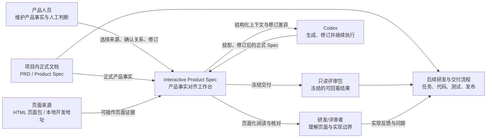
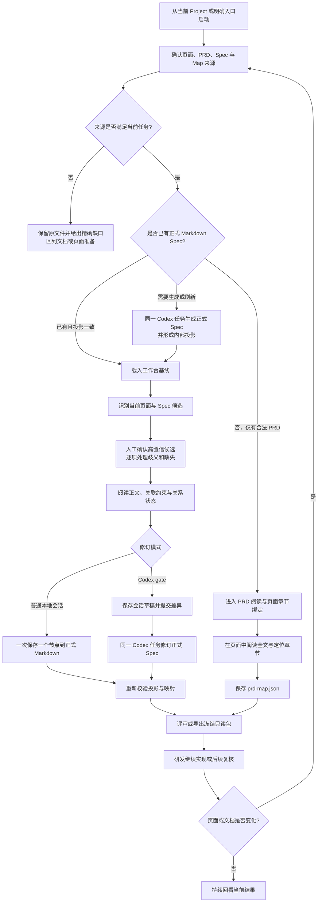

# Interactive Product Spec 产品系统蓝图

> 文档状态：draft  
> 蓝图版本：v0.2
> 最近更新：2026-09-15
> 适用范围：当前已形成的产品能力，以及从 Spec 工具演化为产品工作闭环控制面的目标边界

## 1. 结论与权威边界

Interactive Product Spec 是一个面向产品人员、研发人员与 Codex 的本地产品事实对齐工作台。它把需求来源、按实际页面完整承接需求的精简 Product Spec、可操作页面、页面关系、人工修订和 Agent 回流连接成一条可核验的工作闭环。研发可从 Action / Surface 及直接关联说明理解产品，无需另读 PRD；PRD 独立阅读能力保留。

本产品的边界是“产品事实进入研发与 Agent 工作的控制面”，不是覆盖全部产品管理活动的一体化平台。当前不拥有需求立项、任务排期、代码实施、测试管理、生产部署管理、线上指标或组织审批；这些环节可以消费本产品形成的文档、映射和评审结果，但不由本产品复制实现。

本蓝图是跨能力产品事实入口，负责产品边界、端到端主链、跨能力对象、状态所有权和依赖。各类文档职责如下：

| 产物 | 事实责任 |
|---|---|
| 本蓝图 | 跨能力产品骨架、核心对象、所有权、依赖与 Walking Skeleton |
| `drafts-documents/Interactive Product Spec产品需求文档.md` | 面向研发连续阅读的页面、操作、产品结果和规则；当前为草稿 |
| Product Spec | 按页面完整承接适用需求的长期产品事实，不由本蓝图复制正文 |
| `architecture/designs/product-work-lifecycle.md` | 本产品的技术结构、质量场景、取舍、迁移与验证 |
| `ARCHITECTURE.md` | 已经实现并验证的当前代码职责与统一验证入口 |
| `README.md` | 安装、启动、使用和当前能力概览，不再承担唯一产品事实源 |
| `progress/` | 仅恢复未完成工作，不保存产品或架构事实 |

本版采用以下来源标签：

- **当前事实**：已由当前源码、Schema、测试、README 或现行决定直接支持。
- **目标边界**：本蓝图为下一阶段产品建设固定的责任和结果，尚不表示已经实现。
- **候选探索**：可继续验证的方向，不进入当前承诺。
- **TBD**：缺少会影响跨能力结论的证据，暂不猜测。

2026-09-15 目标边界补充（本机实现与回归通过，跨设备实机验收待完成）：评审交付扩展为多项目局域网只读发布。一个本机后台服务管理各项目独立链接、四位密码与冻结版本；服务全局启停归项目中心，单项目管理沿原导出入口。发布状态只表示交付副本是否提供访问，不代表生产部署、文档确认或在线协作。产品细则归 PRD 4.7.3—4.7.4，工程机制归目标技术架构 4.6。

## 2. 系统边界与能力责任

### 2.1 产品上下文

工作台聚合多种来源，但不因此拥有所有来源的事实。PRD 和 Product Spec 的产品语义仍由其正式文档生命周期拥有；HTML 负责证明当前可见页面和交互；两类 Map 只拥有人工确认的关系；Codex 负责生成和修订过程，不自动获得产品确认权。

### 2.2 能力地图

| 产品能力 | 主要责任 | 明确不拥有 |
|---|---|---|
| 工作上下文与来源接入 | 选择 Project、页面来源、PRD、Spec 与 Map，校验能否组成一次工作会话并恢复最近项目 | 不扫描整个工作区后擅自决定正式来源，不修改候选文件 |
| 产品文档阅读与页面索引 | 阅读可映射 PRD、搜索目录、显示当前页面相关章节、维护页面到 PRD 章节的关系 | 不改写 PRD 正文，不把章节关系当作需求确认 |
| Spec 准备与内部投影 | 从正式 Markdown Spec 形成工作台可消费的内部投影，并保留来源 revision 与可见 Codex 对话 | 不把内部 JSON 升级为第二份正式 Spec |
| 页面与组件对齐 | 识别页面、计算候选、人工确认 `SURFACE` / `ACTION` 到 DOM 的关系并检测漂移 | 不根据 DOM 或点击位置生成业务规则，不自动确认候选 |
| 可视化阅读与修订 | 在页面上下文中查看节点正文、关联约束和映射状态；按会话模式直接写回或形成草稿 | 不让非 DOM 节点承担页面映射，不静默覆盖外部修改 |
| Agent 协作与回流 | 把图形修订差异返回同一个等待中的 Codex 任务，或创建可见的投影任务 | 不自动批准产品内容，不以隐藏后台任务替代用户可追溯过程 |
| 评审交付 | 生成包含页面、文档、映射与 revision 的本地只读评审包 | 不伪造后端、登录态、WebSocket、企业签名或公网协作 |
| 变更复核 | 在文档、页面或映射变化后区分仍有效、需进入场景和真正漂移的关系 | 不把当前页面不可见直接写成正式映射失效 |

### 2.3 角色边界

当前角色是工作职责，不是系统账号权限：

- **产品人员**：选择正式来源，维护 PRD 或 Product Spec，确认页面关系，判断修订是否回到正式产品事实。
- **研发与评审者**：在真实页面上下文阅读产品要求、查看约束、使用只读包持续回看。
- **Codex**：生成或刷新投影、接收节点级差异、修订正式 Spec，并继续后续任务。
- **产品文档流程**：拥有 PRD 的 Draft/Confirm 生命周期；工作台只消费正文并维护同组 `prd-map.json`。
- **外部研发与交付系统**：消费本产品结果；当前不与工作台形成双向任务或发布状态同步。

## 3. 端到端产品工作主干

### 3.1 主流程

### 3.2 决定性分支

- 合法 PRD 可以在没有 Spec 时独立进入页面工作台；这条路径只提供 PRD 阅读与章节关系，不伪造空 Spec 能力。
- 选择了 Markdown Spec 但内部投影缺失或过期时，必须恢复或重新生成投影，不能因为存在 PRD 而降级进入不一致的空工作台。
- 自动候选只提供定位和批量确认建议；正式 `spec-map.json` 仍由人的明确确认形成。
- 普通本地会话与 Codex gate 共享相同 revision 和映射约束，但提交所有者不同：前者写回当前正式 Markdown，后者只形成会话草稿并把差异交回原 Codex 任务。
- 页面地址只用于尽力导航。已确认组件暂时不在当前 DOM 时保留关系；只有 selector 不唯一、目标类型不兼容或语义指纹变化才进入真正复核。
- 导出只读包是交付快照，不代表 PRD/Spec 已确认、实现已验收或评审已通过。

### 3.3 中断与恢复

- 来源不合法：保留原文件，显示具体问题和所属流程，不自动重写。
- 投影任务中断：保留可见 Codex 对话；本地服务恢复后把未完成任务标记为失败并允许重新生成。
- 正式 Spec 在外部变化：拒绝当前保存，要求重新载入，不覆盖新版本。
- 映射保存冲突：拒绝旧 revision 写入，保留当前人工操作供用户重试。
- 动态场景无法自动进入：显示“已关联 · 需手动进入”，用户进入场景后恢复定位，不要求重新绑定。
- 导出条件不足：没有可独立读取的 HTML 页面包时失败关闭，不猜测开发服务的构建产物。

## 4. 跨能力核心对象

| 核心对象 | 产品含义与稳定身份 | 所有者 | 生命周期与跨能力关系 | 来源状态 |
|---|---|---|---|---|
| 产品工作上下文 | 一次工作所绑定的 Project、页面来源和产品资料集合；当前以本地 Project 路径、来源类型与页面入口形成工具侧身份 | 来源接入能力 | 建立、恢复、替换或移除最近记录；连接文档、页面和会话，但不改变其内容 | 当前事实；跨设备身份为 TBD |
| PRD | 面向研发连续阅读的正式产品正文；稳定章节使用中文 `prd-section-id` | 产品文档流程 | Draft 中编写，用户明确确认后与 `prd-map.json` 同组冻结；可独立被工作台消费 | 当前事实 |
| PRD 章节 | 一个页面或关键交互区域的完整产品说明，或一条跨功能规则；稳定身份是隐藏中文语义 ID | PRD | 标题、顺序和正文可变但 ID 保持；语义拆分、合并或废弃才改变 ID | 当前事实 |
| Product Spec | 覆盖适用页面展示、全部操作及相关规则的正式产品事实；保留 PRD 来源版本，稳定身份来自产品 ID、版本和节点 ID | Product Spec 流程 | 可由 Codex 生成、由工作台节点级修订、按自身状态冻结；被内部投影和页面映射消费 | 当前事实 |
| Spec 节点 | `SURFACE`、`ACTION` 及规则、状态、权限、事件、验收等语义节点；稳定身份为节点 ID | Product Spec | 页面节点可映射 DOM；非 DOM 节点只通过关系阅读，不进入映射完成率 | 当前事实 |
| 页面来源 | 可操作 HTML 页面包或受限本地开发地址，提供当前页面结构和交互证据 | 页面实现所属 Project | 可重新构建、变更或失效；被页面识别、映射和评审包消费 | 当前事实 |
| PRD 页面关系 | 页面/路由上下文到 PRD 稳定章节 ID 的人工索引 | `prd-map.json` | 与 PRD 同组保存和冻结；PRD revision 或 ID 变化时进入复核 | 当前事实 |
| Spec 组件关系 | Spec 页面节点到页面上下文、CSS selector 与语义指纹的人工确认关系 | `spec-map.json` | 确认后持久保存；运行时重新校验但不把临时状态写回关系事实 | 当前事实 |
| 内部 Spec 投影 | 正式 Markdown Spec 的可重建工作台视图 | 投影能力 | 随来源 revision 生成、复用或失效；不得独立冻结或维护 | 当前事实 |
| 评审会话 | 把一组来源 revision、工作模式、草稿和可写能力组合成一次工作过程 | 工作台会话 | 打开、编辑、提交或离开；视图状态和候选缓存随会话存在，不进入正式文档 | 当前事实；统一基线对象为目标边界 |
| Codex 任务 | 生成投影或接收门禁差异的用户可见 Agent 工作单元 | Codex | 可见、可继续、成功或失败；通过 thread ID 与当前工作回链 | 当前事实 |
| 只读评审包 | 某一时点页面、文档、映射和 revision 的冻结副本 | 评审交付能力 | 生成后不可写；接收者本地打开并持续回看 | 当前事实 |

## 5. 状态与事件所有权

| 状态或事件族 | 唯一所有者 | 进入与输出 | 只读消费者 | 边界 |
|---|---|---|---|---|
| PRD / Product Spec 的 `draft → reviewing → confirmed → superseded` | 各自正式文档流程 | 作者修订与用户明确确认形成新版本 | 工作台、Codex、评审包 | 结构校验、页面绑定、导出和测试均不能自动 Confirm |
| 投影任务 `queued / running / completed / failed / cancelled` | 投影能力 | 从固定 Markdown revision 发起；完成后形成内部投影与可见 Codex 任务信息 | 项目中心、工作台 | 服务重启可把未完成任务转为失败，不改正式 Spec |
| Spec 关系确认 | `spec-map.json` 写入能力 | 人工确认、重新关联或解除形成持久关系 | 工作台、评审包 | 正式文件只保存确认事实，不保存当前页面派生状态 |
| Spec 关系运行时状态 `confirmed / invalid / ambiguous / drifted / out-of-context` | 当前浏览器会话的校验器 | 当前页面、selector、目标类型和指纹共同计算 | 工作台筛选与提示 | `out-of-context` 不进入需复核数量；派生状态不写回 Map |
| PRD 关系新鲜度 | PRD 关系校验器 | PRD revision、章节 ID 和关系 revision 变化形成正常或 stale | PRD 阅读器、工作台 | stale 只要求复核关系，不改 PRD 正文 |
| Spec 修订草稿 | 当前 gate 会话 | 用户编辑节点后暂存；提交后形成差异包 | 等待中的 Codex 任务 | 离开会话可能放弃草稿；草稿不冒充正式 Spec |
| 正式 Spec 节点保存 | 普通本地写入能力或返回后的 Codex 任务 | 在 revision 一致时原子更新 Markdown，并同步可重建投影 | 工作台、后续研发 | 一次仅保存一个节点；冲突必须拒绝覆盖 |
| 评审包生成 | 评审交付能力 | 在待保存 Map 成功后冻结当前资料和 revision | 研发/评审者 | 只读、仅本机、无写入与 Codex API，不代表验收通过 |

## 6. 跨能力依赖合同

| 消费能力 | 提供能力 | 必需输入 | 消费结果 | 失败或未知时的产品行为 |
|---|---|---|---|---|
| 来源接入 | 当前 Project 与用户明确选择 | Project 路径、页面入口或本地地址 | 候选 PRD、Spec、Map 与页面来源 | 不确定时停留在来源确认，不静默选择相似文件 |
| PRD 阅读 | 产品文档流程 | 合法 `可映射PRD-v1` 文档 | 全文、目录、稳定章节和版本状态 | 格式不合格时保留原件并引导生成标准化草稿 |
| PRD 页面绑定 | PRD 阅读与页面识别 | 稳定章节 ID、当前页面上下文、基线 revision | `prd-map.json` 关系 | revision 冲突或 ID 失效时拒绝写入并提示复核 |
| 内部投影 | 正式 Markdown Spec 与 Codex | 固定来源 revision、可选页面证据、模型与推理强度 | 结构化工作台视图、可见任务信息 | 失败时保留任务入口和错误，不生成不合格投影 |
| Spec 页面映射 | 内部投影与页面来源 | `SURFACE` / `ACTION`、页面 DOM、人工确认 | `spec-map.json` 关系 | 无可靠候选时不跳页或自动确认，转人工选择位置 |
| Spec 修订 | 正式 Spec、内部投影与会话模式 | 节点变化、Spec revision、来源 revision、当前 Map | 正式节点更新或 gate 草稿 | 外部变化、跨节点修改或映射不一致时拒绝保存 |
| Codex 回流 | gate 会话 | 来源 revision、节点差异、Spec Map 与应用目标 | 同一任务继续修订正式 Markdown | 原任务不可用时不得另建无来源任务并假装闭环完成 |
| 只读交付 | 当前工作台基线 | HTML 页面包、PRD/Spec、两类 Map 与 revision | 带 manifest 的 ZIP | 开发地址无构建包、越界资源或保存失败时停止导出 |

## 7. V1 Walking Skeleton

V1 的完成单位是一项真实产品功能从正式说明进入可操作页面，完成人工核对和修订，再形成可回看的结果，而不是某个页面或模块单独可用。

| 旅程节点 | V1 最小用户结果 | 必需输入 | 节点输出 | 仿真/外部边界 | 明确不包含 |
|---|---|---|---|---|---|
| 明确工作来源 | 用户知道本次查看的是哪个 Project、页面、PRD 和 Spec | 本地 Project 与至少一个页面来源，PRD 或 Spec 至少一个 | 可恢复的工作上下文 | 本地开发地址只支持受限同源代理 | 自动搜索所有工作区并决定正式来源 |
| 建立产品认知 | 用户能从当前页面打开完整 PRD，并定位相关章节 | 合法可映射 PRD | 页面到章节的人工关系 | PRD 可没有 Spec | 自动修改或确认 PRD |
| 准备页面完整型 Spec | 用户能从完整、精简的正式 Markdown 得到工作台视图 | PRD 与页面证据、Markdown Spec 与固定 revision | 保留全部节点的内部投影与可见 Codex 对话 | 节点留存校验不代替需求语义完整性检查 | JSON 成为正式项目资产 |
| 对齐页面和节点 | 用户能看到候选 DOM，并确认或纠正页面关系 | 页面 DOM 与可映射节点 | 持久 Spec Map | 动态场景可要求手动进入 | 高置信评分自动变成确认 |
| 在页面中修订 | 用户能阅读正文和约束，只修改当前节点 | 正式来源、revision 与可写会话 | 原子写回或 gate 草稿 | 非 DOM 约束只读展示 | 同时改写多个产品事实源 |
| 返回 Agent 继续 | 用户提交后，同一 Codex 任务收到精确差异并继续修订正式 Spec | gate 会话和等待中的原任务 | 修订后的 Markdown 或明确失败 | Codex 是当前首个 Agent 适配器 | 自动审批或跨任务静默提交 |
| 冻结并回看 | 研发可在另一台支持环境的机器本地打开结果 | 独立 HTML 页面包和当前资料 | 带 manifest 的只读 ZIP | 动态后端与登录态不离线复制 | 公网协作、评论、签名和发布审批 |
| 变化后复核 | 页面或文档变化时只复核真正受影响关系 | 新 revision 与旧 Map | 仍有效、需手动进入或需复核的清晰状态 | 动态页面可暂不可见 | 因当前不可见批量抹掉人工关系 |

## 8. 派生门禁与变更影响

新增能力或探索方向进入 PRD、Product Spec 或实现前，必须回答：

1. 它补齐主干中的哪个用户结果，而不是仅增加一个入口或页面？
2. 它读写哪些正式文档、关系、会话或交付快照？唯一所有者是谁？
3. 它会不会让内部投影、候选、缓存或运行时状态变成第二份正式事实？
4. 它是否改变普通本地写回与 Codex gate 的提交所有者或安全边界？
5. 来源变化、Agent 失败、页面动态状态和 revision 冲突时怎样失败关闭与恢复？
6. 它是否需要改变现有项目中心、工作台、评审模式或导出主线？若是，为什么现有职责无法容纳？
7. 它对 V1 Walking Skeleton 的贡献、明确非目标和回归范围是什么？

以下变化必须先更新蓝图：

- 从单人本地工具进入多人协作或服务端空间；
- 引入 Codex 之外的正式 Agent 适配器并改变任务回流语义；
- 让任务、实现、测试、生产部署或指标成为产品内正式状态；
- 改变 PRD、Product Spec、HTML、两类 Map 或评审包的所有权；
- 引入批准/拒绝、签名、权限或不可逆写回；
- 允许远程页面、外部系统或公网分发进入默认路径。

## 9. 探索方向与待确认项

### 9.1 建议优先探索

1. **产品工作基线**：把一次工作所使用的 PRD、Spec、页面和两类 Map revision 组合成可见基线，解决“每个文件都合法但并非同一时点”的一致性问题。
2. **从产品事实到实现证据的回链**：不在本产品内复制任务和测试系统，只探索 Spec 节点如何引用实现提交、测试证据或交付结果，并保持来源可追踪。
3. **变更影响工作台**：从“单条映射是否漂移”扩展到“某次 PRD/Spec/页面变更影响哪些页面、节点和评审包”，仍由人决定是否修订。
4. **Agent 适配边界**：先把 Codex 交互抽象为清晰的生成、回流和继续协议，再验证是否值得支持其他 Agent；当前仍保持 Codex-first，不宣传已具备通用 Agent 能力。
5. **受控协作发布**：在只读 ZIP 已证明交付价值后，探索带身份、评论和版本的共享评审空间；这将改变安全、权限和部署边界，必须单独立项。

### 9.2 暂不优先

- 自建任务看板、研发排期、代码托管、测试管理或发布平台；这些会迅速扩大事实所有权。
- 根据页面自动反推完整产品需求；当前页面只能证明可见实现，不能替代产品判断。
- 无人确认的自动映射或自动批准；评分、结构通过和实现存在都不等于产品确认。
- 为通用性提前引入微服务、远程数据库或插件市场；当前核心质量问题仍是本地闭环的一致性和可恢复性。

### 9.3 跨能力 TBD

| 待确认项 | 当前安全处理 | 影响范围 | 解除条件 |
|---|---|---|---|
| 正式对外产品名称与品牌 | 继续使用仓库名 `Interactive Product Spec` | 文档标题、安装包、对外传播 | 用户明确命名和品牌定位 |
| “整个产品工作环节”最终覆盖到哪里 | 当前只承诺产品事实进入研发与 Agent 工作的闭环，不拥有执行、测试、发布和指标状态 | 后续模块边界与竞争定位 | 明确首个需要纳入的下游业务结果及其事实所有者 |
| 多人协作、角色与审批是否进入产品 | 当前无账号、权限矩阵或审批语义；评审模式仅只读 | 安全、部署、数据、状态和收费模式 | 有真实团队协作场景、责任人和不可逆边界 |
| 是否支持远程真实系统页面 | 当前只支持本地 HTML 或受限本地开发地址 | 登录、隐私、代理、安全与可复现性 | 明确目标系统、授权方式和数据保护要求 |
| 评审包的企业签名与跨组织分发 | 当前 Windows 启动器未签名，只作为本地评审工具 | 可信分发与用户安装体验 | 确定发布主体、证书和支持责任 |

## 10. 变更记录

| 版本 | 日期 | 主要变化 | 状态 |
|---|---|---|---|
| v0.1 | 2026-09-01 | 基于当前源码、README、架构契约和现行决定建立首版跨能力产品骨架 | draft |
